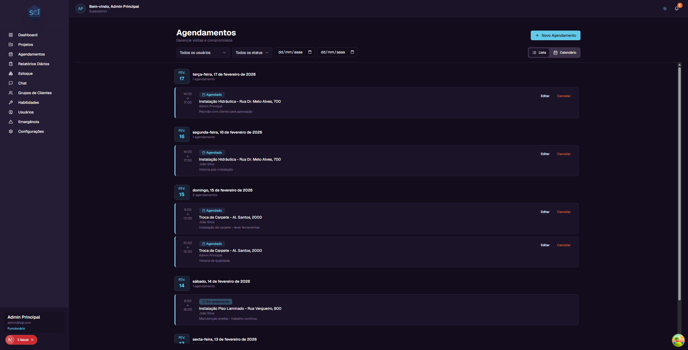
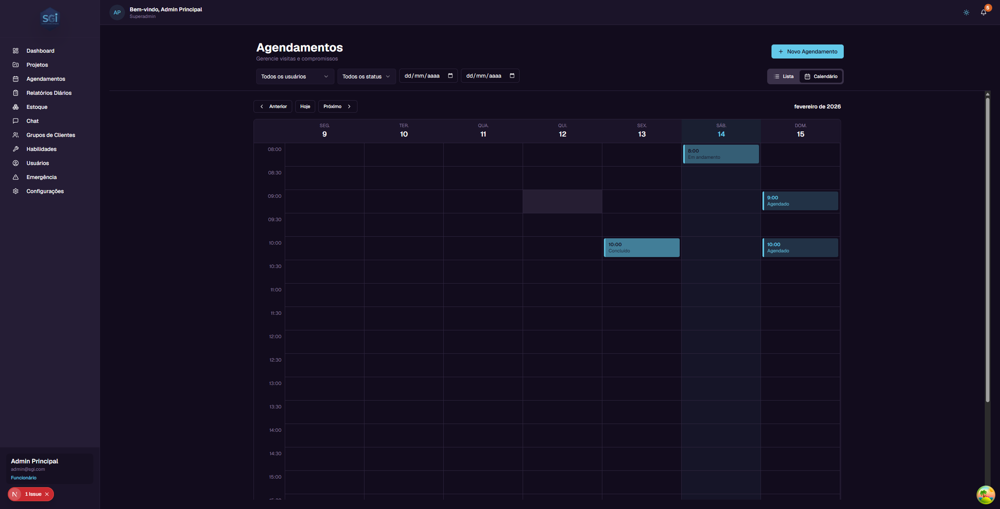
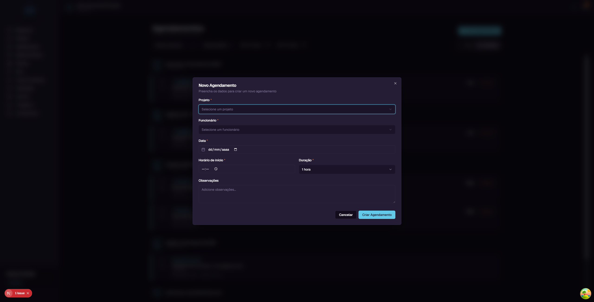
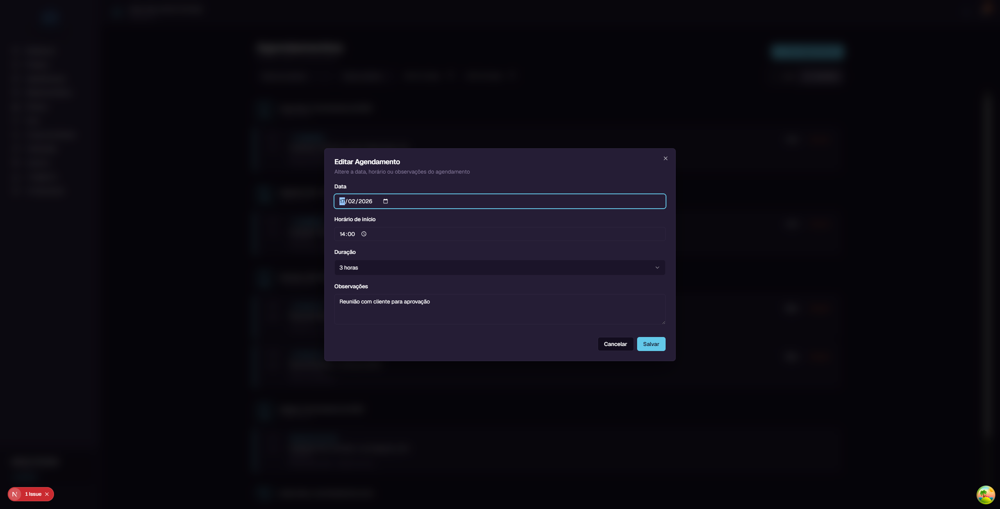
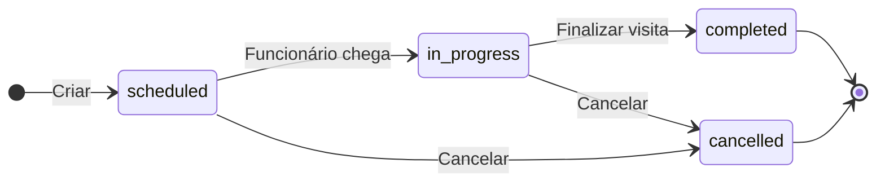
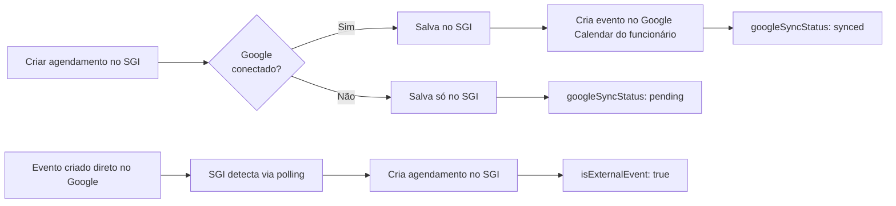

# Agendamentos - Guia do Usuário

Este guia explica tudo sobre o módulo de **Agendamentos** do SGI, usado para programar visitas e compromissos dos funcionários nos projetos.

---

## 1. Acessando a tela de Agendamentos

No menu lateral, clique em **"Agendamentos"**. Você verá a página principal de gerenciamento.

---

## 2. Modos de visualização

São 2 modos, com alternador no canto superior direito. A preferência é **salva por usuário** (fica persistida entre sessões).

### Lista (padrão)

Agendamentos agrupados por data, do mais recente para o mais antigo. Cada card mostra:

- **Horário** - Hora de início e fim (ex: 14:00 → 17:00)
- **Status** - Badge colorido (Agendado, Em andamento, Concluído, Cancelado)
- **Projeto** - Nome do projeto vinculado
- **Funcionário** - Quem está atribuído
- **Observações** - Notas adicionais sobre a visita
- **Botões** - Editar e Cancelar

### Calendário

Grade semanal (segunda a domingo), slots das 08:00 às 18:00. Blocos coloridos por status.

Use **"Anterior"**, **"Hoje"** e **"Próximo"** para navegar entre semanas.

---

## 3. Criando um agendamento

Clique em **"Novo Agendamento"** no canto superior direito (desktop) ou no **botão flutuante "+"** (mobile).

| Campo | Obrigatório? | Descrição |
|-------|:---:|-----------|
| **Projeto** | Sim | Projeto vinculado à visita |
| **Funcionário** | Sim | Quem fará a visita |
| **Data** | Sim | Data da visita |
| **Horário de início** | Sim | Hora em que começa |
| **Duração** | Sim | 1h, 2h, 3h, 4h ou customizada (mínimo 1 minuto) |
| **Observações** | Não | Notas adicionais |

### Exemplo passo a passo

1. Clique em **"Novo Agendamento"**
2. Em **Projeto**, selecione: `Instalação Hidráulica - Rua Dr. Melo Alves, 700`
3. Em **Funcionário**, selecione: `João Silva`
4. Em **Data**, selecione a data desejada
5. Em **Horário de início**, digite: `09:00`
6. Em **Duração**, selecione: `2 horas`
7. Em **Observações**, digite: `Levar ferramentas para vistoria`
8. Clique em **"Criar Agendamento"**

---

## 4. Editando e cancelando

### Editar

Na lista, clique em **"Editar"** no card. Você pode alterar:

- **Data** - Mudar o dia
- **Horário de início** - Mudar a hora
- **Duração** - Mudar o tempo
- **Observações** - Alterar as notas

### Cancelar

Clique em **"Cancelar"** no card. O status muda para **Cancelado** (o agendamento não é apagado, fica registrado).

---

## 5. Filtros

No topo da página:

| Filtro | O que faz |
|--------|-----------|
| **Usuários** | Filtra por funcionário (admin); funcionários veem só os seus |
| **Status** | agendado / em andamento / concluído / cancelado |
| **Data** | Intervalo (data início e fim) |

---

## 6. Status dos agendamentos

| Status | Significado | Cor |
|--------|-------------|-----|
| **Agendado** (`scheduled`) | Visita programada para o futuro | Azul |
| **Em andamento** (`in_progress`) | Visita acontecendo agora | Verde |
| **Concluído** (`completed`) | Visita realizada | Cinza |
| **Cancelado** (`cancelled`) | Visita cancelada | Vermelho |

---

## 7. Integração com Google Calendar

Quando a conta Google da organização está conectada (via **Configurações > Integrações**, apenas super admin pode conectar), agendamentos sincronizam automaticamente.

### Como funciona

- O sistema cria **calendários individuais por funcionário** (ex: `SGI - João Silva`)
- Criar/editar/cancelar no SGI aparece automaticamente no Google Calendar
- **Two-way sync:** eventos criados direto no Google Calendar **também aparecem no SGI** (com flag `isExternalEvent`)

### Status de sincronização

Cada agendamento tem um campo `googleSyncStatus` visível no detalhe:

| Status | Significado |
|--------|-------------|
| `pending` | Aguardando próximo sync |
| `syncing` | Sincronização em andamento |
| `synced` | Sincronizado com sucesso |
| `failed` | Erro na sincronização (mensagem em `googleSyncError`) |

### Sem Google conectado

!!! note "Google Calendar é opcional"
    A integração **não é obrigatória**. Se a conta Google não estiver conectada, o agendamento é criado **normalmente no SGI** - apenas não sincroniza com Google. Tudo funciona, só não tem o calendário externo.

---

## 8. Sugestão inteligente de funcionário

Ao criar um agendamento pelo **Chat com IA**, a IA **sugere automaticamente** o melhor funcionário com base em:

1. **Skills (habilidades)** - Funcionários com a competência certa para o trabalho
2. **Disponibilidade** - Evita conflitos de horário
3. **Carga de trabalho** - Prefere quem tem menos agendamentos no período

!!! tip "A sugestão é uma recomendação"
    A IA sugere, mas **você decide**. Pode aceitar, escolher outro funcionário, ou pedir para a IA mostrar outras opções.

---

## Regras Importantes

### Campos obrigatórios e limites

| Campo | Obrigatório | Mínimo | Máximo | Observação |
|-------|:---:|:---:|:---:|---|
| `projectId` | Sim | - | - | Deve existir no sistema |
| `employeeId` | Sim | - | - | Usuário deve estar ativo |
| `startTime` | Sim | - | - | ISO 8601 (data no passado é permitida) |
| `durationMinutes` | Sim | 1 min | - | Sem limite máximo explícito |
| `notes` | Não | - | - | Texto livre |

### Permissões necessárias

| Operação | Super Admin | Admin | Funcionário com `canCreateSchedules` | Funcionário padrão |
|----------|:---:|:---:|:---:|:---:|
| Ver seus agendamentos | Sim | Sim | Sim | Sim |
| Ver agendamentos de todos | Sim | Sim | Não | Não |
| Criar agendamento | Sim | Sim | Sim | Não |
| Editar agendamento | Sim | Sim | Sim (só os próprios) | Não |
| Cancelar agendamento | Sim | Sim | Sim (só os próprios) | Não |

### Validações que bloqueiam

!!! warning "Conflito de horário"
    O sistema **valida automaticamente** se o funcionário já tem agendamento no mesmo slot e retorna erro:
    `Funcionário não disponível neste horário`

    Para resolver: escolha outro horário ou outro funcionário.

!!! note "Data no passado é permitida"
    O sistema **permite** criar agendamentos em datas passadas (útil para registrar visitas que já aconteceram). Atenção ao confirmar a data.

### Defaults do sistema

| Configuração | Valor padrão | Onde alterar |
|---|---|---|
| Duração padrão | 2 horas | Na criação |
| Slot do calendário | 08:00-18:00 | Sistema (não configurável) |
| Status inicial | `scheduled` | Automático |
| Sync Google Calendar | Opcional | Super admin em Integrações |

---

## Resumo rápido

| Você quer... | Faça isso... |
|-------------|-------------|
| Ver todos os agendamentos | Clique em "Agendamentos" no menu |
| Ver no calendário | Clique no botão "Calendário" |
| Criar agendamento | Clique em "Novo Agendamento" |
| Criar via Chat | "Agendar visita para projeto X amanhã 9h" |
| Editar agendamento | Botão "Editar" no card |
| Cancelar agendamento | Botão "Cancelar" no card |
| Filtrar por funcionário | Dropdown "Todos os usuários" |
| Ver integração Google | Configurações > Integrações (super admin) |
