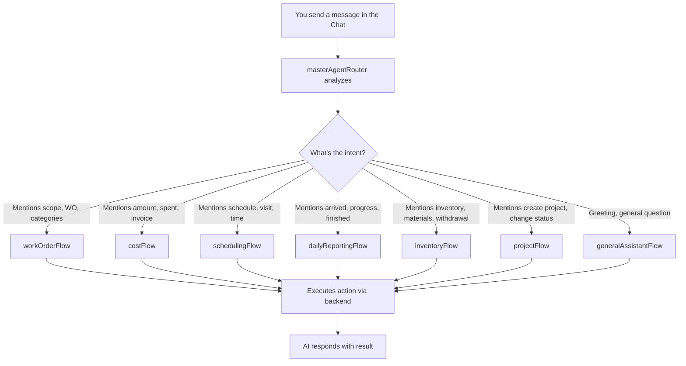

# Chat with AI Assistant - User Guide

In this guide, you will learn everything about the **Chat with AI Assistant** in SGI - the heart of the system. This is where artificial intelligence organizes all your work: generates detailed scopes, registers costs by reading invoices, schedules visits, collects progress reports, manages inventory and projects - all through natural conversation.

> **Why is the Chat so important?** Almost everything you do manually on other SGI screens can be done faster through the Chat. Just talk naturally with the AI, as if it were a personal assistant in the field.

---

## 1. What is the SGI Chat

The SGI Chat is your **personal field assistant**. It works like a natural conversation where you can:

- **Generate detailed scopes** for projects from text, photos, audio, or video
- **Register costs** and expenses, including automatic invoice reading
- **Schedule visits** with intelligent suggestion of the best employee
- **Send daily progress reports** from field work
- **Manage inventory** - withdraw materials, check quantities, verify alerts
- **Manage projects** - create, edit, change status

### How it works

You don't need to choose any "mode" or "function". The AI automatically understands what you want based on your message. If you say "I spent $500 at the store", the AI knows you want to register a cost. If you say "schedule a visit for tomorrow", the AI knows you want to create an appointment.

The conversation adapts: if you start talking about costs and then switch to scheduling, the AI follows naturally. Everything works in the same chat, without needing to switch screens.

!!! note "Current availability"
    The Chat works through the App (PWA) on all devices (desktop, tablet, mobile). WhatsApp support is planned for future releases, but is not yet available.

---

## 2. The Chat screen

On the left sidebar menu, click **"Chat"**. You will be taken to the assistant screen.

### What you see on the screen

- **Header:** "Assistente SGI" with a status indicator that changes based on the conversation context (see below)
- **Initial message:** The AI introduces itself and lists its 5 main capabilities
- **"Nova Conversa" (New Conversation) button** (top right corner) - To start a fresh conversation
- **Conversation area:** Where messages appear (WhatsApp-style)

### Status indicator

The text below the "Assistente SGI" name changes automatically based on what the AI is currently doing:

| Displayed status | When it appears |
|-----------------|-----------------|
| **online** | When the AI is ready to receive any message (default) |
| **General Assistant** | Answering general questions or helping with doubts |
| **Work Order** | Generating or editing a work scope |
| **Adding Cost** | Registering an expense or reading an invoice |
| **Scheduling** | Creating or consulting appointments |
| **Daily Reporting** | Collecting progress report from a visit |
| **Inventory Management** | Consulting or moving materials |
| **Project Management** | Creating, editing, or consulting projects |

> **Tip:** The status indicator helps you understand what the AI is processing. If you are generating a scope and change the subject, the status automatically changes to reflect the new context.

### Input bar

At the bottom of the screen, you will find:

**Desktop:** Individual buttons for each attachment type.

| Element | What it does |
|---------|-------------|
| **Text field** | "Digite sua mensagem..." - where you type (up to 2000 characters) |
| **Image button** | Send photos (invoices, work site, documents) |
| **Microphone button** | Record voice audio directly in the app (with waveform) |
| **Audio button** | Send a pre-recorded audio file |
| **Video button (camera)** | Record video up to 30s directly in the app |
| **Video button (upload)** | Send pre-recorded video |
| **PDF button** | Send PDF file (up to 10MB) - useful for importing Work Orders |
| **Send button** | Send the message (or press Enter) |

**Mobile:** A single **"+"** button opens a WhatsApp-style menu with all options (photo, audio, video, PDF).

<!-- TODO: screenshot of ChatInputBar mobile with attachments menu open. File: images/chat-mobile-menu.png. Capture: Popover menu with Photo/Record Audio/Upload Audio/Record Video/Upload Video/Upload PDF options -->
{ .placeholder-image }

!!! tip "Keyboard shortcuts"
    - **Enter** - Send the message
    - **Shift+Enter** - New line without sending

!!! note "Chat limits"
    - **Text:** up to 2000 characters per message (counter shows when you pass 80%)
    - **PDF:** up to 10 MB per file
    - **Image/audio/video:** up to 50 MB per file
    - **Video recorded in app:** maximum 30 seconds
    - **Session:** expires automatically (1 day for most flows, 7 days for specific cases). After expiration, the AI no longer remembers the context of that conversation.

---

## 3. How the AI works

The SGI AI is smart: it understands the context of your conversation and automatically decides which action to take. You don't need to use special commands or choose menus.

### Examples of how the AI understands you

| You say... | The AI understands you want to... |
|-----------|----------------------------------|
| "I need a scope for project X" | Generate a scope (Work Order) |
| "I spent $500 on materials" | Register a cost |
| [Send invoice photo] | Read the invoice and register the cost |
| "Schedule a visit for tomorrow at 9am" | Create an appointment |
| "I arrived at the site" | Start a progress report |
| "How much cement is in stock?" | Check inventory |
| "Create a new project" | Create a project |
| "Hi, good morning!" | Greet and offer help |

### The conversation adapts naturally

The AI remembers the context of your conversation. You don't need to repeat information:

> **You:** "I need to generate a scope for the Rua das Flores project"
> **AI:** "Got it! I'll collect the scope information for 'Carpet Installation - Rua das Flores 123'. Describe the work that needs to be done."
> **You:** "Install 100 SF of drywall in the main bathroom"
> **AI:** "Added to scope: Drywall - Install Drywall, 100 SF, Main Bathroom. Any more items?"
> **You:** "No, that's it. Oh, and schedule a visit for tomorrow at 9am"
> **AI:** "Perfect! Scope finalized. Now I'll schedule the visit. Checking availability... I recommend Joao Silva (skill: Drywall). Confirm for tomorrow at 09:00?"

Notice how the conversation naturally changed from "generate scope" to "schedule visit" without any interruption.

---

## 4. Generate Scopes (Work Order)

### What is a scope

The **scope** (also called Work Order) is the **complete breakdown of work** that needs to be done in a project. It organizes all tasks into professional categories, in the actual execution order of the construction.

Each scope item has:
- **Task** - What needs to be done (e.g., "Install Drywall")
- **Action** - Type of action: Install, Remove, or Detach & Reset
- **Type** - Labor, Material, or Equipment
- **Quantity** - How much (e.g., 100)
- **Unit** - Measurement used (e.g., SF - square feet, EA - each)
- **Room** - Where it will be done (e.g., Bathroom, Kitchen)
- **Notes** - Additional observations

The scope is directly connected to the **"Scope"** tab in the project. When you generate a scope through Chat, it automatically appears in the project details.

### The power of scope generation

What makes SGI special is the ability to **generate complete scopes from any type of input**:

| Input | What the AI does |
|-------|-----------------|
| **Text** | You describe the work and the AI organizes it into categories |
| **Photos** | The AI analyzes photos and identifies materials, conditions, and dimensions |
| **Audio** | You record yourself talking about the work and the AI transcribes and organizes it |
| **Video** | The AI analyzes the video frame by frame, extracting visual and audio information |

You can even **combine** multiple input types in the same conversation!

---

## 5. Generating scope by text

The simplest way to generate a scope is by describing the work through text.

### Complete conversation example

> **You:** "I need to generate a scope for the Rua Dr. Melo Alves project"
> **AI:** "Found the project 'Hydraulic Installation - Rua Dr. Melo Alves, 700'. I'll collect the scope items. Describe the work that needs to be done."
>
> **You:** "I need to install 100 SF of drywall in the main bathroom and paint 2 bedrooms, each with 200 SF"
> **AI:** "Got it! I'll organize the scope:
>
> **Category DRY - Drywall:**
> - Install Drywall | Labor | 100 SF | Main Bathroom
>
> **Category PNT - Painting:**
> - Install Paint | Labor | 200 SF | Bedroom 1
> - Install Paint | Labor | 200 SF | Bedroom 2
>
> Total: 3 items in 2 categories. Want to add more items?"
>
> **You:** "Yes, also need to replace the bathroom floor, 50 SF of tile"
> **AI:** "Added!
>
> **Category TIL - Tile:**
> - Install Tile | Labor | 50 SF | Main Bathroom
>
> Updated total: 4 items in 3 categories. Anything else?"
>
> **You:** "No, you can finalize"
> **AI:** "Scope sent for review! Final summary:
> - DRY (Drywall): 1 item - 100 SF
> - PNT (Painting): 2 items - 400 SF total
> - TIL (Tile): 1 item - 50 SF
>
> The scope is available in the 'Scope' tab of the project. An administrator can review and approve it."

### Tips for describing work

- **Be specific with quantities:** "100 SF of drywall" is better than "drywall in the bathroom"
- **Mention the rooms:** "painting in the living room" helps organize by location
- **Use clear actions:** "install", "remove", "replace" help the AI classify correctly
- **You can mix languages:** "50 SF de tile no bathroom" works perfectly

---

## 6. Generating scope from photos

One of the most powerful SGI features is the ability to **analyze photos** to automatically generate scopes.

### How it works

1. Send one or more photos of the work site
2. The AI analyzes the images and identifies:
   - **Rooms** and visible spaces
   - **Materials** and their conditions
   - **Approximate dimensions**
   - **Problems** or visible damage
3. The AI automatically suggests items and categories for the scope

### Conversation example

> **You:** "I'll send photos from the apartment inspection"
> **You:** [Sends 3 photos: bathroom with damaged tiles, bedroom with peeling paint, kitchen with broken floor]
>
> **AI:** "I analyzed the 3 photos. I identified:
>
> **Photo 1 - Bathroom:**
> - Tiles with cracks and deteriorated grout
> - Estimate: ~40 SF of area to be replaced
>
> **Photo 2 - Bedroom:**
> - Wall with peeling paint
> - Needs surface preparation + repainting
> - Estimate: ~150 SF of area
>
> **Photo 3 - Kitchen:**
> - Ceramic floor broken in several spots
> - Estimate: ~60 SF of area
>
> I suggest the following scope:
>
> **TIL - Tile:** Remove + Install Tile | 40 SF | Bathroom
> **PNT - Painting:** Install Paint | 150 SF | Bedroom
> **FCW - Floor Covering:** Remove + Install Floor | 60 SF | Kitchen
>
> Want to confirm, adjust quantities, or add more items?"
>
> **You:** "The bathroom is bigger, it's actually 60 SF"
> **AI:** "Corrected! Tile in Bathroom: 40 SF → 60 SF. Any other adjustments?"

### Tips for photos

- **Take photos from different angles** so the AI has more context
- **Include a size reference** (e.g., a visible measuring tape) for more accurate estimates
- **Clear, well-lit photos** give better results
- **You can send multiple photos** at once - the AI analyzes all of them

---

## 7. Generating scope from audio

Ideal for **field inspections**. You can walk through the site talking naturally about what needs to be done, and the AI transcribes and organizes everything.

### How it works

1. Click the **microphone** button to record or send an **audio file**
2. The AI transcribes the audio automatically
3. Extracts structured information (tasks, quantities, rooms)
4. Organizes into scope categories

### Conversation example

> **You:** [Records 2-minute audio while walking through the site]
> *"I'm in the main bathroom, need to replace all the tile, about 60 square feet. The sink also needs to be reinstalled. Now I'm in the bedroom... it's painting here, about 200 square feet of wall. There's a hole in the drywall near the window, about 4 square feet that needs to be patched. In the kitchen the plumbing is leaking under the sink, need to replace the pipes."*
>
> **AI:** "I transcribed the audio and organized the scope:
>
> **TIL - Tile:**
> - Remove + Install Tile | 60 SF | Main Bathroom
>
> **PLM - Plumbing:**
> - Detach & Reset Sink | 1 EA | Main Bathroom
> - Remove + Install Plumbing | 1 EA | Kitchen (leak)
>
> **DRY - Drywall:**
> - Install Drywall Patch | 4 SF | Bedroom (hole near window)
>
> **PNT - Painting:**
> - Install Paint | 200 SF | Bedroom
>
> Total: 5 items in 4 categories. Is this correct?"

### Tips for audio recording

- **Speak naturally** - no need to be formal
- **Mention the room** when you change location ("now I'm in the kitchen...")
- **Give quantities** when possible ("about 100 square feet")
- **You can mix languages** - the AI understands Portuguese and English
- **Longer recordings** are better - more details = more accurate scope

---

## 8. Generating scope from video

The **most complete** way to generate a scope. The AI analyzes the video frame by frame, combining visual and audio information for maximum detail.

### How it works

1. Click the **video** button and send the file
2. The AI analyzes:
   - **Video frames** - identifies rooms, materials, dimensions, damage
   - **Video audio** - transcribes your comments during recording
3. Combines both sources for a more complete scope

### Conversation example

> **You:** [Sends 3-minute video doing walkthrough of the apartment, commenting while filming]
>
> **AI:** "I analyzed the complete video. I combined what I saw in the images with your comments:
>
> **Identified visually:**
> - Bathroom: damaged tiles, old sink, cracked glass shower enclosure
> - Bedroom: walls with peeling paint, hole in drywall
> - Kitchen: broken ceramic floor, visible leak under sink
>
> **From your comments:**
> - Bathroom: 60 SF of tile, reinstall sink
> - Bedroom: 200 SF of painting, 4 SF of drywall patch
> - Kitchen: replace plumbing
>
> **Suggested scope:**
> - TIL: 60 SF | Bathroom
> - PLM: Sink (Bathroom) + Plumbing (Kitchen)
> - GLS: 1 EA Glass Enclosure | Bathroom (cracked - not mentioned in audio, saw in images)
> - DRY: 4 SF Patch | Bedroom
> - PNT: 200 SF | Bedroom
> - FCW: ~60 SF Floor | Kitchen
>
> I noticed the glass enclosure is cracked but you didn't mention it. Want to include it in the scope?"

Notice how the AI **complemented** the audio information with what it saw in the images, identifying the cracked glass enclosure that wasn't mentioned verbally.

### Tips for videos

> **⚠️ In testing phase:** Video upload is in testing phase. We strongly recommend sending **short videos** (up to 1-2 minutes). Long videos may take longer to process or have less accurate results.

- **Short videos** - prefer videos of up to 1-2 minutes per room
- **Comment while filming** - "here we need drywall, about 100 SF"
- **Film slowly** - give the AI time to analyze each scene
- **Show details** - zoom in on damage, cracks, leaks
- **Prefer photos + audio** if the video is too long - results may be better

---

## 9. The 16 work categories

The SGI scope organizes work into **16 professional categories**, in the actual execution order of the construction. This ensures work is done in the correct sequence.

| Code | Name | Description |
|------|------|-------------|
| **FRM** | Framing | Wood structures, walls, beams |
| **ELE** | Electrical | Wiring, outlets, switches, panels |
| **INS** | Insulation | Thermal and acoustic insulation |
| **DRY** | Drywall | Gypsum boards, partitions |
| **MUD** | Mud/Taping | Joint compound, tape, finishing |
| **FNC** | Finish Carpentry | Baseboards, moldings, doors, windows |
| **PNT** | Painting | Wall, ceiling, and trim painting |
| **FCW** | Floor Covering | Carpet, laminate, vinyl |
| **TIL** | Tile | Ceramic tiles, porcelain, stone |
| **PLM** | Plumbing | Pipes, sinks, toilets, showers |
| **DTL** | Details/Hardware | Handles, locks, accessories |
| **GLS** | Glass/Mirrors | Mirrors, glass enclosures, glass windows |
| **CLN** | Cleaning | Post-construction cleaning |
| **TCH** | Touch Ups | Final paint and finish touch-ups |
| **CON** | Contents | Furniture, appliances, decor |
| **DMO** | Demolition | Demolition of existing structures |

### Measurement units

| Abbreviation | Name | Usage |
|-------------|------|-------|
| **EA** | Each | Individual items (sink, toilet, door) |
| **SF** | Square Feet | Areas (walls, floors) |
| **LF** | Linear Feet | Lengths (baseboards, pipes) |
| **SY** | Square Yards | Larger areas (carpet) |
| **HR** | Hours | Work time |

> **Note:** The categories and units follow the American construction standard, as the system is designed to serve international markets. The AI accepts input in Portuguese and converts automatically.

---

## 10. Reviewing and editing the scope

After the AI generates the scope, you can review and adjust before finalizing.

### What you can do

- **Add more items:** "Add 50 LF of baseboard in the living room"
- **Remove items:** "Remove the painting item for bedroom 2"
- **Change quantities:** "The drywall in the bathroom is 80 SF, not 60"
- **Change rooms:** "The tile is in the kitchen, not the bathroom"
- **Confirm and submit:** "You can finalize the scope"

### Scope status

| Status | Meaning |
|--------|---------|
| **Draft** | Scope being built, can be freely edited |
| **Ready for Review** | Scope finalized, awaiting admin approval |
| **Approved** | Scope approved and ready for execution |
| **In Progress** | Work being executed |
| **Completed** | Work finished |

### Edit example

> **AI:** "Current scope has 4 items. Want to adjust anything?"
> **You:** "The drywall is actually 120 SF, and add demolition of the old floor in the kitchen, 60 SF"
> **AI:** "Updated!
> - DRY: 100 SF → 120 SF (Main Bathroom)
> - DMO: Added - Remove Floor | 60 SF | Kitchen
>
> Total: 5 items in 4 categories. Any more adjustments?"

---

## 11. How the scope appears in the project

After finalizing the scope through Chat, it automatically appears in the **"Scope"** tab of the project details.

### What you see in the Scope tab

- **Collapsible categories** - Click to expand/collapse each category
- **Detailed items** - Task, action, type, quantity, unit, room, and notes
- **Prices** - Only administrators see estimated prices
- **Approval button** - Administrators can approve the scope

### Visibility difference by role

| Information | Administrator | Employee |
|------------|:---:|:---:|
| Categories and items | Sees | Sees |
| Quantities and units | Sees | Sees |
| Rooms and notes | Sees | Sees |
| Unit prices | Sees | Doesn't see |
| Total prices | Sees | Doesn't see |
| Approve button | Sees | Doesn't see |

> For more details about the Scope tab, see the **Projects Guide**.

---

## 12. Register costs through Chat

You can register project costs and expenses directly through Chat, without needing to navigate to the projects screen.

### Conversation example

> **You:** "I spent R$ 1,250 on materials at Home Depot for the Rua das Flores project"
> **AI:** "Got it! I'll register the cost:
> - **Project:** Carpet Installation - Rua das Flores 123
> - **Amount:** R$ 1,250.00
> - **Description:** Materials - Home Depot
> - **Category:** Material
>
> Confirm?"
> **You:** "Yes"
> **AI:** "Cost registered successfully! Status: Approved."

### Who can register costs

Cost registration depends on **user permissions**:

- **Users with "Can add costs" permission:** Can register costs normally through Chat. The cost is created in the project.
- **Users without this permission:** **Cannot register costs** through Chat. The AI informs you that you don't have authorization for this operation.

> **Note:** Permissions are configured by the administrator on the Users screen. See the **Users and Skills Guide** for more details.

---

## 13. Automatic invoice reading (OCR)

One of the most practical SGI features: just **send a photo of the invoice** and the AI reads everything automatically.

### How it works

1. Take a photo of the invoice or receipt
2. Send the photo in Chat
3. The AI uses computer vision to extract:
   - **Total amount** of the purchase
   - **Items** purchased (name, quantity, unit price)
   - **Vendor** (store name)
   - **Date** of purchase
4. You check the data and confirm

### Conversation example

> **You:** [Sends photo of an invoice from the materials store]
>
> **AI:** "I analyzed the invoice. I identified:
>
> **Vendor:** Casa dos Materiais Ltda
> **Date:** 02/10/2026
> **Total:** R$ 2,350.00
>
> **Items:**
> | Item | Qty | Unit Price | Total |
> |------|-----|------------|-------|
> | White Acrylic Paint 18L | 5 | R$ 250.00 | R$ 1,250.00 |
> | Wool Roller 23cm | 10 | R$ 35.00 | R$ 350.00 |
> | Sandpaper 150 (pack 50) | 3 | R$ 45.00 | R$ 135.00 |
> | Masking Tape 50mm | 20 | R$ 12.00 | R$ 240.00 |
> | Spackle 25kg | 5 | R$ 75.00 | R$ 375.00 |
>
> Does the data look correct? Which project should I associate it with?"
>
> **You:** "Data is correct, the Rua Dr. Melo Alves project"
> **AI:** "Cost of R$ 2,350.00 added to project 'Hydraulic Installation - Rua Dr. Melo Alves, 700'. Status: Approved."

### Tips for invoice photos

- **Flat, well-lit photo** - avoid shadows and reflections
- **Include the entire invoice** - the AI needs to see the total and items
- **Can be a printed or electronic invoice** (phone screen)
- **If the invoice is crumpled**, try to flatten it before photographing

> **Note:** If the AI can't read some field, it will ask you to provide it manually. You always confirm before saving.

---

## 14. Schedule visits through Chat

Scheduling a visit through Chat is faster than through the Scheduling screen, because the AI automatically suggests the best employee.

### Conversation example

> **You:** "I need to schedule a visit for the Rua das Flores project, tomorrow at 9am"
> **AI:** "Checking availability for 'Carpet Installation - Rua das Flores 123'...
>
> **I recommend:** Joao Silva
> - Skill: Carpet Installation
> - Available tomorrow at 09:00
> - No schedule conflicts
>
> Confirm the appointment?"
> **You:** "Confirm"
> **AI:** "Appointment created!
> - Employee: Joao Silva
> - Date: 02/15/2026 at 09:00
> - Duration: 2 hours
> - Project: Carpet Installation - Rua das Flores 123
>
> Notification sent to Joao Silva."

### How the AI suggests an employee

The AI analyzes 3 criteria to make a **suggestion**:
1. **Skills** - Selects employees with the right competency for the job
2. **Availability** - Checks the schedule to avoid time conflicts
3. **Workload** - Prefers employees with fewer appointments in the period

> **Important:** The AI's suggestion is just a **recommendation**. The administrator has **full control** over who gets scheduled. You can accept the suggestion, choose a different employee, or ask the AI to show other options. The final decision is always yours.

> **Note:** Administrators can schedule for any employee. Employees only see their own appointments.

---

## 15. Send progress reports through Chat

Daily reports are generated by employees in the field, directly through Chat. There is no "create report" button on the Daily Reports page - they are created here.

### Complete flow: from start to end of a visit

#### 1. Arriving at the site

> **You:** "I arrived at the Rua das Flores project"
> **AI:** "Visit started! Project: 'Carpet Installation - Rua das Flores 123'. Good work! Let me know about progress throughout the day."

#### 2. Reporting progress

> **You:** "I did 40% of the carpet, finished the living room and starting the bedrooms"
> **AI:** "Progress updated: 40% completed. Tasks registered:
> - Carpet installation in living room (completed)
> - Starting installation in bedrooms
>
> Keep it up!"

> **You:** [Sends 2 photos of the installed carpet in the living room]
> **AI:** "Photos received and attached to the report. The work looks great!"

#### 3. Reporting problems

> **You:** "I found a problem: the subfloor in bedroom 2 is uneven, it will need leveling before the carpet"
> **AI:** "Problem registered in the report:
> - 'Uneven subfloor in bedroom 2 - needs leveling'
>
> Want to continue working in the other rooms meanwhile?"

#### 4. Finishing the visit

> **You:** "I'm done for today. Did 75% of the total, still missing the 2 smaller bedrooms"
> **AI:** "Report finalized!
>
> **Today's summary:**
> - Progress: 75%
> - Tasks completed: Carpet in living room, Carpet in bedroom 1
> - Problems: Uneven subfloor in bedroom 2
> - Photos: 2 attachments
>
> Report submitted and available on the Daily Reports page and in the project's Reports tab. Have a good rest!"

---

## 16. What a report contains

Each report generated through Chat includes:

| Field | Description | Example |
|-------|-------------|---------|
| **Project** | Project name | Carpet Installation - Rua das Flores 123 |
| **Date** | When the report was submitted | 02/15/2026 |
| **Employee** | Who submitted | Joao Silva |
| **Progress** | Completion percentage | 75% |
| **Tasks completed** | List of what was done | Carpet in living room, Carpet in bedroom 1 |
| **Problems** | Difficulties encountered | Uneven subfloor in bedroom 2 |
| **Notes** | Additional observations | Smaller bedrooms remaining |
| **Photos** | Progress images | 2 photos attached |

### Where the report appears

- **Daily Reports page** (sidebar menu > "Daily Reports")
- **"Reports" tab** in the corresponding project details

### Who sees what

| Role | Access |
|------|--------|
| **Administrator** | Sees **all** reports from all employees |
| **Employee** | Sees only **their own** reports |

> For more details about the Daily Reports page, see the **Scheduling, Reports, Settings and Emergency Guide**.

---

## 17. Manage inventory through Chat

You can check and move inventory directly through Chat, without needing to go to the Inventory screen.

### Available operations

#### Check quantity
> **You:** "How much white paint is in stock?"
> **AI:** "White paint stock:
> - White Acrylic Paint 18L: **12 cans** (Average price: R$ 250.00)
> - Total stock value: R$ 3,000.00
>
> Want to do any operation?"

#### Withdraw material for a project
> **You:** "Withdraw 5 cans of white paint for the Rua Dr. Melo Alves project"
> **AI:** "Confirm the withdrawal:
> - Material: White Acrylic Paint 18L
> - Quantity: 5 cans
> - Project: Hydraulic Installation - Rua Dr. Melo Alves, 700
> - Estimated cost: R$ 1,250.00 (5 x R$ 250.00)
>
> Confirm?"
> **You:** "Yes"
> **AI:** "Withdrawal registered!
> - Stock updated: 12 → 7 cans
> - Cost of R$ 1,250.00 added to project (approved)
>
> Warning: Low stock! Minimum configured quantity: 10 cans."

#### Check low stock
> **You:** "Which items are low on stock?"
> **AI:** "1 item with low stock:
> - **White Acrylic Paint 18L:** 7 cans (minimum: 10)
>
> I recommend restocking."

> For more details about the inventory system, see the **Inventory Guide**.

---

## 18. Manage projects through Chat

Administrators can create and manage projects directly through Chat.

> **Important:** Only administrators and super administrators can use these functions. Employees do not have access.

### Create a project

> **You:** "Create a new Residential Painting project at Av. Paulista 1000"
> **AI:** "I'll create the project. Any description or additional notes?"
> **You:** "Complete painting of 3 bedrooms and living room, client Ana Silva"
> **AI:** "Project created successfully!
> - Name: Residential Painting
> - Address: Av. Paulista 1000, Sao Paulo
> - Description: Complete painting of 3 bedrooms and living room
> - Client: Ana Silva
> - Status: Pending"

### Change project status

> **You:** "Change the Av. Paulista project status to on hold"
> **AI:** "Found project 'Residential Painting - Av. Paulista 1000'. What's the reason for pausing?"
> **You:** "Waiting for material delivery from supplier"
> **AI:** "Status updated: Pending → On Hold
> Reason: Waiting for material delivery from supplier"

### Query projects

> **You:** "What are my active projects?"
> **AI:** "You have 3 active projects:
> 1. Carpet Installation - Rua das Flores 123 (In Progress, 75%)
> 2. Hydraulic Installation - Rua Dr. Melo Alves, 700 (In Progress, 30%)
> 3. Residential Painting - Av. Paulista 1000 (On Hold)"

> For more details about project management, see the **Projects Guide**.

---

## 19. Accepted input types

The Chat accepts **5 input types**, and you can combine text with any of them:

| Type | Formats | Main use | Limit |
|------|---------|----------|-------|
| **Text** | Typed in the field | All commands and conversations | 2000 chars |
| **Image** | JPG, PNG, HEIC, WebP | Invoices (OCR), site photos, documents | 50 MB |
| **Audio** | MP3, OGG, AAC, WAV, WebM | Verbal scope description, field inspections | 50 MB |
| **Video** | MP4, MOV, WebM | Site walkthroughs, complete inspections | 50 MB |
| **PDF** | PDF | **Import Work Orders** from other systems | 10 MB |

### Which functions accept which types

| Function | Text | Image | Audio | Video | PDF |
|----------|:---:|:---:|:---:|:---:|:---:|
| Generate scopes (Work Orders) | Yes | Yes | Yes | Yes* | **Yes (import)** |
| Register costs | Yes | Yes (OCR) | Yes | - | - |
| Schedule visits | Yes | - | Yes | - | - |
| Daily reports | Yes | Yes | Yes | Yes* | - |
| Manage inventory | Yes | - | Yes | - | - |
| Manage projects | Yes | - | Yes | - | - |

!!! tip "Audio works in all functions"
    You can use audio in any Chat function. The AI automatically transcribes what you say and interprets the intent. For example, record an audio saying "I spent 500 on materials" and the AI registers the cost.

!!! warning "Video in testing phase"
    Video upload functionality is in **testing phase**. We strongly recommend sending **short videos** (up to 1-2 minutes) for best results. Very long videos may take longer to process or have less accurate results.

---

## 19.1 Importing Work Orders from external PDFs

If your company receives **ready Work Orders** from other systems (clients, partners, estimating software), you can import them directly into SGI through the Chat.

### How it works

1. Click the **PDF** button (desktop) or the **"+"** menu → **PDF** (mobile)
2. Select the external Work Order PDF file (up to 10 MB)
3. Send the message
4. The AI analyzes the PDF and **automatically extracts**:
   - **Header:** Work Order number, Job number, Project Manager, date
   - **Customer:** name, address, phone, email
   - **Job address:** street, city, state, ZIP
   - **Items:** organized in the 16 professional categories
   - **Prices:** unit and total (if present in the PDF)

5. The AI presents a **structured preview** with:
   - Detected format (**SGI**, **external**, or **unknown**)
   - **Confidence score** (0 to 1) indicating extraction quality
   - **Warnings** if there is missing or questionable data

6. You **review** and can adjust before confirming
7. After confirming, the Work Order is **created automatically** in the project

### Example conversation

> **You:** [Sends PDF "WO-2024-589-Rabiee.pdf"]
>
> **AI:** "Analyzed the PDF (format detected: `external`, confidence: 0.87). Extracted:
>
> **Header:**
> - WO Number: WO0001-14547
> - Job Number: 25-1959-RPR
> - Job Name: 590 Indigo Drive - Rabiee, Sarah
> - Project Manager: John Smith
>
> **Customer:** Sarah Rabiee - 590 Indigo Drive, Orlando FL 32828
>
> **Items extracted:** 24 items in 8 categories
> - DRY (Drywall): 8 items, 450 SF total
> - PNT (Painting): 6 items, 1,200 SF total
> - FCW (Floor Covering): 4 items
> - ... (others)
>
> **Warnings:** 2 items without room defined. Want to review before importing?"
>
> **You:** "Yes, show me the items without room"
>
> **AI:** [lists items and lets you assign rooms before saving]

!!! tip "SGI format recognized"
    If the PDF was generated by SGI itself (via export), extraction has **high confidence (>0.95)** and practically needs no adjustments. For PDFs from other systems, quality varies according to the original document layout.

📖 See the [Work Order Guide](work-order-en.md) for more details about the Work Order system.

---

## 19.2 How the AI picks the right action (masterAgentRouter)

The AI uses an intelligent router that detects the intent of your message and sends it to the right specialized agent.

This is why the **status indicator** in the Chat header changes as you talk - it reflects which agent is active.

---

## 20. Tips for using the Chat better

### Be specific

| Less effective | More effective |
|---------------|---------------|
| "I need something" | "I need to schedule a visit for tomorrow" |
| "Is there stuff in stock?" | "How much cement is in stock?" |
| "I spent money" | "I spent R$ 500 on materials at Home Depot" |

### Use the right input type

- **Invoices?** Send a photo - the AI reads it automatically
- **Field inspection?** Record audio while walking through the site
- **Complete walkthrough?** Film a video showing all rooms
- **Simple scope?** Just describe it with text

### The AI remembers context (with limits)

Within the same conversation, you don't need to repeat information. If you already selected a project, the AI remembers:

> **You:** "I spent R$ 200 on screws"
> **AI:** "Registered in the 'Carpet Installation - Rua das Flores 123' project (same project from the conversation). Confirm?"

**However, context has limits:**
- The AI remembers the **most recent messages** in the conversation well
- Very long conversations go through **automatic compaction**: older messages are summarized to free up space, and some details may be lost
- Information from **weeks or months ago** will likely no longer be accessible in the AI's memory
- If you need the AI to remember something specific from a long time ago, **repeat the information** in the current conversation

> **Practical tip:** For new tasks, don't rely on the AI remembering details from very old conversations. Provide the necessary data (project, address, amounts) again. If the conversation has gotten too long, use the **"Nova Conversa"** (New Conversation) button and start fresh.

### If something went wrong

- Say **"cancel"** or **"undo"** to reverse the last action
- Use the **"Nova Conversa"** (New Conversation) button to start fresh
- The AI always **asks for confirmation** before executing important actions

### You can mix languages

The AI understands Portuguese and English. You can say "I need 100 SF of drywall in the banheiro" and it works perfectly.

---

## Important Rules

### Size limits

| Type | Limit |
|------|-------|
| Text per message | **2000 characters** |
| Image | 50 MB |
| Audio | 50 MB |
| Video | 50 MB |
| PDF | 10 MB |
| Video recorded in app | 30 seconds |

### Required permissions

| Operation | Super Admin | Admin | Employee |
|-----------|:---:|:---:|:---:|
| Use Chat | Yes | Yes | Yes |
| Generate scope/WO | Yes | Yes | Yes (if assigned to project) |
| Record cost | Yes | Yes | `canAddCosts` |
| Schedule visit | Yes | Yes | `canCreateSchedules` |
| Create project | Yes | Yes | `canCreateProjects` |
| Manage inventory | Yes | Yes | No |

### Validations and behaviors

!!! warning "Session expires automatically"
    - **1 day** for most flows (chat, cost, scheduling)
    - **7 days** for special flows
    - After expiration, the AI no longer remembers the context. Use **"Nova Conversa"** (New Conversation) to start fresh.

!!! note "Automatic compaction"
    Very long conversations go through compaction: older messages are summarized to free up space. Very old details may be lost. For critical information from past conversations, repeat it in the current conversation.

!!! tip "Mix languages"
    The AI understands PT and EN. "Preciso 100 SF of drywall in the bathroom" works perfectly.

### System defaults

| Setting | Default |
|---|---|
| Text limit | 2000 characters |
| Default session TTL | 1 day |
| service_catalog TTL | 7 days |
| Default max file size | 50 MB |
| Recorded video max | 30 seconds |
| Accepted languages | PT and EN (mixed OK) |

---

## 21. Quick reference

### What to say in Chat for each action

| You want to... | Say this in Chat... |
|----------------|---------------------|
| Generate scope | "I need to generate a scope for..." or send photos/audio/video |
| Add cost | "I spent R$ X on..." or send invoice photo |
| Schedule visit | "Schedule a visit for project X tomorrow at 9am" |
| Start visit | "I arrived at the site" or "Start visit at project X" |
| Report progress | "I did X% of the work" or send progress photos |
| Finish visit | "I finished the work" or "Completed" |
| Check inventory | "How much X is in stock?" |
| Withdraw material | "Withdraw X units of Y for project Z" |
| Create project | "Create a [type] project at [address]" |
| Change status | "Change project X status to [status]" |
| Query projects | "What are my active projects?" |
| General help | "How does inventory work?" or "Help me with..." |

### Useful shortcuts

| Action | How to do it |
|--------|-------------|
| Send message | Press **Enter** |
| New line | Press **Shift+Enter** |
| Start fresh | Click **"Nova Conversa"** (New Conversation) |
| Send photo | Click the **image** button |
| Record audio | Click the **microphone** button |
| Send video | Click the **video** button |
