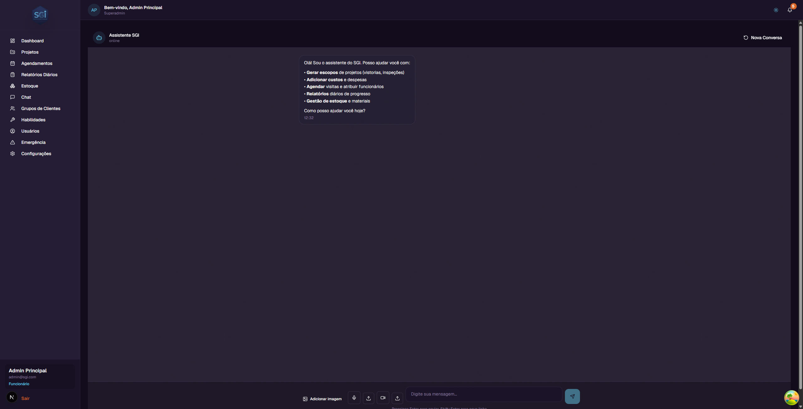

# Chat com Assistente IA - Guia do Usuario

Neste guia, voce vai aprender tudo sobre o **Chat com Assistente IA** do SGI - o coracao do sistema. Aqui e onde a inteligencia artificial organiza todo o seu trabalho: gera escopos detalhados, registra custos lendo notas fiscais, agenda visitas, coleta relatorios de progresso, gerencia estoque e projetos - tudo por conversa natural.

> **Por que o Chat e tao importante?** Quase tudo que voce faz manualmente nas outras telas do SGI pode ser feito mais rapido pelo Chat. Basta conversar naturalmente com a IA, como se fosse um assistente pessoal no campo.

---

## 1. O que e o Chat do SGI

O Chat do SGI e o seu **assistente pessoal de campo**. Ele funciona como uma conversa natural onde voce pode:

- **Gerar escopos** detalhados de projetos a partir de texto, fotos, audios ou videos
- **Registrar custos** e despesas, incluindo leitura automatica de notas fiscais
- **Agendar visitas** com sugestao inteligente do melhor funcionario
- **Enviar relatorios** de progresso diario do trabalho em campo
- **Gerenciar estoque** - retirar materiais, consultar quantidades, verificar alertas
- **Gerenciar projetos** - criar, editar, mudar status

### Como funciona

Voce nao precisa escolher nenhum "modo" ou "funcao". A IA entende automaticamente o que voce quer com base na sua mensagem. Se voce diz "gastei R$ 500 na loja", a IA sabe que voce quer registrar um custo. Se voce diz "agendar visita para amanha", a IA sabe que voce quer criar um agendamento.

A conversa se adapta: se voce comeca falando sobre custos e depois muda para agendamento, a IA acompanha naturalmente. Tudo funciona no mesmo chat, sem precisar trocar de tela.

> **Fase de testes:** Atualmente o Chat funciona pelo App (PWA). Apos os testes, funcionara tambem pelo WhatsApp com a mesma logica - so muda a entrada de texto.

---

## 2. A tela do Chat

No menu lateral esquerdo, clique em **"Chat"**. Voce sera levado para a tela do assistente.

### O que voce ve na tela

- **Cabecalho:** "Assistente SGI" com indicador de status que muda conforme o contexto da conversa (veja abaixo)
- **Mensagem inicial:** A IA se apresenta e lista suas 5 capacidades principais
- **Botao "Nova Conversa"** (canto superior direito) - Para iniciar uma conversa do zero
- **Area de conversa:** Onde as mensagens aparecem (estilo WhatsApp)

### Indicador de status

O texto abaixo do nome "Assistente SGI" muda automaticamente conforme o que a IA esta fazendo no momento:

| Status exibido | Quando aparece |
|---------------|----------------|
| **online** | Quando a IA esta pronta para receber qualquer mensagem (padrao) |
| **Assistente Geral** | Respondendo perguntas gerais ou ajudando com duvidas |
| **Work Order** | Gerando ou editando um escopo de trabalho |
| **Adicionando Custo** | Registrando uma despesa ou lendo nota fiscal |
| **Agendamento** | Criando ou consultando agendamentos |
| **Relatorio Diario** | Coletando relatorio de progresso de uma visita |
| **Gestao de Estoque** | Consultando ou movimentando materiais |
| **Gestao de Projetos** | Criando, editando ou consultando projetos |

> **Dica:** O indicador de status ajuda voce a entender o que a IA esta processando. Se voce estiver gerando um escopo e mudar de assunto, o status muda automaticamente para refletir o novo contexto.

### Barra de entrada

Na parte inferior da tela, voce encontra:

| Elemento | O que faz |
|----------|----------|
| **Campo de texto** | "Digite sua mensagem..." - onde voce escreve |
| **Botao de imagem** | Envia fotos (notas fiscais, local de trabalho, documentos) |
| **Botao de microfone** | Grava audio de voz diretamente |
| **Botao de audio** | Envia arquivo de audio ja gravado |
| **Botao de video** | Envia video de vistoria ou walkthrough |
| **Botao enviar** | Envia a mensagem (ou pressione Enter) |

> **Dica:** Pressione **Enter** para enviar a mensagem. Use **Shift+Enter** para pular uma linha sem enviar.

---

## 3. Como a IA funciona

A IA do SGI e inteligente: ela entende o contexto da sua conversa e decide automaticamente qual acao tomar. Voce nao precisa usar comandos especiais ou escolher menus.

### Exemplos de como a IA entende voce

| Voce diz... | A IA entende que voce quer... |
|-------------|-------------------------------|
| "Preciso de um escopo para o projeto X" | Gerar um escopo (Work Order) |
| "Gastei R$ 500 em materiais" | Registrar um custo |
| [Envia foto de nota fiscal] | Ler a nota e registrar o custo |
| "Agendar visita para amanha as 9h" | Criar um agendamento |
| "Cheguei no local" | Iniciar um relatorio de progresso |
| "Quanto tem de cimento no estoque?" | Consultar o estoque |
| "Criar um novo projeto" | Criar um projeto |
| "Oi, bom dia!" | Cumprimentar e oferecer ajuda |

### A conversa se adapta naturalmente

A IA lembra do contexto da sua conversa. Voce nao precisa repetir informacoes:

> **Voce:** "Preciso gerar um escopo para o projeto Rua das Flores"
> **IA:** "Entendido! Vou coletar as informacoes do escopo para o projeto 'Instalacao Carpete - Rua das Flores 123'. Descreva o trabalho que precisa ser feito."
> **Voce:** "Instalar 100 SF de drywall no banheiro"
> **IA:** "Adicionei ao escopo: Drywall - Install Drywall, 100 SF, Banheiro. Mais algum item?"
> **Voce:** "Nao, e so isso. Ah, e agenda uma visita para amanha as 9h"
> **IA:** "Perfeito! Escopo finalizado. Agora vou agendar a visita. Verificando disponibilidade... Recomendo Joao Silva (skill: Drywall). Confirma para amanha as 09:00?"

Veja como a conversa mudou naturalmente de "gerar escopo" para "agendar visita" sem nenhuma interrupcao.

---

## 4. Gerar Escopos (Work Order)

### O que e um escopo

O **escopo** (tambem chamado de Work Order ou Ordem de Servico) e o **detalhamento completo do trabalho** que precisa ser feito em um projeto. Ele organiza todas as tarefas em categorias profissionais, na ordem de execucao real da obra.

Cada item do escopo tem:
- **Tarefa** - O que precisa ser feito (ex: "Install Drywall")
- **Acao** - Tipo de acao: Install (Instalar), Remove (Remover) ou Detach & Reset (Desmontar e Remontar)
- **Tipo** - Labor (Mao de Obra), Material ou Equipment (Equipamento)
- **Quantidade** - Quanto (ex: 100)
- **Unidade** - Medida usada (ex: SF - pe quadrado, EA - unidade)
- **Comodo** - Onde sera feito (ex: Banheiro, Cozinha)
- **Notas** - Observacoes adicionais

O escopo e conectado diretamente a aba **"Escopo"** do projeto. Quando voce gera um escopo pelo Chat, ele aparece automaticamente no detalhe do projeto.

### O poder da geracao de escopo

O que torna o SGI especial e a capacidade de **gerar escopos completos a partir de qualquer tipo de entrada**:

| Entrada | O que a IA faz |
|---------|---------------|
| **Texto** | Voce descreve o trabalho e a IA organiza em categorias |
| **Fotos** | A IA analisa as fotos e identifica materiais, condicoes e dimensoes |
| **Audio** | Voce grava falando sobre o trabalho e a IA transcreve e organiza |
| **Video** | A IA analisa o video quadro a quadro, extraindo informacoes visuais e de audio |

Voce pode ate **combinar** varios tipos de entrada na mesma conversa!

---

## 5. Gerando escopo por texto

A forma mais simples de gerar um escopo e descrevendo o trabalho por texto.

### Exemplo completo de conversa

> **Voce:** "Preciso gerar um escopo para o projeto da Rua Dr. Melo Alves"
> **IA:** "Encontrei o projeto 'Instalacao Hidraulica - Rua Dr. Melo Alves, 700'. Vou coletar os itens do escopo. Descreva o trabalho que precisa ser feito."
>
> **Voce:** "Preciso instalar 100 SF de drywall no banheiro principal e pintar 2 quartos, cada um com 200 SF"
> **IA:** "Entendido! Vou organizar o escopo:
>
> **Categoria DRY - Drywall:**
> - Install Drywall | Labor | 100 SF | Banheiro Principal
>
> **Categoria PNT - Painting:**
> - Install Paint | Labor | 200 SF | Quarto 1
> - Install Paint | Labor | 200 SF | Quarto 2
>
> Total: 3 itens em 2 categorias. Deseja adicionar mais itens?"
>
> **Voce:** "Sim, tambem precisa trocar o piso do banheiro, 50 SF de ceramica"
> **IA:** "Adicionado!
>
> **Categoria TIL - Tile:**
> - Install Tile | Labor | 50 SF | Banheiro Principal
>
> Total atualizado: 4 itens em 3 categorias. Mais alguma coisa?"
>
> **Voce:** "Nao, pode finalizar"
> **IA:** "Escopo enviado para revisao! Resumo final:
> - DRY (Drywall): 1 item - 100 SF
> - PNT (Painting): 2 itens - 400 SF total
> - TIL (Tile): 1 item - 50 SF
>
> O escopo esta disponivel na aba 'Escopo' do projeto. Um administrador pode revisar e aprovar."

### Dicas para descrever o trabalho

- **Seja especifico com quantidades:** "100 SF de drywall" e melhor que "drywall no banheiro"
- **Mencione os comodos:** "pintura na sala" ajuda a organizar por local
- **Use acoes claras:** "instalar", "remover", "trocar" ajudam a IA a classificar corretamente
- **Pode misturar idiomas:** "50 SF de tile no bathroom" funciona perfeitamente

---

## 6. Gerando escopo a partir de fotos

Uma das funcionalidades mais poderosas do SGI e a capacidade de **analisar fotos** para gerar escopos automaticamente.

### Como funciona

1. Envie uma ou mais fotos do local de trabalho
2. A IA analisa as imagens e identifica:
   - **Comodos** e espacos visiveis
   - **Materiais** existentes e suas condicoes
   - **Dimensoes** aproximadas
   - **Problemas** ou danos visiveis
3. A IA sugere automaticamente itens e categorias para o escopo

### Exemplo de conversa

> **Voce:** "Vou enviar fotos da vistoria do apartamento"
> **Voce:** [Envia 3 fotos: banheiro com azulejo danificado, quarto com parede descascando, cozinha com piso quebrado]
>
> **IA:** "Analisei as 3 fotos. Identifiquei:
>
> **Foto 1 - Banheiro:**
> - Azulejo com trincas e juntas deterioradas
> - Estimativa: ~40 SF de area a ser trocada
>
> **Foto 2 - Quarto:**
> - Parede com pintura descascando
> - Necessita preparacao de superficie + repintura
> - Estimativa: ~150 SF de area
>
> **Foto 3 - Cozinha:**
> - Piso ceramico quebrado em varios pontos
> - Estimativa: ~60 SF de area
>
> Sugiro o seguinte escopo:
>
> **TIL - Tile:** Remove + Install Tile | 40 SF | Banheiro
> **PNT - Painting:** Install Paint | 150 SF | Quarto
> **FCW - Floor Covering:** Remove + Install Floor | 60 SF | Cozinha
>
> Deseja confirmar, ajustar quantidades ou adicionar mais itens?"
>
> **Voce:** "O banheiro e maior, sao 60 SF na verdade"
> **IA:** "Corrigido! Tile no Banheiro: 40 SF → 60 SF. Mais algum ajuste?"

### Dicas para fotos

- **Tire fotos de angulos diferentes** para a IA ter mais contexto
- **Inclua referencia de tamanho** (ex: uma fita metrica visivel) para estimativas mais precisas
- **Fotos claras e bem iluminadas** dao melhores resultados
- **Pode enviar varias fotos** de uma vez - a IA analisa todas

---

## 7. Gerando escopo a partir de audio

Ideal para **vistorias no campo**. Voce pode caminhar pelo local falando naturalmente sobre o que precisa ser feito, e a IA transcreve e organiza tudo.

### Como funciona

1. Clique no botao de **microfone** para gravar ou envie um **arquivo de audio**
2. A IA transcreve o audio automaticamente
3. Extrai informacoes estruturadas (tarefas, quantidades, comodos)
4. Organiza em categorias do escopo

### Exemplo de conversa

> **Voce:** [Grava audio de 2 minutos caminhando pelo local]
> *"Estou no banheiro principal, precisa trocar todo o azulejo, uns 60 pes quadrados. A pia tambem precisa ser reinstalada. Agora estou no quarto... aqui e pintura, umas 200 pes quadrados de parede. Tem um buraco no drywall perto da janela, uns 4 pes quadrados que precisa patchar. Na cozinha o encanamento esta vazando debaixo da pia, precisa trocar a tubulacao."*
>
> **IA:** "Transcri o audio e organizei o escopo:
>
> **TIL - Tile:**
> - Remove + Install Tile | 60 SF | Banheiro Principal
>
> **PLM - Plumbing:**
> - Detach & Reset Sink | 1 EA | Banheiro Principal
> - Remove + Install Plumbing | 1 EA | Cozinha (vazamento)
>
> **DRY - Drywall:**
> - Install Drywall Patch | 4 SF | Quarto (buraco perto da janela)
>
> **PNT - Painting:**
> - Install Paint | 200 SF | Quarto
>
> Total: 5 itens em 4 categorias. Esta correto?"

### Dicas para gravacao de audio

- **Fale naturalmente** - nao precisa ser formal
- **Mencione o comodo** quando mudar de ambiente ("agora estou na cozinha...")
- **De quantidades** quando possivel ("uns 100 pes quadrados")
- **Pode misturar idiomas** - a IA entende portugues e ingles
- **Gravacoes mais longas** sao melhores - mais detalhes = escopo mais preciso

---

## 8. Gerando escopo a partir de video

A forma **mais completa** de gerar um escopo. A IA analisa o video quadro a quadro, combinando informacoes visuais e de audio para maximo de detalhes.

### Como funciona

1. Clique no botao de **video** e envie o arquivo
2. A IA analisa:
   - **Frames do video** - identifica comodos, materiais, dimensoes, danos
   - **Audio do video** - transcreve seus comentarios durante a gravacao
3. Combina ambas as fontes para um escopo mais completo

### Exemplo de conversa

> **Voce:** [Envia video de 3 minutos fazendo walkthrough do apartamento, comentando enquanto filma]
>
> **IA:** "Analisei o video completo. Combinei o que vi nas imagens com seus comentarios:
>
> **Identificado visualmente:**
> - Banheiro: azulejo danificado, pia antiga, box de vidro trincado
> - Quarto: paredes com pintura descascando, buraco no drywall
> - Cozinha: piso ceramico quebrado, vazamento visivel sob a pia
>
> **Dos seus comentarios:**
> - Banheiro: 60 SF de azulejo, reinstalar pia
> - Quarto: 200 SF de pintura, 4 SF de patch no drywall
> - Cozinha: trocar encanamento
>
> **Escopo sugerido:**
> - TIL: 60 SF | Banheiro
> - PLM: Sink (Banheiro) + Plumbing (Cozinha)
> - GLS: 1 EA Glass Box | Banheiro (trincado - nao mencionado no audio, vi nas imagens)
> - DRY: 4 SF Patch | Quarto
> - PNT: 200 SF | Quarto
> - FCW: ~60 SF Floor | Cozinha
>
> Notei que o box de vidro esta trincado mas voce nao mencionou. Deseja incluir no escopo?"

Note como a IA **complementou** as informacoes do audio com o que viu nas imagens, identificando o box trincado que nao foi mencionado verbalmente.

### Dicas para videos

> **⚠️ Em fase de testes:** O envio de videos esta em fase de testes. Recomendamos fortemente enviar **videos curtos** (ate 1-2 minutos). Videos longos podem demorar para processar ou ter resultados menos precisos.

- **Videos curtos** - prefira videos de ate 1-2 minutos por comodo
- **Comente enquanto filma** - "aqui precisa de drywall, uns 100 SF"
- **Filme devagar** - de tempo para a IA analisar cada cena
- **Mostre detalhes** - aproxime de danos, trincas, vazamentos
- **Prefira fotos + audio** se o video estiver muito longo - os resultados podem ser melhores

---

## 9. As 16 categorias de trabalho

O escopo do SGI organiza o trabalho em **16 categorias profissionais**, na ordem de execucao real da obra. Isso garante que o trabalho seja feito na sequencia correta.

| Codigo | Nome | Descricao |
|--------|------|-----------|
| **FRM** | Framing (Estrutura) | Estruturas de madeira, paredes, vigas |
| **ELE** | Electrical (Eletrica) | Fiacao, tomadas, interruptores, paineis |
| **INS** | Insulation (Isolamento) | Isolamento termico e acustico |
| **DRY** | Drywall | Placas de gesso, divisorias |
| **MUD** | Mud/Taping (Acabamento Drywall) | Massa, fita, acabamento de juntas |
| **FNC** | Finish Carpentry (Acabamento Carpintaria) | Rodapes, molduras, portas, janelas |
| **PNT** | Painting (Pintura) | Pintura de paredes, tetos, acabamentos |
| **FCW** | Floor Covering (Piso) | Carpete, laminado, vinilico |
| **TIL** | Tile (Ceramica) | Azulejos, pisos ceramicos, porcelanato |
| **PLM** | Plumbing (Encanamento) | Tubulacoes, pias, vasos, chuveiros |
| **DTL** | Details (Detalhes/Hardware) | Macanetas, fechaduras, acessorios |
| **GLS** | Glass/Mirrors (Vidros) | Espelhos, box de vidro, janelas de vidro |
| **CLN** | Cleaning (Limpeza) | Limpeza pos-obra |
| **TCH** | Touch Ups (Retoques) | Retoques finais de pintura e acabamento |
| **CON** | Contents (Moveis) | Moveis, eletrodomesticos, decoracao |
| **DMO** | Demolition (Demolicao) | Demolicao de estruturas existentes |

### Unidades de medida

| Sigla | Nome | Uso |
|-------|------|-----|
| **EA** | Each (Unidade) | Itens individuais (pia, vaso, porta) |
| **SF** | Square Feet (Pe Quadrado) | Areas (paredes, pisos) |
| **LF** | Linear Feet (Pe Linear) | Comprimentos (rodapes, tubulacoes) |
| **SY** | Square Yards (Jarda Quadrada) | Areas maiores (carpete) |
| **HR** | Hours (Horas) | Tempo de trabalho |

> **Nota:** As categorias e unidades seguem o padrao americano de construcao civil, pois o sistema e projetado para atender mercados internacionais. A IA aceita entrada em portugues e converte automaticamente.

---

## 10. Revisando e editando o escopo

Apos a IA gerar o escopo, voce pode revisar e ajustar antes de finalizar.

### O que voce pode fazer

- **Adicionar mais itens:** "Adicione 50 LF de rodape na sala"
- **Remover itens:** "Remova o item de pintura do quarto 2"
- **Alterar quantidades:** "O drywall do banheiro sao 80 SF, nao 60"
- **Mudar comodos:** "O tile e na cozinha, nao no banheiro"
- **Confirmar e enviar:** "Pode finalizar o escopo"

### Status do escopo

| Status | Significado |
|--------|-------------|
| **Rascunho (Draft)** | Escopo sendo montado, pode ser editado livremente |
| **Pronto para Revisao (Ready for Review)** | Escopo finalizado, aguardando aprovacao do admin |
| **Aprovado (Approved)** | Escopo aprovado e pronto para execucao |
| **Em Andamento (In Progress)** | Trabalho em execucao |
| **Concluido (Completed)** | Trabalho finalizado |

### Exemplo de edicao

> **IA:** "Escopo atual tem 4 itens. Deseja ajustar algo?"
> **Voce:** "O drywall na verdade sao 120 SF, e adiciona demolição do piso antigo na cozinha, 60 SF"
> **IA:** "Atualizado!
> - DRY: 100 SF → 120 SF (Banheiro Principal)
> - DMO: Adicionado - Remove Floor | 60 SF | Cozinha
>
> Total: 5 itens em 4 categorias. Mais algum ajuste?"

---

## 11. Como o escopo aparece no projeto

Apos finalizar o escopo pelo Chat, ele aparece automaticamente na aba **"Escopo"** do detalhe do projeto.

### O que voce ve na aba Escopo

- **Categorias colapsaveis** - Clique para expandir/recolher cada categoria
- **Itens detalhados** - Tarefa, acao, tipo, quantidade, unidade, comodo e notas
- **Precos** - Apenas administradores veem os precos estimados
- **Botao de aprovacao** - Administradores podem aprovar o escopo

### Diferenca de visualizacao por cargo

| Informacao | Administrador | Funcionario |
|-----------|:---:|:---:|
| Categorias e itens | Ve | Ve |
| Quantidades e unidades | Ve | Ve |
| Comodos e notas | Ve | Ve |
| Precos unitarios | Ve | Nao ve |
| Precos totais | Ve | Nao ve |
| Botao aprovar | Ve | Nao ve |

> Para mais detalhes sobre a aba Escopo, consulte o **Guia de Projetos**.

---

## 12. Registrar custos pelo Chat

Voce pode registrar custos e despesas de projetos diretamente pelo Chat, sem precisar navegar ate a tela de projetos.

### Exemplo de conversa

> **Voce:** "Gastei R$ 1.250 em materiais na Home Depot para o projeto da Rua das Flores"
> **IA:** "Entendido! Vou registrar o custo:
> - **Projeto:** Instalacao Carpete - Rua das Flores 123
> - **Valor:** R$ 1.250,00
> - **Descricao:** Materiais - Home Depot
> - **Categoria:** Material
>
> Confirma?"
> **Voce:** "Sim"
> **IA:** "Custo registrado com sucesso! Status: Aprovado."

### Quem pode registrar custos

O registro de custos depende das **permissoes do usuario**:

- **Usuarios com permissao "Pode adicionar custos":** Podem registrar custos normalmente pelo Chat. O custo e criado no projeto.
- **Usuarios sem essa permissao:** **Nao conseguem registrar custos** pelo Chat. A IA informa que voce nao tem autorizacao para essa operacao.

> **Nota:** As permissoes sao configuradas pelo administrador na tela de Usuarios. Consulte o **Guia de Usuarios e Habilidades** para mais detalhes.

---

## 13. Leitura automatica de notas fiscais (OCR)

Uma das funcionalidades mais praticas do SGI: basta **enviar uma foto da nota fiscal** e a IA le tudo automaticamente.

### Como funciona

1. Tire uma foto da nota fiscal ou recibo
2. Envie a foto no Chat
3. A IA usa visao computacional para extrair:
   - **Valor total** da compra
   - **Itens** comprados (nome, quantidade, preco unitario)
   - **Fornecedor** (nome da loja)
   - **Data** da compra
4. Voce confere os dados e confirma

### Exemplo de conversa

> **Voce:** [Envia foto de uma nota fiscal da loja de materiais]
>
> **IA:** "Analisei a nota fiscal. Identifiquei:
>
> **Fornecedor:** Casa dos Materiais Ltda
> **Data:** 10/02/2026
> **Total:** R$ 2.350,00
>
> **Itens:**
> | Item | Qtd | Preco Unit. | Total |
> |------|-----|-------------|-------|
> | Tinta Acrilica Branca 18L | 5 | R$ 250,00 | R$ 1.250,00 |
> | Rolo de La 23cm | 10 | R$ 35,00 | R$ 350,00 |
> | Lixa 150 (pct 50) | 3 | R$ 45,00 | R$ 135,00 |
> | Fita Crepe 50mm | 20 | R$ 12,00 | R$ 240,00 |
> | Massa Corrida 25kg | 5 | R$ 75,00 | R$ 375,00 |
>
> Conferiu os dados? Qual projeto devo associar?"
>
> **Voce:** "Dados corretos, projeto da Rua Dr. Melo Alves"
> **IA:** "Custo de R$ 2.350,00 adicionado ao projeto 'Instalacao Hidraulica - Rua Dr. Melo Alves, 700'. Status: Aprovado."

### Dicas para fotos de notas fiscais

- **Foto plana e bem iluminada** - evite sombras e reflexos
- **Inclua toda a nota** - a IA precisa ver o valor total e os itens
- **Pode ser nota impressa ou eletronica** (tela do celular)
- **Se a nota estiver amassada**, tente alisar antes de fotografar

> **Nota:** Se a IA nao conseguir ler algum campo, ela vai pedir para voce informar manualmente. Voce sempre confirma antes de salvar.

---

## 14. Agendar visitas pelo Chat

Agendar uma visita pelo Chat e mais rapido do que pela tela de Agendamentos, porque a IA sugere automaticamente o melhor funcionario.

### Exemplo de conversa

> **Voce:** "Preciso agendar uma visita para o projeto da Rua das Flores, amanha as 9h"
> **IA:** "Verificando disponibilidade para o projeto 'Instalacao Carpete - Rua das Flores 123'...
>
> **Recomendo:** Joao Silva
> - Habilidade: Instalacao de Carpete
> - Disponivel amanha as 09:00
> - Sem conflitos de agenda
>
> Confirma o agendamento?"
> **Voce:** "Confirma"
> **IA:** "Agendamento criado!
> - Funcionario: Joao Silva
> - Data: 15/02/2026 as 09:00
> - Duracao: 2 horas
> - Projeto: Instalacao Carpete - Rua das Flores 123
>
> Notificacao enviada para Joao Silva."

### Como a IA sugere o funcionario

A IA analisa 3 criterios para fazer uma **sugestao**:
1. **Habilidades (Skills)** - Seleciona funcionarios com a competencia certa para o trabalho
2. **Disponibilidade** - Verifica a agenda para evitar conflitos de horario
3. **Carga de trabalho** - Prefere funcionarios com menos agendamentos no periodo

> **Importante:** A sugestao da IA e apenas uma **recomendacao**. O administrador tem **total controle** sobre quem sera agendado. Voce pode aceitar a sugestao, escolher outro funcionario, ou pedir para a IA mostrar outras opcoes. A decisao final e sempre sua.

> **Nota:** Administradores podem agendar para qualquer funcionario. Funcionarios veem apenas seus proprios agendamentos.

---

## 15. Enviar relatorios de progresso pelo Chat

Os relatorios diarios sao gerados pelos funcionarios no campo, diretamente pelo Chat. Nao ha botao de "criar relatorio" na pagina de Relatorios Diarios - eles sao criados aqui.

### Fluxo completo: do inicio ao fim de uma visita

#### 1. Chegando no local

> **Voce:** "Cheguei no projeto da Rua das Flores"
> **IA:** "Visita iniciada! Projeto: 'Instalacao Carpete - Rua das Flores 123'. Bom trabalho! Me avise sobre o progresso durante o dia."

#### 2. Reportando progresso

> **Voce:** "Fiz 40% do carpete, terminei a sala e estou comecando os quartos"
> **IA:** "Progresso atualizado: 40% concluido. Tarefas registradas:
> - Instalacao de carpete na sala (concluida)
> - Inicio da instalacao nos quartos
>
> Continue assim!"

> **Voce:** [Envia 2 fotos do carpete instalado na sala]
> **IA:** "Fotos recebidas e anexadas ao relatorio. O trabalho esta ficando otimo!"

#### 3. Reportando problemas

> **Voce:** "Encontrei um problema: o contrapiso do quarto 2 esta irregular, vai precisar de nivelamento antes do carpete"
> **IA:** "Problema registrado no relatorio:
> - 'Contrapiso irregular no quarto 2 - necessita nivelamento'
>
> Deseja continuar o trabalho nos outros comodos enquanto isso?"

#### 4. Finalizando a visita

> **Voce:** "Terminei por hoje. Fiz 75% do total, faltam os 2 quartos menores"
> **IA:** "Relatorio finalizado!
>
> **Resumo do dia:**
> - Progresso: 75%
> - Tarefas concluidas: Carpete na sala, Carpete no quarto 1
> - Problemas: Contrapiso irregular no quarto 2
> - Fotos: 2 anexos
>
> Relatorio enviado e disponivel na pagina de Relatorios Diarios e na aba Relatorios do projeto. Bom descanso!"

---

## 16. O que um relatorio contem

Cada relatorio gerado pelo Chat inclui:

| Campo | Descricao | Exemplo |
|-------|-----------|---------|
| **Projeto** | Nome do projeto | Instalacao Carpete - Rua das Flores 123 |
| **Data** | Quando o relatorio foi enviado | 15/02/2026 |
| **Funcionario** | Quem enviou | Joao Silva |
| **Progresso** | Porcentagem de conclusao | 75% |
| **Tarefas concluidas** | Lista do que foi feito | Carpete na sala, Carpete no quarto 1 |
| **Problemas** | Dificuldades encontradas | Contrapiso irregular no quarto 2 |
| **Notas** | Observacoes adicionais | Faltam quartos menores |
| **Fotos** | Imagens do progresso | 2 fotos anexadas |

### Onde o relatorio aparece

- **Pagina de Relatorios Diarios** (menu lateral > "Relatorios Diarios")
- **Aba "Relatorios"** no detalhe do projeto correspondente

### Quem ve o que

| Cargo | Acesso |
|-------|--------|
| **Administrador** | Ve **todos** os relatorios de todos os funcionarios |
| **Funcionario** | Ve apenas **seus proprios** relatorios |

> Para mais detalhes sobre a pagina de Relatorios Diarios, consulte o **Guia de Agendamentos, Relatorios, Configuracoes e Emergencia**.

---

## 17. Gerenciar estoque pelo Chat

Voce pode consultar e movimentar o estoque diretamente pelo Chat, sem precisar ir ate a tela de Estoque.

### Operacoes disponiveis

#### Consultar quantidade
> **Voce:** "Quanto tem de tinta branca no estoque?"
> **IA:** "Estoque de tinta branca:
> - Tinta Acrilica Branca 18L: **12 latas** (Preco medio: R$ 250,00)
> - Valor total em estoque: R$ 3.000,00
>
> Deseja fazer alguma operacao?"

#### Retirar material para projeto
> **Voce:** "Retirar 5 latas de tinta branca para o projeto Rua Dr. Melo Alves"
> **IA:** "Confirme a retirada:
> - Material: Tinta Acrilica Branca 18L
> - Quantidade: 5 latas
> - Projeto: Instalacao Hidraulica - Rua Dr. Melo Alves, 700
> - Custo estimado: R$ 1.250,00 (5 x R$ 250,00)
>
> Confirma?"
> **Voce:** "Sim"
> **IA:** "Retirada registrada!
> - Estoque atualizado: 12 → 7 latas
> - Custo de R$ 1.250,00 adicionado ao projeto (aprovado)
>
> ⚠️ Alerta: Estoque baixo! Quantidade minima configurada: 10 latas."

#### Verificar estoque baixo
> **Voce:** "Quais itens estao com estoque baixo?"
> **IA:** "1 item com estoque baixo:
> - **Tinta Acrilica Branca 18L:** 7 latas (minimo: 10)
>
> Recomendo repor o estoque."

> Para mais detalhes sobre o sistema de estoque, consulte o **Guia de Estoque**.

---

## 18. Gerenciar projetos pelo Chat

Administradores podem criar e gerenciar projetos diretamente pelo Chat.

> **Importante:** Apenas administradores e super administradores podem usar estas funcoes. Funcionarios nao tem acesso.

### Criar um projeto

> **Voce:** "Criar um novo projeto de Pintura Residencial no endereco Av. Paulista 1000"
> **IA:** "Vou criar o projeto. Alguma descricao ou observacao adicional?"
> **Voce:** "Pintura completa de 3 quartos e sala, cliente Ana Silva"
> **IA:** "Projeto criado com sucesso!
> - Nome: Pintura Residencial
> - Endereco: Av. Paulista 1000, Sao Paulo
> - Descricao: Pintura completa de 3 quartos e sala
> - Cliente: Ana Silva
> - Status: Pendente"

### Mudar status de um projeto

> **Voce:** "Mudar status do projeto Av. Paulista para em espera"
> **IA:** "Encontrei o projeto 'Pintura Residencial - Av. Paulista 1000'. Qual o motivo da pausa?"
> **Voce:** "Aguardando entrega de materiais do fornecedor"
> **IA:** "Status atualizado: Pendente → Em Espera
> Motivo: Aguardando entrega de materiais do fornecedor"

### Consultar projetos

> **Voce:** "Quais sao meus projetos ativos?"
> **IA:** "Voce tem 3 projetos ativos:
> 1. Instalacao Carpete - Rua das Flores 123 (Em Andamento, 75%)
> 2. Instalacao Hidraulica - Rua Dr. Melo Alves, 700 (Em Andamento, 30%)
> 3. Pintura Residencial - Av. Paulista 1000 (Em Espera)"

> Para mais detalhes sobre gerenciamento de projetos, consulte o **Guia de Projetos**.

---

## 19. Tipos de entrada aceitos

O Chat aceita 4 tipos de entrada, e voce pode combinar texto com qualquer um deles:

| Tipo | Formatos | Uso principal |
|------|----------|---------------|
| **Texto** | Digitado no campo | Todos os comandos e conversas |
| **Imagem** | JPG, PNG, HEIC | Notas fiscais (OCR), fotos do local, documentos |
| **Audio** | MP3, OGG, AAC, WAV | Descricao verbal de escopos, vistorias no campo |
| **Video** | MP4, MOV | Walkthrough de locais, vistorias completas |

### Quais funcoes aceitam quais tipos

| Funcao | Texto | Imagem | Audio | Video |
|--------|:---:|:---:|:---:|:---:|
| Gerar escopos | Sim | Sim | Sim | Sim* |
| Registrar custos | Sim | Sim (OCR) | Sim | - |
| Agendar visitas | Sim | - | Sim | - |
| Relatorios diarios | Sim | Sim | Sim | Sim* |
| Gerenciar estoque | Sim | - | Sim | - |
| Gerenciar projetos | Sim | - | Sim | - |

> **Audio em todas as funcoes:** Voce pode usar audio em qualquer funcao do Chat. A IA transcreve automaticamente o que voce fala e interpreta a intencao. Por exemplo, grave um audio dizendo "gastei 500 reais em material" e a IA registra o custo.
>
> **\*Videos em fase de testes:** A funcionalidade de envio de videos esta em **fase de testes**. Recomendamos fortemente enviar **videos curtos** (ate 1-2 minutos) para melhores resultados. Videos muito longos podem demorar para processar ou ter resultados menos precisos.

---

## 20. Dicas para usar melhor o Chat

### Seja especifico

| Menos eficaz | Mais eficaz |
|-------------|------------|
| "Preciso de algo" | "Preciso agendar uma visita para amanha" |
| "Tem coisa no estoque?" | "Quanto tem de cimento no estoque?" |
| "Gastei dinheiro" | "Gastei R$ 500 em materiais na Home Depot" |

### Use o tipo de entrada certo

- **Notas fiscais?** Envie uma foto - a IA le automaticamente
- **Vistoria no campo?** Grave um audio enquanto caminha pelo local
- **Walkthrough completo?** Filme um video mostrando todos os comodos
- **Escopo simples?** Descreva por texto mesmo

### A IA lembra do contexto (com limites)

Dentro da mesma conversa, voce nao precisa repetir informacoes. Se voce ja selecionou um projeto, a IA lembra:

> **Voce:** "Gastei R$ 200 em parafusos"
> **IA:** "Registrado no projeto 'Instalacao Carpete - Rua das Flores 123' (mesmo projeto da conversa). Confirma?"

**Porem, o contexto tem limites:**
- A IA lembra bem das **ultimas mensagens** da conversa (as mais recentes)
- Conversas muito longas passam por uma **compactacao automatica**: mensagens antigas sao resumidas para liberar espaco, e alguns detalhes podem se perder
- Informacoes de **semanas ou meses atras** provavelmente nao estarao mais acessiveis na memoria da IA
- Se voce precisa que a IA lembre algo especifico de muito tempo atras, **repita a informacao** na conversa atual

> **Dica pratica:** Para tarefas novas, nao dependa da IA lembrar detalhes de conversas muito antigas. Informe os dados necessarios (projeto, endereco, valores) novamente. Se a conversa ficou muito longa, use o botao **"Nova Conversa"** e comece do zero.

### Se algo deu errado

- Diga **"cancelar"** ou **"desfazer"** para reverter a ultima acao
- Use o botao **"Nova Conversa"** para comecar do zero
- A IA sempre **pede confirmacao** antes de executar acoes importantes

### Pode misturar idiomas

A IA entende portugues e ingles. Voce pode dizer "Preciso de 100 SF de drywall no bathroom" e funciona perfeitamente.

---

## 21. Resumo rapido

### O que dizer no Chat para cada acao

| Voce quer... | Diga isso no Chat... |
|-------------|---------------------|
| Gerar escopo | "Preciso gerar um escopo para..." ou envie fotos/audio/video |
| Adicionar custo | "Gastei R$ X em..." ou envie foto da nota fiscal |
| Agendar visita | "Agendar visita para o projeto X amanha as 9h" |
| Iniciar visita | "Cheguei no local" ou "Iniciar visita no projeto X" |
| Reportar progresso | "Fiz X% do trabalho" ou envie fotos do progresso |
| Finalizar visita | "Terminei o trabalho" ou "Concluido" |
| Consultar estoque | "Quanto tem de X no estoque?" |
| Retirar material | "Retirar X unidades de Y para o projeto Z" |
| Criar projeto | "Criar projeto de [tipo] no endereco [endereco]" |
| Mudar status | "Mudar status do projeto X para [status]" |
| Consultar projetos | "Quais sao meus projetos ativos?" |
| Ajuda geral | "Como funciona o estoque?" ou "Me ajude com..." |

### Atalhos uteis

| Acao | Como fazer |
|------|-----------|
| Enviar mensagem | Pressione **Enter** |
| Nova linha | Pressione **Shift+Enter** |
| Comecar do zero | Clique em **"Nova Conversa"** |
| Enviar foto | Clique no botao de **imagem** |
| Gravar audio | Clique no botao de **microfone** |
| Enviar video | Clique no botao de **video** |
