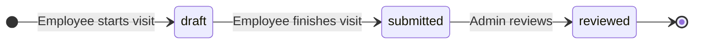

# Daily Reports - User Guide

This guide explains how the **Daily Reports** module in SGI works. Reports are used to track the daily progress of field work.

---

## 1. Accessing Daily Reports

On the left sidebar menu, click **"Relatorios Diarios"** (Daily Reports).

!!! warning "Reports are created ONLY through the Chat"
    **There is no "Create Report" button** on this page. All reports are generated by employees through the **[AI Chat](chat-en.md)** during or after a visit.

    This page is only for **viewing, filtering, and auditing** reports that have already been submitted.

---

## 2. Understanding a report

Each card contains:

| Field | Description | Example |
|-------|-----------|---------|
| **Project** | Project name (card title) | Carpet Installation - 123 Flores Street |
| **Status** | Current status badge | Submitted |
| **Date** | Report date | 02/15/2026 |
| **Employee** | Who submitted | Joao Silva |
| **Progress** | Completion percentage | 75% |
| **Completed tasks** | List of activities performed | Surface preparation, Primer |
| **Issues** | Difficulties encountered | Uneven subfloor in bedroom 2 |
| **Notes** | Additional notes | Smaller bedrooms are missing |
| **Attached photos** | Progress images | 2 photos |

---

## 3. How a report is created (via Chat)

The employee, during the visit, uses the AI Chat to report progress naturally:

> **Employee:** "I arrived at the Flores Street project"
> **AI:** "Visit started! Good work."
>
> **Employee:** "I did 40% of the carpet, finished the living room and am starting the bedrooms"
> **AI:** "Progress updated: 40%. Tasks recorded: living room completed, bedrooms started."
>
> **Employee:** [Sends 2 photos of installed carpet]
> **AI:** "Photos received and attached to the report."
>
> **Employee:** "Found uneven subfloor in bedroom 2, will need leveling"
> **AI:** "Issue recorded."
>
> **Employee:** "I'm done for today, 75%"
> **AI:** "Report finalized and submitted!"

See the [Chat Guide](chat-en.md) for complete details of the flow.

---

## 4. Report status

| Status | Meaning | Who changes it |
|--------|-------------|-----------|
| **Draft** (`draft`) | Under construction during the visit | System (via Chat) |
| **Submitted** (`submitted`) | Employee finalized and submitted | Employee (via Chat "I'm done") |
| **Reviewed** (`reviewed`) | Admin has reviewed | **Admin** (manual action) |

!!! warning "Once submitted, it cannot be edited"
    After the employee marks as **submitted**, they **can no longer edit** the report. If something needs correction, they will have to ask the admin to adjust or create a new report.

---

## 5. Available filters

| Filter | Options | What it does |
|--------|--------|-----------|
| **Filter Type** | All / By Project / By User | Changes the main criterion |
| **By Project** | Projects dropdown | Lists only reports from the selected project |
| **By User** (admin) | Users dropdown | Lists only reports from the employee |

!!! note "Visibility by role"
    - **Administrators/Super Admins:** See **all** reports + filter by user
    - **Employees:** See **only their own** reports

---

## 6. Reports appear in the project detail

Each report also appears in the **"Relatorios"** (Reports) tab of the corresponding project, allowing you to view the entire progress history of the project in one place.

---

## Important Rules

### Required fields

| Field | Required | Limits | Note |
|-------|:---:|:---:|---|
| `projectId` | Yes | - | Project must exist |
| `userId` | Yes | - | Authenticated user |
| `reportDate` | Yes | - | ISO 8601 (YYYY-MM-DD) |
| `progressPercentage` | Yes | 0-100 | Percentage |
| `tasksCompleted` | No | Array of strings | Task list |
| `issues` | No | Array of strings | Issues list |
| `notes` | No | Free text | Notes |
| `attachments` | No | Array | URLs of attached photos |
| `status` | Yes | draft / submitted / reviewed | Current status |

### Required permissions

| Operation | Super Admin | Admin | Employee |
|----------|:---:|:---:|:---:|
| Create via Chat | Yes | Yes | Yes |
| See own reports | Yes | Yes | Yes |
| See everyone's reports | Yes | Yes | **No** |
| Filter by user | Yes | Yes | No |
| Mark as reviewed | Yes | Yes | **No** |
| Edit `submitted` report | No (nobody) | No (nobody) | No |

### Validations that block

!!! warning "Submitted report is immutable"
    Once submitted (`submitted`), **neither the employee nor the admin can edit** the report content. This guarantees audit integrity.

    To correct something: create a new report or add an external comment (outside the system).

!!! danger "Report cannot be deleted by the employee"
    Employees **do not have permission** to delete their own reports. Only admins can delete (via direct Firestore).

### System defaults

| Setting | Value | Note |
|---|---|---|
| Initial status | `draft` | Automatic on "I arrived at the location" |
| Automatic transition | `draft -> submitted` | When saying "I'm done" in Chat |
| Review | Manual | Admin must mark as `reviewed` |

---

## Quick summary

| You want to... | Do this... |
|-------------|-------------|
| See all reports | "Relatorios Diarios" (Daily Reports) menu |
| See reports for a project | Filter "By Project" OR go to the "Relatorios" (Reports) tab of the project |
| See reports from an employee | Filter "By User" (admin) |
| Create a report | **Through the [AI Chat](chat-en.md)** - there is no other path |
| Mark as reviewed | Admin, directly on the report card |
