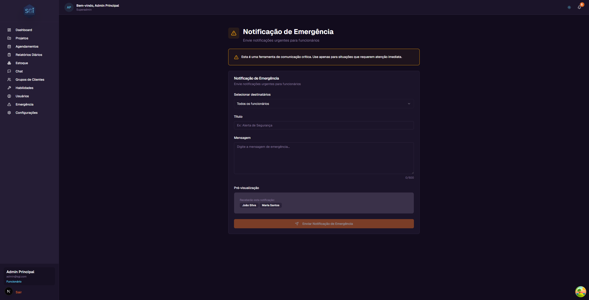
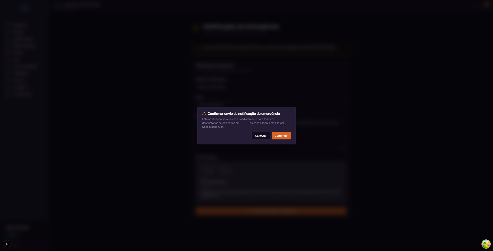

# Emergency Notification - User Guide

This guide explains the **Emergency Notifications** functionality in SGI, used by administrators to send urgent alerts to employees.

!!! danger "Critical communication tool"
    Use **only for situations that require immediate attention**. Emergency notifications:

    - Ignore users' notification preferences
    - Are sent on **all available channels** (App, Email, Push)
    - Generate an audit log in the system
    - Count toward the admin's rate limit (5 per minute)

    **Do not use for routine communication** - this generates distrust and may cause users to ignore real alerts.

---

## 1. Accessing the screen

On the left sidebar menu, click **"Emergencia"** (Emergency) (only admins see this option).

---

## 2. The form

### Available fields

| Field | Description | Limit |
|-------|-----------|--------|
| **Recipients** | Who will receive (see 3 modes below) | Maximum 100 users |
| **Title** | Short emergency title | 100 characters |
| **Message** | Detailed description | 500 characters (visible counter) |
| **Preview** | Shows in real time what will be sent | - |

### 3 modes for selecting recipients

| Mode | What it does |
|------|-----------|
| **All employees** | Sends to all active employees (up to 100) |
| **By project** | Only those assigned to a specific project |
| **Manual selection** | Individual checkboxes |

---

## 3. Sending the notification

### Step-by-step

1. Select the **recipient mode**
2. Choose who will receive
3. Fill in **Title** (max 100 chars) and **Message** (max 500 chars)
4. Check the **preview**
5. Click **"Enviar Notificacao de Emergencia"** (Send Emergency Notification)

### Confirmation window

The confirmation warns:

> **"This notification will be sent immediately to all selected recipients on ALL channels (App, Email, Push). Do you want to continue?"**

Click **"Confirmar"** (Confirm) to send or **"Cancelar"** (Cancel) to go back.

!!! tip "There is no way to undo"
    Once sent, the notification **cannot be retrieved**. Verify recipients, title, and message before confirming.

---

## 4. What happens after sending

1. **System distributes** to all selected recipients
2. Each user receives on **3 simultaneous channels** (even if they have turned them off in preferences):
   - **App:** appears on the bell icon (red highlight)
   - **Email:** sent to registered email
   - **Push:** browser pop-up (if permission granted)
3. **Audit log** is generated in the system with: who sent it, when, how many received, title
4. The sending admin **counts toward the rate limit** (5 sends/minute)

---

## Important Rules

### Limits

| Item | Limit | Consequence if exceeded |
|------|--------|----------------------------|
| **Characters in title** | 100 | System prevents sending (form validation) |
| **Characters in message** | 500 | Counter shows how much is left; blocks sending |
| **Recipients per send** | 100 | System returns error |
| **Sends per minute (rate limit)** | 5 per admin | "Rate limit exceeded" error - wait 1 min |

### Required permissions

| Operation | Super Admin | Admin | Employee |
|----------|:---:|:---:|:---:|
| See "Emergencia" (Emergency) menu | Yes | Yes | No |
| Send emergency notification | **Yes** | **Yes** | No |
| Receive emergency notification | Yes | Yes | Yes |

### Validations that block

!!! warning "Rate limit: 5 per minute"
    Each admin can send **at most 5 emergency notifications per minute**. Beyond that, the system temporarily blocks and returns an error. This protects against abuse.

!!! warning "Maximum 100 recipients"
    If your selection has more than 100 users, the system blocks sending. To reach a larger group, split into separate batches.

### Differences from regular notifications

| Characteristic | Regular Notification | Emergency Notification |
|---|:---:|:---:|
| Respects user preferences | Yes | **No** (ignores) |
| Channels sent | Configurable | **All** (In-App, Email, Push) |
| Sender rate limit | No | **5/minute** |
| Audit log | No | **Yes** |
| Priority | normal | **emergency** |
| TTL (expiration) | 30 days | 30 days |

### System defaults

| Setting | Value |
|---|---|
| Priority | `emergency` |
| Channels sent | All available |
| Rate limit | 5/min per admin |
| Max recipients | 100 per send |
| Audit log | Always |

---

## Quick summary

| You want to... | Do this... |
|-------------|-------------|
| Send emergency alert | "Emergencia" (Emergency) menu |
| Send to all employees | Select "All employees" |
| Send to a project team | Select "By project" and choose the project |
| Send to specific people | Select "Manual selection" + checkboxes |

---

## Best practices

!!! tip "Use sparingly"
    Emergencies "lose value" if sent too frequently. Reserve for:

    - Workplace safety issues
    - Situations affecting the entire team immediately
    - Last-minute changes to critical deadlines
    - Client alerts that require rapid response

!!! tip "Be objective"
    Short and direct title ("Evacuation Paulista building 1000"), message with **what to do** and **when**. Do not use corporate jargon in emergencies.

!!! danger "Never use for routine communication"
    If you are using "Emergency" for:

    - General notices
    - Meeting reminders
    - Administrative information

    **Stop.** Use Chat, email, or regular notifications. Emergency loses its value if it becomes routine.
