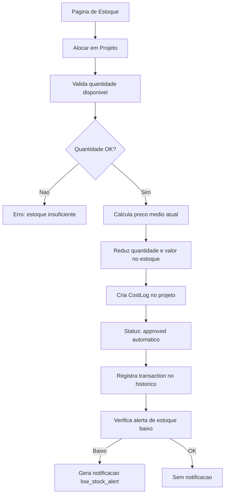

# Estoque - Guia do Usuario

Neste guia, voce vai aprender tudo sobre a tela de **Estoque** do SGI. Aqui e onde voce controla os materiais da empresa, acompanha valores e aloca itens para projetos.

---

## 1. Acessando a tela de Estoque

No menu lateral esquerdo, clique em **"Estoque"**. Voce sera levado para a pagina com todos os itens cadastrados.


---

## 2. Entendendo a tela principal

### Cards de resumo

No topo da pagina, existem 4 cards com informacoes gerais:

| Card | O que mostra | Exemplo |
|------|-------------|---------|
| **Total de Itens** | Quantos itens estao cadastrados no estoque | 9 |
| **Valor Total** | A soma do valor de todos os itens em estoque | R$ 38.460,00 |
| **Baixo Estoque** | Quantos itens estao com quantidade abaixo do minimo | 1 |
| **Categorias** | Quantas categorias diferentes existem | 5 |

### Campo de busca

Abaixo dos cards, existe um campo de busca com o texto "Pesquisar". Digite o nome de um item para filtrar a lista.

### Card de cada item

Cada item aparece como um card com as seguintes informacoes:

- **Nome** - Nome do material (ex: "Cimento CP-II 50kg")
- **Descricao** - Detalhes sobre o material
- **Categoria** - Tag colorida indicando a categoria (ex: Construcao, Pintura, Eletrica)
- **Unidade** - Tag indicando a unidade de medida (ex: sacos, latas, m3)
- **Quantidade** - Quantas unidades existem em estoque
- **Valor Total** - Quanto vale todo o estoque desse item (ex: R$ 6.750,00)
- **Preco Medio** - Valor medio por unidade (ex: R$ 45,00)
- **Qtd. Minima** - Quantidade minima configurada para alerta
- **Ultima Atualizacao** - Data da ultima movimentacao

### Alerta de estoque baixo

Quando a quantidade de um item fica abaixo da "Quantidade Minima", uma tag vermelha **"Estoque baixo!"** aparece no card do item.


O card "Baixo Estoque" no topo da pagina mostra quantos itens estao nessa situacao.

---

## 3. Menu de acoes do item

Cada card de item tem um botao de menu (**...**) no canto superior direito. Ao clicar nele, aparecem 5 opcoes:

| Opcao | O que faz |
|-------|-----------|
| **Editar Item** | Altera nome, descricao, unidade, categoria e quantidade minima |
| **Adicionar Estoque** | Registra uma nova entrada de material (compra) |
| **Alocar em Projeto** | Retira material do estoque e envia para um projeto |
| **Ver Historico** | Mostra todas as entradas e saidas do item |
| **Excluir Item** | Remove o item do sistema (so funciona se quantidade = 0) |

> **Nota:** O botao "Excluir Item" fica desabilitado (cinza) enquanto o item tiver estoque. Voce precisa alocar ou zerar todo o estoque antes de excluir.

---

## 4. Criando um novo item

Para cadastrar um material no estoque, clique no botao **"Novo Item"** no canto superior direito.


Uma janela vai abrir com os seguintes campos:

| Campo | Obrigatorio? | Descricao |
|-------|:---:|-----------:|
| **Nome do Material** | Sim | Nome que identifica o item. Ex: "Cimento CP-II 50kg" |
| **Descricao** | Nao | Detalhes adicionais sobre o material |
| **Unidade de Medida** | Sim | Como o item e medido. Ex: kg, litros, sacos, metros |
| **Categoria** | Nao | Grupo do material. Ex: Construcao, Pintura, Eletrica |
| **Quantidade Inicial** | Nao | Quantas unidades voce ja tem (padrao: 0) |
| **Valor Inicial** | Nao | Valor total do estoque inicial (padrao: 0) |
| **Quantidade Minima para Alerta** | Nao | Abaixo deste numero, o sistema mostra alerta de estoque baixo |

### Exemplo passo a passo

Vamos cadastrar um novo item:

1. Clique em **"Novo Item"**
2. Em **Nome do Material**, digite: `Tinta Acrilica Branca 18L`
3. Em **Descricao**, digite: `Tinta acrilica premium para paredes internas e externas`
4. Em **Unidade de Medida**, digite: `latas`
5. Em **Categoria**, digite: `Pintura`
6. Em **Quantidade Inicial**, digite: `10`
7. Em **Valor Inicial**, digite: `2500` (R$ 2.500,00 por 10 latas = R$ 250,00 cada)
8. Em **Quantidade Minima para Alerta**, digite: `5`S
9. Clique em **"Criar"**

O item sera criado e aparecera na lista com preco medio de R$ 250,00 (R$ 2.500 / 10 latas).

---

## 5. Editando um item

Para editar um item, clique no menu (**...**) do card e selecione **"Editar Item"**.


Voce pode alterar:
- Nome do Material
- Descricao
- Unidade de Medida
- Categoria
- Quantidade Minima para Alerta

> **Importante:** Voce **nao pode** alterar a quantidade ou o valor do item por aqui. Quantidades sao controladas apenas por entradas (compras) e saidas (alocacoes). Isso garante a rastreabilidade completa de todas as movimentacoes.

Apos fazer as alteracoes, clique em **"Salvar"**.

---

## 6. Adicionando estoque (entrada)

Quando voce compra material, precisa registrar a entrada no sistema. Clique no menu (**...**) do item e selecione **"Adicionar Estoque"**.

O sistema oferece dois modos de registro:

### Modo 1: Por Valor Total


Use este modo quando voce sabe o valor total da compra.

**Campos:**
- **Quantidade** - Quantas unidades comprou
- **Valor Total da Entrada** - Quanto pagou no total
- **Observacoes** (opcional) - Notas sobre a compra

**Exemplo:** Voce comprou 50 sacos de cimento por R$ 2.250,00 no total.
- Quantidade: `50`
- Valor Total: `2250`

### Modo 2: Por Valor Unitario


Use este modo quando voce sabe o preco de cada unidade.

**Campos:**
- **Quantidade** - Quantas unidades comprou
- **Valor Unitario** - Quanto pagou por unidade
- **Observacoes** (opcional) - Notas sobre a compra

**Exemplo:** Voce comprou 50 sacos de cimento a R$ 45,00 cada.
- Quantidade: `50`
- Valor Unitario: `45`

### Quando usar cada modo

| Situacao | Modo recomendado |
|----------|-----------------|
| Nota fiscal mostra valor total | Por Valor Total |
| Nota fiscal mostra preco unitario | Por Valor Unitario |
| Compra com desconto no lote | Por Valor Total |
| Compra com preco tabelado por unidade | Por Valor Unitario |

Apos preencher, clique em **"Adicionar Estoque"**. A quantidade e o valor do item serao atualizados automaticamente.

---

## 7. Como funciona o Preco Medio

O SGI usa um sistema chamado **Preco Medio Ponderado** para calcular o valor dos itens em estoque. Entender esse calculo ajuda voce a saber por que os valores mudam a cada compra.

### A formula e simples

```
Preco Medio = Valor Total em Estoque / Quantidade em Estoque
```

### Exemplo pratico

Imagine que voce tem **100 sacos de cimento** no estoque, com valor total de **R$ 4.000,00**:

- Preco medio atual: R$ 4.000 / 100 = **R$ 40,00 por saco**

Agora voce compra mais **50 sacos por R$ 2.250,00** (R$ 45,00 cada - o preco subiu):

| | Antes | Compra | Depois |
|--|-------|--------|--------|
| **Quantidade** | 100 sacos | + 50 sacos | = 150 sacos |
| **Valor Total** | R$ 4.000,00 | + R$ 2.250,00 | = R$ 6.250,00 |
| **Preco Medio** | R$ 40,00 | R$ 45,00 | = **R$ 41,67** |

O novo preco medio (R$ 41,67) fica entre o preco antigo (R$ 40,00) e o preco da nova compra (R$ 45,00). Isso acontece porque o sistema **pondera** os dois precos pela quantidade.

### Por que esse metodo e eficiente

O sistema de preco medio ponderado traz diversas vantagens:

1. **Absorve variacoes de preco naturalmente** - Se voce comprou cimento a R$ 40,00 e depois a R$ 45,00, o preco medio reflete a realidade: voce tem cimento que custou em media R$ 41,67. Nao precisa separar lotes ou rastrear qual saco veio de qual compra.

2. **Lida bem com promocoes e reajustes** - Se uma compra teve desconto, o preco medio cai. Se o fornecedor reajustou, o preco medio sobe. O sistema equilibra tudo automaticamente.

3. **Calculo automatico** - Voce nao precisa fazer nenhuma conta. Basta informar a quantidade e o valor da compra. O sistema recalcula o preco medio sozinho.

4. **Nao precisa controlar lotes** - Diferente de outros metodos (como FIFO ou LIFO), voce nao precisa saber "qual cimento foi comprado primeiro". Todo o estoque tem o mesmo preco medio.

5. **Custo justo para projetos** - Quando voce aloca material para um projeto, o custo e baseado no preco medio real. Isso evita distorcoes como cobrar o preco mais caro ou mais barato de uma unica compra.

### Mais um exemplo: varias compras

| Compra | Qtd | Valor Total | Preco Unit. | Estoque Apos | Valor Total Apos | Preco Medio |
|--------|-----|-------------|-------------|-------------|-----------------|-------------|
| 1a compra | 100 | R$ 4.000 | R$ 40,00 | 100 | R$ 4.000 | R$ 40,00 |
| 2a compra | 50 | R$ 2.250 | R$ 45,00 | 150 | R$ 6.250 | R$ 41,67 |
| 3a compra | 80 | R$ 2.800 | R$ 35,00 | 230 | R$ 9.050 | R$ 39,35 |

Na 3a compra, o preco unitario caiu para R$ 35,00 (uma promocao). O preco medio ajustou automaticamente de R$ 41,67 para R$ 39,35, absorvendo o desconto de forma proporcional.

---

## 8. Alocando material para um projeto

Quando voce precisa usar material de estoque em um projeto, use a opcao **"Alocar em Projeto"**. Clique no menu (**...**) do item e selecione essa opcao.


### Informacoes exibidas

No topo da janela, o sistema mostra:
- **Preco Medio** - O valor medio atual por unidade (ex: R$ 45,00)
- **Valor Total em Estoque** - Quanto vale todo o estoque desse item (ex: R$ 6.750,00)

### Campos para preencher

| Campo | Obrigatorio? | Descricao |
|-------|:---:|-----------:|
| **Projeto de Destino** | Sim | Selecione o projeto que vai receber o material |
| **Quantidade** | Sim | Quantas unidades deseja alocar (maximo: quantidade disponivel) |
| **Justificativa** | Nao | Motivo da alocacao (opcional) |

### Custo estimado

O sistema calcula e exibe automaticamente o **custo estimado** da alocacao:

```
Custo Estimado = Preco Medio x Quantidade
```

**Exemplo:** Se o preco medio do cimento e R$ 45,00 e voce aloca 20 sacos:
- Custo estimado: R$ 45,00 x 20 = **R$ 900,00**

### O que acontece apos alocar

Ao clicar em **"Alocar em Projeto"**, tres coisas acontecem automaticamente:

1. **O estoque diminui** - A quantidade e o valor total do item sao reduzidos
2. **Um custo e criado no projeto** - O valor da alocacao aparece na aba "Custos" do projeto como um custo **aprovado automaticamente**
3. **O historico e registrado** - A movimentacao fica registrada no historico do item

> **Nota:** O preco medio **nao muda** quando voce retira material. Tanto a quantidade quanto o valor diminuem na mesma proporcao, mantendo o preco medio intacto.

### Como o custo aparece no projeto

Na aba **Custos** do projeto, o custo de estoque aparece com:
- **Descricao:** "[Nome do item] - Retirada de Estoque (X unidades)"
- **Categoria:** Atribuida automaticamente como custo de estoque
- **Status:** Aprovado (nao precisa de aprovacao manual)
- **Valor:** Preco medio x quantidade alocada

> Para mais detalhes sobre a aba de Custos, consulte o **Guia de Projetos**.

---

## 9. Historico de movimentacoes

Para ver todo o historico de entradas e saidas de um item, clique no menu (**...**) e selecione **"Ver Historico"**.


### O que aparece em cada registro

**Para entradas:**
- Tag verde **"Entrada"**
- Data e hora
- Quantidade adicionada (ex: +154)
- Valor unitario e valor total
- Modo de entrada (Por valor total ou Por valor unitario)
- Justificativa/observacoes
- Quem realizou a operacao

**Para saidas (alocacoes):**
- Tag laranja **"Saida"**
- Data e hora
- Quantidade retirada (ex: -20)
- Valor unitario e valor total
- Projeto de destino
- Justificativa
- Quem realizou a operacao

O historico e organizado em ordem cronologica (mais recente primeiro), permitindo rastreabilidade completa de cada movimentacao.

---

## 10. Alerta de estoque baixo

O alerta de estoque baixo serve para avisar quando um material esta acabando.

### Como funciona

- Ao criar ou editar um item, voce define a **Quantidade Minima para Alerta**
- Quando a quantidade em estoque fica **abaixo** desse valor, o sistema mostra a tag vermelha **"Estoque baixo!"** no card do item
- O card **"Baixo Estoque"** no topo da pagina mostra quantos itens estao nessa situacao

### Exemplo

O item "Argamassa AC-III 20kg" tem:
- Quantidade atual: **5 sacos**
- Quantidade minima: **15 sacos**

Como 5 e menor que 15, o sistema exibe o alerta "Estoque baixo!" no card, indicando que e hora de comprar mais.

---

## 11. Excluindo um item

Para excluir um item, clique no menu (**...**) e selecione **"Excluir Item"**.

> **Regra importante:** Voce so pode excluir um item quando a quantidade em estoque e **zero**. Enquanto houver material, o botao fica desabilitado (cinza). Isso evita que voce perca o controle de materiais que ainda existem fisicamente.

Para excluir um item com estoque:
1. Primeiro, aloque todo o material para projetos (ou ajuste via entradas/saidas)
2. Quando a quantidade chegar a zero, o botao "Excluir Item" sera habilitado
3. Clique em "Excluir Item" e confirme

---

## 12. Integracao Estoque x Projetos

O estoque do SGI esta diretamente conectado aos custos dos projetos. Veja como funciona essa integracao:

### Fluxo completo



### Pontos importantes

- A alocacao pode ser feita pela **pagina de Estoque** (menu ... > Alocar em Projeto) ou pelo **Chat** com a inteligencia artificial do sistema
- Neste guia, abordamos apenas a alocacao pela pagina de Estoque. O uso via Chat sera explicado no **Guia do Chat**
- Na aba Custos do projeto, o botao "Adicionar Custo" e para custos **manuais** (como mao de obra, transporte, etc.)
- Custos de estoque sao **adicionados automaticamente** quando voce faz a alocacao
- O valor do custo e calculado com base no **preco medio do momento da alocacao**
- Custos de estoque ja vem com status **"Aprovado"** e contam imediatamente no orcamento do projeto

### Exemplo pratico

1. Voce tem 150 sacos de cimento a R$ 45,00 cada (preco medio)
2. Na pagina de Estoque, voce aloca 20 sacos para o projeto "Reforma Cozinha"
3. O estoque do cimento cai para 130 sacos
4. Na aba Custos do projeto "Reforma Cozinha", aparece automaticamente:
   - "Cimento CP-II 50kg - Retirada de Estoque (20 unidades)"
   - Valor: R$ 900,00 (20 x R$ 45,00)
   - Status: Aprovado

---

## Regras Importantes

### Campos obrigatórios e limites

| Campo | Obrigatório | Min | Max | Observação |
|-------|:---:|:---:|:---:|---|
| `name` | Sim | 2 chars | 100 chars | - |
| `description` | Não | - | 500 chars | - |
| `unit` | Sim | 1 char | 20 chars | Ex: kg, litros, unidades |
| `category` | Não | - | 50 chars | Texto livre |
| `initialQuantity` | Não | 0 | - | Padrão: 0 |
| `initialValue` | Não | 0 | - | Padrão: 0 |
| `minQuantity` | Não | 0 | - | Para alerta de estoque baixo |
| **Entrada** `totalValue` OU `unitValue` | Sim (um ou outro) | - | - | **XOR** - exatamente um obrigatório |

!!! warning "Entrada: modo XOR"
    Ao adicionar estoque, você deve informar **OU** `totalValue` **OU** `unitValue` — nunca os dois juntos nem nenhum. O sistema bloqueia se ambos ou nenhum forem enviados.

### Permissões necessárias

| Operação | Super Admin | Admin | Funcionário |
|----------|:---:|:---:|:---:|
| Ver estoque | Sim | Sim | Sim |
| Criar item | Sim | Sim | Não |
| Editar item | Sim | Sim | Não |
| Adicionar estoque (entrada) | Sim | Sim | Não |
| Alocar em projeto | Sim | Sim | Não |
| Reverter retirada | Sim | Sim | Não |
| Deletar item | Sim | Sim | Não |

### Validações que bloqueiam

!!! danger "Não pode deletar com quantidade > 0"
    Botão de deletar fica desabilitado enquanto `currentQuantity > 0`. Aloque todo o estoque antes de deletar.

!!! warning "Alocação não pode exceder disponível"
    Ao alocar em projeto, quantidade não pode ser maior que `currentQuantity`. Sistema retorna erro.

!!! note "Reversão de retirada"
    Admins podem reverter uma alocação feita por engano. Cria transação compensatória (com `isReversal: true`) e adiciona quantidade de volta ao estoque. A transação original fica marcada com `reversedAt` e `reversedBy`.

### Defaults do sistema

| Configuração | Padrão |
|---|---|
| `currentQuantity` inicial | `initialQuantity` ou 0 |
| `totalValue` inicial | `initialValue` ou 0 |
| `minQuantity` | Não configurado (sem alerta) |
| Preço médio | Recalculado automaticamente a cada entrada |
| Status de alocação | `approved` (não precisa aprovação manual) |

---

## Resumo rapido

| Voce quer... | Faca isso... |
|-------------|-------------|
| Ver todos os materiais | Clique em "Estoque" no menu lateral |
| Buscar um item | Digite no campo "Pesquisar" |
| Cadastrar novo material | Clique em "Novo Item" |
| Editar dados de um item | Menu (...) > "Editar Item" |
| Registrar uma compra | Menu (...) > "Adicionar Estoque" |
| Enviar material para um projeto | Menu (...) > "Alocar em Projeto" |
| Ver entradas e saidas | Menu (...) > "Ver Historico" |
| Saber itens com estoque baixo | Ver card "Baixo Estoque" no topo |
| Excluir um item | Menu (...) > "Excluir Item" (quantidade deve ser 0) |
| Ver custo de estoque no projeto | Aba "Custos" no detalhe do projeto |
