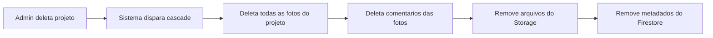

# Fotos do Projeto - Guia do Usuário

O módulo **Fotos do Projeto** permite anexar, organizar e comentar imagens relacionadas ao trabalho em cada projeto - progresso, vistorias, danos, conclusão, etc.

!!! warning "Aba controlada por permissão"
    A aba **"Fotos"** no detalhe do projeto **só aparece** para usuários com a permissão `canViewProjectPhotos`. Para fazer upload/editar/deletar, precisa também de `canEditProjectPhotos`.

---

## 1. Onde encontrar

As fotos ficam na **aba "Fotos"** dentro do detalhe de cada projeto.

1. Acesse **"Projetos"** no menu lateral
2. Clique no card do projeto desejado
3. Na página de detalhe, clique na aba **"Fotos"**

<!-- TODO: screenshot de PhotosTab ativa. Arquivo: images/project-photos-tab.png. Capturar: grid de miniaturas + botao de upload + filtros de tag -->
{ .placeholder-image }

---

## 2. O que você vê

### Photo Grid

Grid responsivo de miniaturas das fotos anexadas ao projeto.

- **3-4 colunas no desktop**
- **2 colunas no tablet**
- **1 coluna no mobile**

Cada miniatura mostra:

- Thumbnail da foto
- Tags (se houver)
- Data de upload
- Nome de quem subiu

### Empty state

Se o projeto ainda não tem fotos, o card mostra:
> "Nenhuma foto ainda. Clique em 'Upload' para adicionar."

---

## 3. Fazendo Upload

Clique no botão **"Upload"** no canto superior direito da aba.

<!-- TODO: screenshot do PhotosUploadButton em uso. Arquivo: images/project-photos-upload.png. Capturar: dialog/area de upload com drag-and-drop -->
{ .placeholder-image }

### Formas de upload

- **Drag-and-drop** - arraste as fotos para a área demarcada
- **Click para escolher** - abre o file picker do sistema
- **Upload em lote** - selecione múltiplas fotos de uma vez

### Durante o upload

- Progress bar por foto
- Processamento em background (você pode navegar para outra aba)
- Fotos aparecem na grid conforme completam

---

## 4. Metadados de cada foto

Ao clicar em uma foto, abre o **Photo Viewer** em fullscreen. No painel lateral você pode editar:

| Campo | Editável? | Descrição | Limite |
|-------|:---:|-----------|--------|
| **Description** | Sim | Descrição da foto | 2000 caracteres |
| **Tags** | Sim | Tags para organização (ex: "progresso", "dano") | Máx 50 tags, 50 chars cada |
| **Taken At** | Sim | Quando a foto foi tirada (útil se diferente do upload) | - |
| **Original Filename** | Não | Nome do arquivo original | - |
| **Uploaded By** | Não | Quem subiu (auto-capturado) | - |
| **Uploaded At** | Não | Data do upload (auto-capturado) | - |

### Sugestões de tags

Organizar fotos por tags facilita buscar depois:

- **`progresso`** - fotos do trabalho sendo feito
- **`antes`** - estado inicial do local
- **`depois`** - resultado final
- **`dano`** - problemas encontrados
- **`material`** - materiais chegando
- **`vistoria`** - fotos de inspeção

---

## 5. Photo Viewer (Visualização fullscreen)

Ao clicar em uma foto na grid, abre um **dialog fullscreen** com:

<!-- TODO: screenshot de PhotoViewerDialog. Arquivo: images/project-photos-viewer.png. Capturar: foto em fullscreen + painel lateral com metadados e comentarios -->
{ .placeholder-image }

### Elementos

- **Imagem** em alta resolução (zoom disponível)
- **Botões de navegação** (← → para próxima/anterior)
- **Painel lateral** com metadados editáveis
- **Seção de comentários**
- **Botão de deletar** (se você tem permissão)
- **Botão de download** (baixar foto original)
- **Close** (ESC ou botão X)

---

## 6. Comentários colaborativos

Cada foto permite comentários. Útil para:

- **Discussões técnicas**: "Aqui precisa reforçar a estrutura antes do drywall"
- **Instruções**: "Usar massa corrida branca, não cinza"
- **Histórico**: "Foto tirada antes do cliente confirmar alteração"

### Como comentar

1. Abra a foto no Photo Viewer
2. Role até a seção de comentários (painel lateral)
3. Digite seu comentário (texto livre)
4. Clique em **"Enviar"** ou pressione Enter

### Campos do comentário

| Campo | Auto-capturado |
|-------|:---:|
| Texto | Você digita |
| Autor (`userId`) | Sim |
| Nome do autor (`userName`) | Sim |
| Data (`createdAt`) | Sim |

### Quem pode deletar comentários

- **Autor do comentário** - pode deletar o próprio
- **Admin** - pode deletar qualquer comentário

---

## 7. Deletando fotos

1. Abra a foto no Photo Viewer
2. Clique no ícone de **lixeira**
3. Confirme no AlertDialog

!!! warning "Deletar é permanente"
    A foto é removida do Firebase Storage e os metadados do Firestore. **Comentários também são deletados junto.**

### Quem pode deletar

- **Uploader** - dono da foto pode deletar a própria
- **Admin/Super Admin** - pode deletar qualquer foto

---

## 8. Cascade Delete (importante!)

!!! danger "Ao deletar um projeto, todas as fotos vão junto"
    Se um admin deletar o **projeto inteiro**, **todas as fotos** (e comentários) do projeto são **automaticamente deletadas**. Isso é um **cascade delete** automático.

    Se você quer preservar fotos importantes antes de deletar um projeto:
    1. Faça download das fotos relevantes
    2. Só então delete o projeto

---

## 9. Storage: Firebase vs Google Drive

Cada foto tem um campo `storageLocation`:

| Valor | Onde a foto está |
|-------|------------------|
| `storage` | Firebase Storage (padrão) |
| `drive` | Google Drive da organização (se integração ativa) |

### Quando usar Google Drive?

Se a organização tem a integração Google Drive ativa (via `Settings > Integrations`, apenas super admin), as fotos **podem** ser armazenadas no Drive além do Firebase.

Isso é útil para:

- **Backup adicional** fora do Firebase
- **Compartilhar com stakeholders** externos via link do Drive
- **Integração com workflows** existentes da empresa no Workspace

📖 Veja [Configurações](configuracoes.md) para como ativar a integração Google Drive.

---

## Regras Importantes

### Campos obrigatórios e limites

| Campo | Obrigatório | Limite |
|-------|:---:|:---:|
| Arquivo (foto) | Sim | **50 MB** por foto |
| Tipo MIME | Sim | `image/*` (jpg, png, heic, webp, gif, etc.) |
| `description` | Não | 2000 caracteres |
| `tags[]` | Não | Máx 50 tags, 50 chars cada |
| `takenAt` | Sim | ISO 8601 (auto ou manual) |
| **Comentário** (texto) | Sim | 1000 caracteres |

### Permissões necessárias

| Operação | Super Admin | Admin | Funcionário com `canEditProjectPhotos` | Funcionário com `canViewProjectPhotos` | Funcionário padrão |
|----------|:---:|:---:|:---:|:---:|:---:|
| Ver aba Fotos | Sim | Sim | Sim | Sim | **Não (aba oculta)** |
| Ver fotos e metadados | Sim | Sim | Sim | Sim | Não |
| Fazer upload | Sim | Sim | Sim | **Não** | Não |
| Editar metadados (description, tags) | Sim | Sim | Sim | Não | Não |
| Deletar foto (próprias) | Sim | Sim | Sim | Não | Não |
| Deletar foto (qualquer) | **Sim** | **Sim** | Não | Não | Não |
| Comentar | Sim | Sim | Sim | Sim | Não |
| Deletar próprio comentário | Sim | Sim | Sim | Sim | Não |
| Deletar comentário de outros | **Sim** | **Sim** | Não | Não | Não |

### Validações que bloqueiam

!!! warning "Tamanho máximo: 50 MB"
    Fotos maiores que 50 MB são rejeitadas no upload. Se a foto for muito grande:

    - Use compressão (apps como Compressor, ImageOptim)
    - Exporte em qualidade "web" em vez de "original" se veio de câmera profissional
    - Reduza a resolução (2000x2000 px já é suficiente para documentação)

!!! warning "Apenas imagens"
    MIME type deve ser `image/*`. PDFs, vídeos ou documentos não são aceitos nesta aba.

!!! danger "Cascade delete ao deletar projeto"
    Deletar projeto = deletar **todas as fotos e comentários**. Não é possível recuperar após deletar o projeto.

### Defaults

| Configuração | Valor |
|---|---|
| Storage padrão | Firebase Storage |
| `storageLocation` padrão | `storage` |
| Visibilidade | Restrita a quem tem `canViewProjectPhotos` |
| Tags iniciais | Nenhuma (array vazio) |

---

## Resumo rápido

| Você quer... | Faça isso... |
|-------------|-------------|
| Ver fotos de um projeto | Detalhe do projeto > aba "Fotos" |
| Fazer upload | Aba Fotos > "Upload" > drag-and-drop ou click |
| Editar descrição/tags | Click na foto > painel lateral |
| Comentar em uma foto | Click na foto > seção de comentários |
| Deletar uma foto | Click na foto > ícone lixeira |
| Baixar foto original | Click na foto > ícone download |
| Navegar entre fotos | Setas ← → no Photo Viewer |
