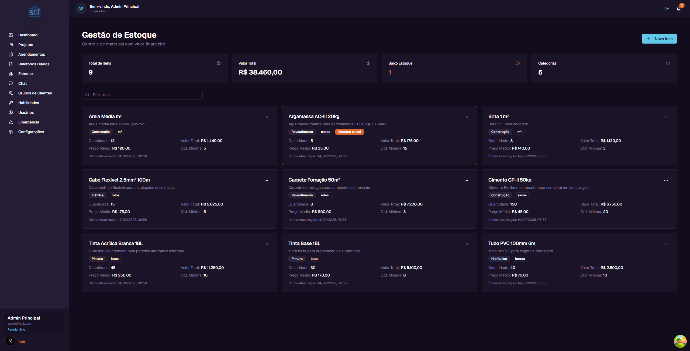
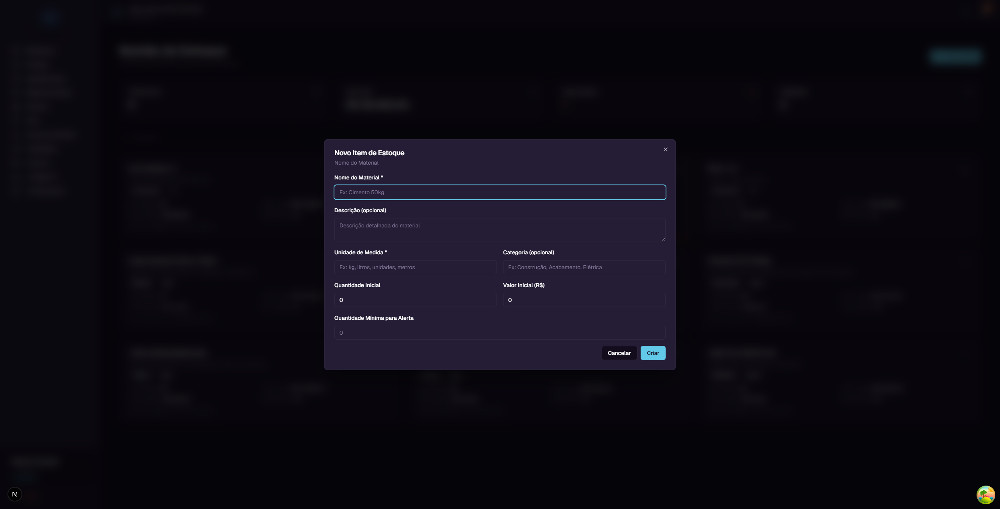
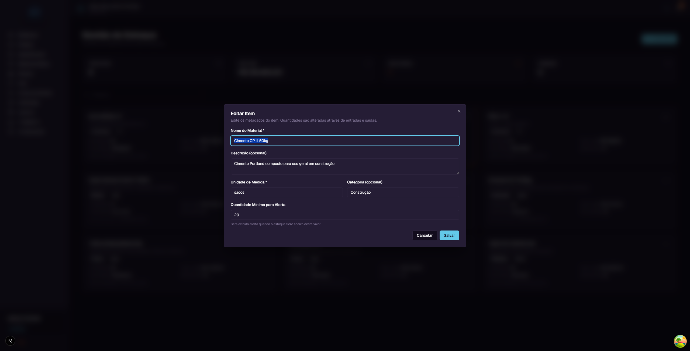
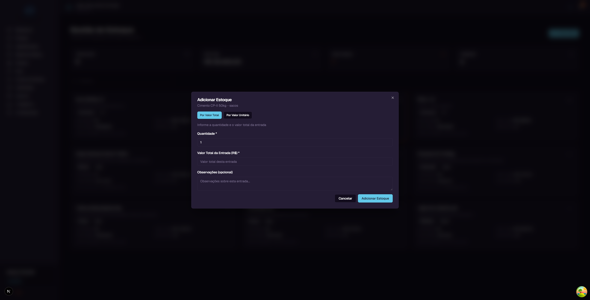
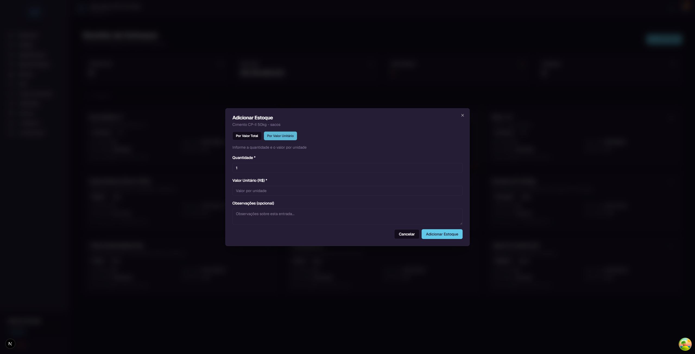
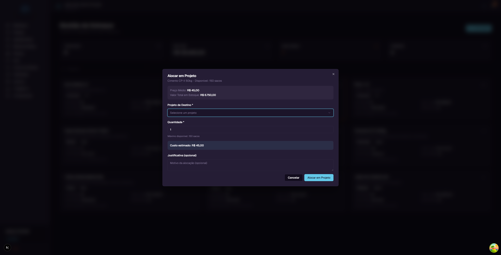
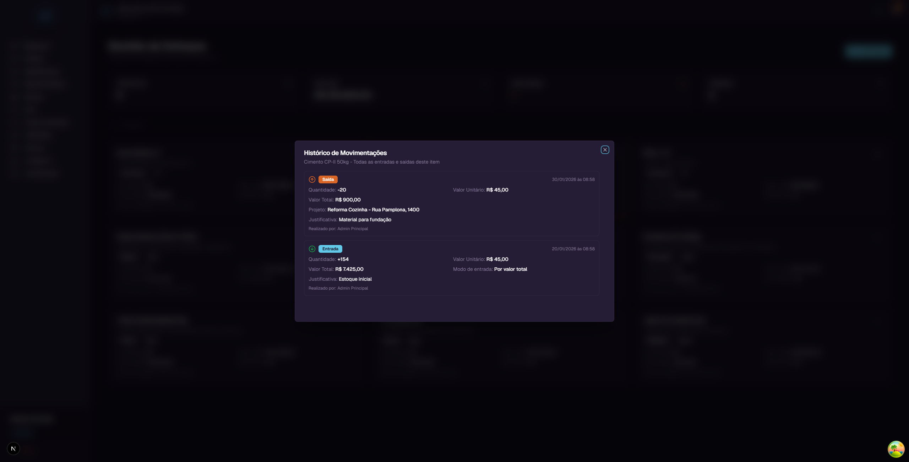

# Inventory - User Guide

In this guide, you will learn everything about the **Inventory** screen in SGI. This is where you manage the company's materials, track values, and allocate items to projects.

---

## 1. Accessing the Inventory screen

On the left sidebar menu, click **"Estoque"** (Inventory). You will be taken to the page with all registered items.



---

## 2. Understanding the main screen

### Summary cards

At the top of the page, there are 4 cards with general information:

| Card | What it shows | Example |
|------|--------------|---------|
| **Total de Itens (Total Items)** | How many items are registered in the inventory | 9 |
| **Valor Total (Total Value)** | The sum of all items' value in stock | R$ 38,460.00 |
| **Baixo Estoque (Low Stock)** | How many items are below the minimum quantity | 1 |
| **Categorias (Categories)** | How many different categories exist | 5 |

### Search field

Below the cards, there is a search field with the text "Pesquisar" (Search). Type an item name to filter the list.

### Each item card

Each item appears as a card with the following information:

- **Name** - Material name (e.g., "Cimento CP-II 50kg")
- **Description** - Details about the material
- **Category** - Colored tag indicating the category (e.g., Construcao, Pintura, Eletrica)
- **Unit** - Tag indicating the unit of measurement (e.g., sacos, latas, m3)
- **Quantity** - How many units are in stock
- **Total Value** - How much the entire stock of this item is worth (e.g., R$ 6,750.00)
- **Average Price** - Average value per unit (e.g., R$ 45.00)
- **Min. Quantity** - Minimum quantity configured for alerts
- **Last Update** - Date of the last movement

### Low stock alert

When an item's quantity falls below the "Minimum Quantity", a red tag **"Estoque baixo!"** (Low stock!) appears on the item card.


The "Baixo Estoque" (Low Stock) card at the top of the page shows how many items are in this situation.

---

## 3. Item action menu

Each item card has a menu button (**...**) in the upper right corner. Clicking it shows 5 options:

| Option | What it does |
|--------|-------------|
| **Editar Item (Edit Item)** | Change name, description, unit, category, and minimum quantity |
| **Adicionar Estoque (Add Stock)** | Register a new material entry (purchase) |
| **Alocar em Projeto (Allocate to Project)** | Remove material from stock and send it to a project |
| **Ver Historico (View History)** | Show all entries and exits for the item |
| **Excluir Item (Delete Item)** | Remove the item from the system (only works if quantity = 0) |

> **Note:** The "Excluir Item" (Delete Item) button is disabled (grayed out) while the item has stock. You need to allocate or zero out all stock before deleting.

---

## 4. Creating a new item

To register a material in the inventory, click the **"Novo Item"** (New Item) button in the upper right corner.



A window will open with the following fields:

| Field | Required? | Description |
|-------|:---------:|-------------|
| **Nome do Material (Material Name)** | Yes | Name that identifies the item. E.g.: "Cimento CP-II 50kg" |
| **Descricao (Description)** | No | Additional details about the material |
| **Unidade de Medida (Unit of Measurement)** | Yes | How the item is measured. E.g.: kg, liters, bags, meters |
| **Categoria (Category)** | No | Material group. E.g.: Construction, Painting, Electrical |
| **Quantidade Inicial (Initial Quantity)** | No | How many units you already have (default: 0) |
| **Valor Inicial** | No | Total value of initial stock (default: 0) |
| **Quantidade Minima para Alerta (Minimum Quantity for Alert)** | No | Below this number, the system shows a low stock alert |

### Step-by-step example

Let's register a new item:

1. Click **"Novo Item"**
2. In **Nome do Material**, type: `Tinta Acrilica Branca 18L`
3. In **Descricao**, type: `Tinta acrilica premium para paredes internas e externas`
4. In **Unidade de Medida**, type: `latas`
5. In **Categoria**, type: `Pintura`
6. In **Quantidade Inicial**, type: `10`
7. In **Valor Inicial**, type: `2500` (R$ 2,500.00 for 10 cans = R$ 250.00 each)
8. In **Quantidade Minima para Alerta**, type: `5`
9. Click **"Criar"** (Create)

The item will be created and appear in the list with an average price of R$ 250.00 (R$ 2,500 / 10 cans).

---

## 5. Editing an item

To edit an item, click the menu (**...**) on the card and select **"Editar Item"** (Edit Item).



You can change:
- Material Name
- Description
- Unit of Measurement
- Category
- Minimum Quantity for Alert

> **Important:** You **cannot** change the quantity or value of the item from here. Quantities are controlled only through entries (purchases) and exits (allocations). This ensures complete traceability of all movements.

After making changes, click **"Salvar"** (Save).

---

## 6. Adding stock (entry)

When you purchase material, you need to register the entry in the system. Click the menu (**...**) on the item and select **"Adicionar Estoque"** (Add Stock).

The system offers two registration modes:

### Mode 1: By Total Value



Use this mode when you know the total purchase value.

**Fields:**
- **Quantidade (Quantity)** - How many units you purchased
- **Valor Total da Entrada(Total Entry Value)** - How much you paid in total
- **Observacoes (Notes)** (optional) - Notes about the purchase

**Example:** You bought 50 bags of cement for R$ 2,250.00 total.
- Quantity: `50`
- Total Value: `2250`

### Mode 2: By Unit Price



Use this mode when you know the price per unit.

**Fields:**
- **Quantidade (Quantity)** - How many units you purchased
- **Valor Unitario(Unit Price)** - How much you paid per unit
- **Observacoes (Notes)** (optional) - Notes about the purchase

**Example:** You bought 50 bags of cement at R$ 45.00 each.
- Quantity: `50`
- Unit Price: `45`

### When to use each mode

| Situation | Recommended mode |
|-----------|-----------------|
| Invoice shows total value | By Total Value |
| Invoice shows unit price | By Unit Price |
| Bulk purchase with discount | By Total Value |
| Purchase with listed price per unit | By Unit Price |

After filling in, click **"Adicionar Estoque"** (Add Stock). The item's quantity and value will be updated automatically.

---

## 7. How the Average Price works

SGI uses a system called **Weighted Moving Average Price** to calculate the value of items in stock. Understanding this calculation helps you know why values change with each purchase.

### The formula is simple

```
Average Price = Total Value in Stock / Quantity in Stock
```

### Practical example

Imagine you have **100 bags of cement** in stock, with a total value of **R$ 4,000.00**:

- Current average price: R$ 4,000 / 100 = **R$ 40.00 per bag**

Now you buy **50 more bags for R$ 2,250.00** (R$ 45.00 each - the price went up):

| | Before | Purchase | After |
|--|--------|----------|-------|
| **Quantity** | 100 bags | + 50 bags | = 150 bags |
| **Total Value** | R$ 4,000.00 | + R$ 2,250.00 | = R$ 6,250.00 |
| **Average Price** | R$ 40.00 | R$ 45.00 | = **R$ 41.67** |

The new average price (R$ 41.67) falls between the old price (R$ 40.00) and the new purchase price (R$ 45.00). This happens because the system **weighs** both prices by quantity.

### Why this method is efficient

The weighted average price system brings several advantages:

1. **Absorbs price variations naturally** - If you bought cement at R$ 40.00 and then at R$ 45.00, the average price reflects reality: you have cement that cost on average R$ 41.67. No need to separate batches or track which bag came from which purchase.

2. **Handles promotions and price adjustments well** - If a purchase had a discount, the average price drops. If the supplier raised prices, the average price increases. The system balances everything automatically.

3. **Automatic calculation** - You don't need to do any math. Just enter the quantity and purchase value. The system recalculates the average price on its own.

4. **No need to track batches** - Unlike other methods (like FIFO or LIFO), you don't need to know "which cement was purchased first." All stock has the same average price.

5. **Fair cost for projects** - When you allocate material to a project, the cost is based on the real average price. This avoids distortions like charging the highest or lowest price from a single purchase.

### Another example: multiple purchases

| Purchase | Qty | Total Value | Unit Price | Stock After | Total Value After | Average Price |
|----------|-----|-------------|------------|-------------|-------------------|---------------|
| 1st purchase | 100 | R$ 4,000 | R$ 40.00 | 100 | R$ 4,000 | R$ 40.00 |
| 2nd purchase | 50 | R$ 2,250 | R$ 45.00 | 150 | R$ 6,250 | R$ 41.67 |
| 3rd purchase | 80 | R$ 2,800 | R$ 35.00 | 230 | R$ 9,050 | R$ 39.35 |

In the 3rd purchase, the unit price dropped to R$ 35.00 (a promotion). The average price automatically adjusted from R$ 41.67 to R$ 39.35, absorbing the discount proportionally.

---

## 8. Allocating material to a project

When you need to use inventory material in a project, use the **"Alocar em Projeto"** (Allocate to Project) option. Click the menu (**...**) on the item and select this option.



### Information displayed

At the top of the window, the system shows:
- **Preco Medio (Average Price)** - The current average value per unit (e.g., R$ 45.00)
- **Valor Total em Estoque (Total Value in Stock)** - How much the entire stock of this item is worth (e.g., R$ 6,750.00)

### Fields to fill in

| Field | Required? | Description |
|-------|:---------:|-------------|
| **Projeto de Destino (Destination Project)** | Yes | Select the project that will receive the material |
| **Quantidade (Quantity)** | Yes | How many units you want to allocate (maximum: available quantity) |
| **Justificativa (Justification)** | No | Reason for the allocation (optional) |

### Estimated cost

The system automatically calculates and displays the **estimated cost** of the allocation:

```
Estimated Cost = Average Price x Quantity
```

**Example:** If the average price of cement is R$ 45.00 and you allocate 20 bags:
- Estimated cost: R$ 45.00 x 20 = **R$ 900.00**

### What happens after allocating

When you click **"Alocar em Projeto"** (Allocate to Project), three things happen automatically:

1. **Stock decreases** - The item's quantity and total value are reduced
2. **A cost is created in the project** - The allocation value appears in the project's "Custos" (Costs) tab as an **automatically approved** cost
3. **History is recorded** - The movement is registered in the item's history

> **Note:** The average price **does not change** when you remove material. Both quantity and value decrease proportionally, keeping the average price intact.

### How the cost appears in the project

In the project's **Custos** (Costs) tab, the inventory cost appears with:
- **Description:** "[Item name] - Retirada de Estoque (X unidades)" (Inventory Withdrawal)
- **Category:** Automatically assigned as inventory cost
- **Status:** Approved (no manual approval needed)
- **Value:** Average price x allocated quantity

> For more details about the Costs tab, see the **Projects Guide**.

---

## 9. Movement history

To see the full history of entries and exits for an item, click the menu (**...**) and select **"Ver Historico"** (View History).



### What appears in each record

**For entries:**
- Green tag **"Entrada"** (Entry)
- Date and time
- Quantity added (e.g., +154)
- Unit value and total value
- Entry mode (By total value or By unit price)
- Justification/notes
- Who performed the operation

**For exits (allocations):**
- Orange tag **"Saida"** (Exit)
- Date and time
- Quantity removed (e.g., -20)
- Unit value and total value
- Destination project
- Justification
- Who performed the operation

The history is organized in chronological order (most recent first), providing complete traceability of every movement.

---

## 10. Low stock alert

The low stock alert warns you when a material is running out.

### How it works

- When creating or editing an item, you set the **Quantidade Minima para Alerta** (Minimum Quantity for Alert)
- When the stock quantity falls **below** this value, the system shows the red tag **"Estoque baixo!"** (Low stock!) on the item card
- The **"Baixo Estoque"** (Low Stock) card at the top of the page shows how many items are in this situation

### Example

The item "Argamassa AC-III 20kg" has:
- Current quantity: **5 bags**
- Minimum quantity: **15 bags**

Since 5 is less than 15, the system displays the "Estoque baixo!" alert on the card, indicating it's time to purchase more.

---

## 11. Deleting an item

To delete an item, click the menu (**...**) and select **"Excluir Item"** (Delete Item).

> **Important rule:** You can only delete an item when the stock quantity is **zero**. While there is material, the button is disabled (grayed out). This prevents you from losing track of materials that still physically exist.

To delete an item with stock:
1. First, allocate all material to projects (or adjust via entries/exits)
2. When the quantity reaches zero, the "Excluir Item" button will be enabled
3. Click "Excluir Item" and confirm

---

## 12. Inventory x Projects integration

SGI's inventory is directly connected to project costs. Here's how this integration works:

### Complete flow

```
Inventory Page (/inventory)
        |
        | Allocate to Project
        |
        v
Item stock decreases
        |
        | Automatically
        |
        v
Cost added to the project's Costs tab
(Status: Approved | Value: average price x quantity)
```

### Key points

- Allocation can be done from the **Inventory page** (menu ... > Alocar em Projeto) or through the **Chat** with the system's artificial intelligence
- In this guide, we only cover allocation from the Inventory page. Chat usage will be explained in the **Chat Guide**
- In the project's Costs tab, the "Adicionar Custo" (Add Cost) button is for **manual** costs (like labor, transport, etc.)
- Inventory costs are **added automatically** when you make the allocation
- The cost value is calculated based on the **average price at the time of allocation**
- Inventory costs come with **"Approved"** status and count immediately toward the project's budget

### Practical example

1. You have 150 bags of cement at R$ 45.00 each (average price)
2. From the Inventory page, you allocate 20 bags to the "Reforma Cozinha" project
3. The cement stock drops to 130 bags
4. In the "Reforma Cozinha" project's Costs tab, it automatically shows:
   - "Cimento CP-II 50kg - Retirada de Estoque (20 unidades)"
   - Value: R$ 900.00 (20 x R$ 45.00)
   - Status: Approved

---

## Quick reference

| You want to... | Do this... |
|----------------|-----------|
| See all materials | Click "Estoque" in the sidebar menu |
| Search for an item | Type in the "Pesquisar" field |
| Register new material | Click "Novo Item" |
| Edit item data | Menu (...) > "Editar Item" |
| Register a purchase | Menu (...) > "Adicionar Estoque" |
| Send material to a project | Menu (...) > "Alocar em Projeto" |
| See entries and exits | Menu (...) > "Ver Historico" |
| Know items with low stock | See "Baixo Estoque" card at the top |
| Delete an item | Menu (...) > "Excluir Item" (quantity must be 0) |
| See inventory cost in project | "Custos" tab in project details |
