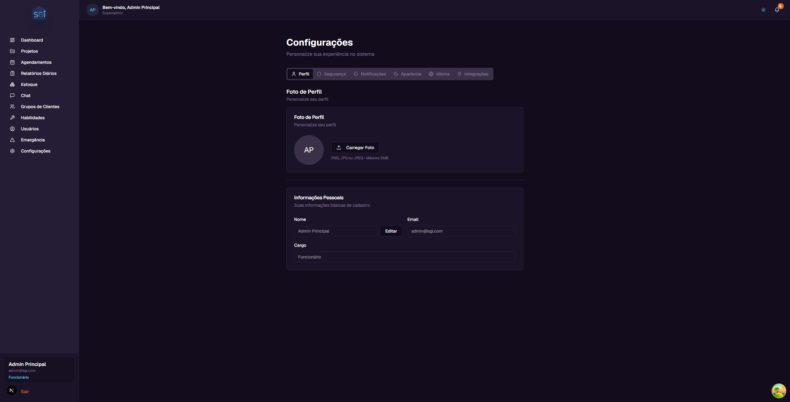
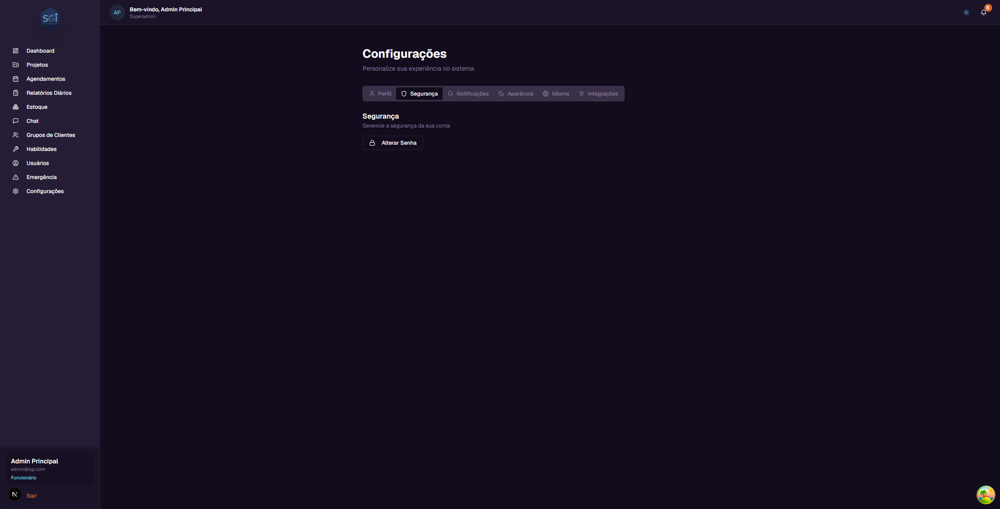
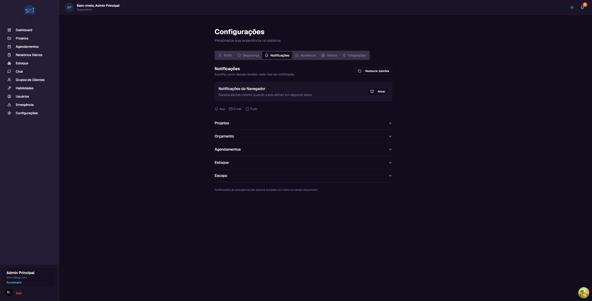
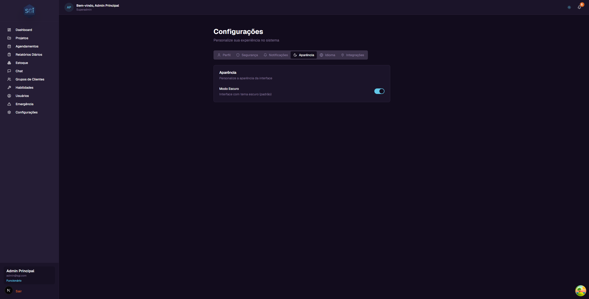
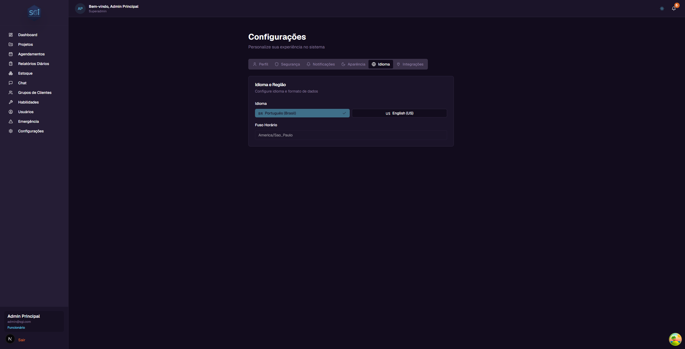
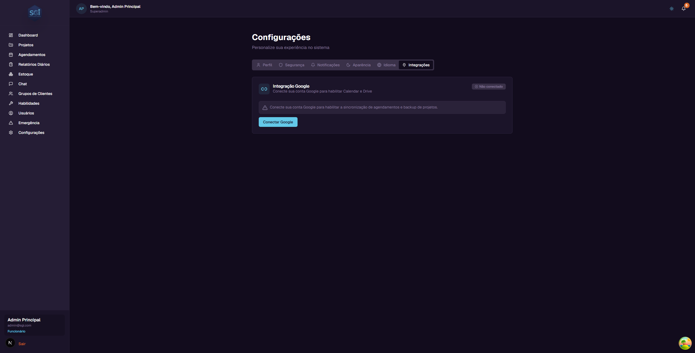

# Scheduling, Reports, Settings and Emergency - User Guide

In this guide, you will learn about the **Scheduling**, **Daily Reports**, **Settings**, and **Emergency Notification** modules in SGI.

---

## PART 1: SCHEDULING

### 1. Accessing the Scheduling screen

On the left sidebar menu, click **"Agendamentos"** (Scheduling). You will be taken to the page for managing visits and appointments.

---

### 2. View modes

You can see the schedules in 2 different ways. The buttons are in the upper right corner of the screen.

#### List (default)

Shows the schedules grouped by date, from most recent to oldest. Each schedule appears as a card with:

- **Time** - Start and end time (e.g., 14:00 > 17:00)
- **Status** - Colored badge indicating the situation (Agendado/Scheduled, Em andamento/In Progress, Concluido/Completed, Cancelado/Cancelled)
- **Project** - Name of the linked project (e.g., "Instalacao Hidraulica - Rua Dr. Melo Alves, 700")
- **Employee** - Who is assigned to the schedule
- **Notes** - Additional notes about the visit
- **Buttons** - Edit and Cancel

#### Calendar

Shows a weekly grid (Monday to Sunday), with time slots from 08:00 to 18:00. Schedules appear as colored blocks according to their status.

Use the **"Anterior"** (Previous), **"Hoje"** (Today), and **"Proximo"** (Next) buttons to navigate between weeks.

---

### 3. Creating a schedule

To create a new schedule, click the **"Novo Agendamento"** (New Schedule) button in the upper right corner.

A window will open with the following fields:

| Field | Required? | Description |
|-------|:---------:|-------------|
| **Projeto (Project)** | Yes | Select the project linked to this visit |
| **Funcionario (Employee)** | Yes | Select the employee who will perform the visit |
| **Data (Date)** | Yes | Date of the visit |
| **Horario de inicio (Start time)** | Yes | Time when the visit begins |
| **Duracao (Duration)** | Yes | How long it will last (1 hour, 2 hours, 3 hours, 4 hours, etc.) |
| **Observacoes (Notes)** | No | Additional notes about the visit |

#### Step-by-step example

1. Click **"Novo Agendamento"**
2. In **Projeto**, select: `Instalacao Hidraulica - Rua Dr. Melo Alves, 700`
3. In **Funcionario**, select: `Joao Silva`
4. In **Data**, select the desired date
5. In **Horario de inicio**, type: `09:00`
6. In **Duracao**, select: `2 horas` (2 hours)
7. In **Observacoes**, type: `Bring tools for inspection`
8. Click **"Criar Agendamento"** (Create Schedule)

---

### 4. Editing and cancelling schedules

#### Edit

In the list view, click the **"Editar"** (Edit) button on the schedule card. A window will open where you can change:

- **Data (Date)** - Change the visit day
- **Horario de inicio (Start time)** - Change the time
- **Duracao (Duration)** - Change how long it will last
- **Observacoes (Notes)** - Change the notes

After making changes, click **"Salvar"** (Save).

#### Cancel

In the list view, click the **"Cancelar"** (Cancel) button on the schedule card. The status will change to "Cancelado" (Cancelled).

---

### 5. Schedule filters

At the top of the page, you will find filters to refine the list:

| Filter | What it does |
|--------|-------------|
| **Usuarios (Users)** | Filter by specific employee (default: "Todos os usuarios" / All users) |
| **Status** | Filter by schedule status (default: "Todos os status" / All statuses) |
| **Data (Date)** | Filter by date range (start and end date fields) |

---

### 6. Schedule statuses

| Status | Meaning | Color |
|--------|---------|-------|
| **Agendado (Scheduled)** | Visit is planned for the future | Blue |
| **Em andamento (In Progress)** | Visit is happening now | Green |
| **Concluido (Completed)** | Visit was carried out | Gray |
| **Cancelado (Cancelled)** | Visit was cancelled | Red |

---

### 7. Google Calendar integration (optional)

When your Google account is connected (via Settings > Integrations), SGI schedules automatically sync with Google Calendar.

**How it works:**
- The system creates individual calendars for each employee (e.g., "SGI - Joao Silva")
- When you create, edit, or cancel a schedule in SGI, the change automatically appears in Google Calendar
- Synchronization is bidirectional

> **Note:** Google Calendar integration is NOT required. The system works perfectly without it. To connect, see the **Integrations** section later in this guide.

---

## PART 2: DAILY REPORTS

### 8. Accessing Daily Reports

On the left sidebar menu, click **"Relatorios Diarios"** (Daily Reports). You will see the list of all work progress reports.

---

### 9. Understanding a report

Each report appears as a card with the following information:

- **Project** - Project name (card title)
- **Status** - "Enviado" (Sent) badge
- **Date** - When the report was submitted
- **Employee** - Who submitted the report
- **Progress** - Completion percentage (e.g., 75%)
- **Completed tasks** - List of activities performed (e.g., "Surface preparation", "Primer application")
- **Problems** - Difficulties encountered during work (if any)
- **Notes** - Additional observations from the employee

#### How reports are created

Reports are **not created on this page**. They are generated by employees through the **Chat** with the system's artificial intelligence. When an employee submits a progress report via Chat, it automatically appears on this page.

> This feature will be explained in detail in the **Chat Guide**.

#### Link with projects

Each report also appears in the **"Relatorios"** (Reports) tab of the corresponding project. For example, a report from the "Troca de Carpete" project appears both on this page and in that project's Reports tab.

---

### 10. Filtering reports

At the top of the page, you can filter reports by:

| Filter | What it does |
|--------|-------------|
| **Todos (All)** | Shows all reports (default) |
| **Por Projeto (By Project)** | Shows only reports from a specific project |
| **Por Usuario (By User)** | Shows only reports from a specific employee |

Select the filter type in the **"Tipo de Filtro"** (Filter Type) dropdown, and if needed, select the project or user in the secondary dropdown that appears.

> **Visibility:** Administrators can see all reports. Employees can only see their own.

---

## PART 3: SETTINGS

### 11. Accessing Settings

On the left sidebar menu, click **"Configuracoes"** (Settings). You will see the page with 6 tabs.

---

### 12. Profile

The **Perfil** (Profile) tab shows and allows you to edit your personal information.

#### Profile Photo
- **Avatar** - Shows your name initials
- **Carregar Foto (Upload Photo)** - Click to upload a profile photo (PNG, JPG, or JPEG, maximum 5MB)

#### Personal Information
- **Nome (Name)** - Your full name. Click **"Editar"** (Edit) to change
- **Email** - Your email (read-only - cannot be changed)
- **Cargo (Role)** - Your role in the system (read-only)

---

### 13. Security

The **Seguranca** (Security) tab allows you to change your password.

To change your password:
1. Click the **"Alterar Senha"** (Change Password) button
2. A window will open with 3 fields:
   - **Senha atual (Current password)** - Enter your current password
   - **Nova senha (New password)** - Enter the new password (minimum 8 characters)
   - **Confirmar nova senha (Confirm new password)** - Repeat the new password
3. Click **"Alterar Senha"** (Change Password) to confirm

> **Tip:** Use the eye button next to the fields to show/hide the password while typing.

---

### 14. Notifications

The **Notificacoes** (Notifications) tab allows you to configure how you receive system alerts.

#### Browser Notifications

Click the **"Ativar"** (Activate) button to receive push alerts even when the SGI tab is in the background.

#### 3 notification channels

| Channel | What it is |
|---------|-----------|
| **App** | Notifications inside SGI (bell icon in the upper right corner) |
| **Email** | Notifications sent to your email |
| **Push** | Browser notifications (pop-up on screen) |

#### 5 notification categories

Each category can be expanded by clicking on it:

| Category | Notification types |
|----------|--------------------|
| **Projetos (Projects)** | Project assignment, unassignment, status change |
| **Orcamento (Budget)** | Budget near limit alert, budget exceeded |
| **Agendamentos (Scheduling)** | Schedule created, updated, cancelled, reminder |
| **Estoque (Inventory)** | Low stock alert |
| **Escopo (Scope)** | Scope ready for review |

For each notification type, you can enable or disable each channel individually.

**"Restaurar padroes" (Restore defaults) button:** Resets all notification settings to the original defaults.

> **Important:** Emergency notifications are **always** sent through all available channels, regardless of your settings.

---

### 15. Appearance

The **Aparencia** (Appearance) tab allows you to change the visual theme of the system.

- **Modo Escuro (Dark Mode)** - Toggle to enable/disable the dark theme (default: enabled)

> **Tip:** You can also switch between light and dark mode by clicking the sun/moon icon in the upper right corner of the header, accessible from any page in the system.

---

### 16. Language and Region

The **Idioma** (Language) tab allows you to change the interface language.

- **Idioma (Language)** - Click one of the buttons to switch immediately:
  - **Portugues (Brasil)** - Interface in Portuguese
  - **English (US)** - Interface in English

- **Fuso Horario (Timezone)** - Currently fixed at "America/Sao_Paulo"

> **Note:** The language is set on first access (via invitation), but you can change it at any time here. In the final launch of the system, timezone and currencies will be fully configurable. They are currently limited as we are in the testing phase.

---

### 17. Integrations (optional)

The **Integracoes** (Integrations) tab allows you to connect your Google account to SGI.

> **Important:** Google integration is NOT required. The system works perfectly without it. It is an optional feature for those who want to sync schedules and back up projects.

#### Integration status

At the top, you see the current status:
- **"Nao conectado" (Not connected)** - Google account is not linked
- **"Conectado" (Connected)** - Google account is linked and active

#### How to connect

1. Click the **"Conectar Google"** (Connect Google) button
2. A Google window will open asking for permission
3. Select your account and authorize access
4. Done! The status changes to "Conectado" (Connected)

#### What the integration enables

| Feature | What it does |
|---------|-------------|
| **Google Calendar** | Syncs SGI schedules with Google Calendar. Creates individual calendars per employee (e.g., "SGI - Joao Silva") |
| **Google Drive** | Allows saving project backups to Google Drive for internal company management |

> **About Google Drive:** SGI uses its own database to store all project data. The Google Drive backup is **optional** and serves only for internal management by companies that want an additional copy.

#### How to disconnect

If you want to remove the integration:
1. Click the **"Desconectar"** (Disconnect) button
2. Confirm the action in the confirmation window
3. Synchronization will be stopped

---

## PART 4: EMERGENCY

### 18. Emergency Notification

The **Notificacao de Emergencia** (Emergency Notification) screen allows administrators to send urgent alerts to employees.

> **Access:** Only administrators can access this feature.

#### Warning alert

At the top of the page, a yellow alert warns: **"Esta e uma ferramenta de comunicacao critica. Use apenas para situacoes que requerem atencao imediata."** (This is a critical communication tool. Use only for situations that require immediate attention.)

#### Form

| Field | Description |
|-------|-------------|
| **Selecionar destinatarios (Select recipients)** | Choose who will receive the notification (3 modes available - see below) |
| **Titulo (Title)** | Short title of the emergency (max. 100 characters). E.g.: "Alerta de Seguranca" (Security Alert) |
| **Mensagem (Message)** | Detailed description of the situation (max. 500 characters). A counter shows how many characters remain |
| **Pre-visualizacao (Preview)** | Shows in real-time who will receive, the title, and the message |

#### 3 recipient selection modes

| Mode | What it does |
|------|-------------|
| **Todos os funcionarios (All employees)** | Sends to all active employees in the system |
| **Por projeto (By project)** | Filters only employees assigned to a specific project |
| **Selecao manual (Manual selection)** | Allows selecting employees individually with checkboxes |

#### Sending the notification

1. Select the recipients
2. Fill in the title and message
3. Check the preview
4. Click **"Enviar Notificacao de Emergencia"** (Send Emergency Notification)
5. A confirmation window will appear

The confirmation warns: **"Esta notificacao sera enviada imediatamente para todos os destinatarios selecionados em TODOS os canais (App, Email, Push). Deseja continuar?"** (This notification will be sent immediately to all selected recipients through ALL channels (App, Email, Push). Do you want to continue?)

6. Click **"Confirmar"** (Confirm) to send or **"Cancelar"** (Cancel) to go back

> **Important:** Emergency notifications **ignore** users' notification preferences. They are always sent through all available channels (App, Email, and Push) to ensure everyone receives the alert.

---

## Quick reference

### Scheduling

| You want to... | Do this... |
|----------------|-----------|
| See all schedules | Click "Agendamentos" in the sidebar menu |
| See calendar view | Click the "Calendario" button |
| Create a schedule | Click "Novo Agendamento" |
| Edit a schedule | "Editar" button on the schedule card |
| Cancel a schedule | "Cancelar" button on the schedule card |
| Filter by employee | Use the "Todos os usuarios" dropdown |

### Daily Reports

| You want to... | Do this... |
|----------------|-----------|
| See all reports | Click "Relatorios Diarios" in the sidebar menu |
| Filter by project | Select "Por Projeto" in the Filter Type |
| Filter by user | Select "Por Usuario" in the Filter Type |

### Settings

| You want to... | Do this... |
|----------------|-----------|
| Change photo | Settings > Profile > "Carregar Foto" |
| Change name | Settings > Profile > "Editar" |
| Change password | Settings > Security > "Alterar Senha" |
| Configure notifications | Settings > Notifications |
| Toggle light/dark theme | Settings > Appearance or sun/moon icon in header |
| Change language | Settings > Language |
| Connect Google | Settings > Integrations > "Conectar Google" |

### Emergency

| You want to... | Do this... |
|----------------|-----------|
| Send emergency alert | Click "Emergencia" in the sidebar menu |
| Send to everyone | Select "Todos os funcionarios" |
| Send to project team | Select "Por projeto" and choose the project |
| Send to specific people | Select "Selecao manual" |
