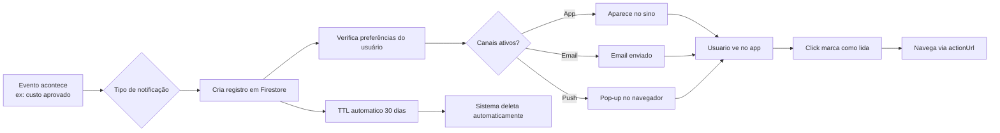

# Central de Notificações - Guia do Usuário

A **Central de Notificações** é onde você vê e gerencia todos os alertas recebidos no SGI. Diferente das **preferências** em Configurações (onde você escolhe COMO quer receber), esta é a tela onde as notificações chegam e podem ser gerenciadas.

---

## 1. Acessando a Central

Você pode chegar na Central de 2 formas:

1. **Sino no cabeçalho** (canto superior direito) - clique para abrir dropdown rápido OU ir para a página completa
2. **URL direta** `/notifications`

<!-- TODO: screenshot da Central de Notificações com lista de notificações e filtros. Arquivo: images/notifications-center.png. Capturar: lista de notificações + dropdown de filtros aberto + checkbox de seleção -->
{ .placeholder-image }

---

## 2. O que você vê

### Header com estatísticas

| Elemento | O que mostra |
|----------|--------------|
| **Badge de não lidas** | Quantas notificações novas você tem |
| **Total** | Total de notificações na lista atual |
| **Botão "Marcar todas como lidas"** | Aparece se há não lidas |
| **Botão "Limpar filtros"** | Aparece se algum filtro está ativo |

### Card de cada notificação

| Elemento | Descrição |
|----------|-----------|
| **Ícone** | Tipo da notificação (projeto, orçamento, agendamento, etc.) |
| **Título** | Resumo curto (ex: "Projeto atribuído") |
| **Mensagem** | Detalhes (ex: "Você foi atribuído ao projeto Pintura Residencial") |
| **Timestamp** | Há quanto tempo foi gerada |
| **Indicador de leitura** | Bolinha azul se não lida |
| **Checkbox** | Para ações em lote |

---

## 3. Os 12 tipos de notificação

### Projetos

| Tipo | Quando aparece |
|------|----------------|
| `project_assigned` | Você foi atribuído a um projeto |
| `project_unassigned` | Você foi removido de um projeto |
| `project_status_changed` | Status de projeto seu mudou |

### Orçamento

| Tipo | Quando aparece |
|------|----------------|
| `budget_alert` | Projeto atingiu X% do orçamento (limite configurado) |
| `budget_exceeded` | Projeto ultrapassou 100% do orçamento |

### Agendamentos

| Tipo | Quando aparece |
|------|----------------|
| `schedule_created` | Novo agendamento foi criado para você |
| `schedule_updated` | Agendamento seu foi alterado |
| `schedule_cancelled` | Agendamento seu foi cancelado |
| `schedule_reminder` | Lembrete antes do horário do agendamento |

### Estoque

| Tipo | Quando aparece |
|------|----------------|
| `low_stock_alert` | Item do estoque está abaixo da quantidade mínima |

### Escopo / Work Order

| Tipo | Quando aparece |
|------|----------------|
| `scope_ready_for_review` | Work Order está pronta para revisão do admin |

### Sistema

| Tipo | Quando aparece |
|------|----------------|
| `emergency` | **Notificação de emergência** enviada por admin (ignora preferências) |

---

## 4. Filtros

Clique no ícone de filtro para abrir o dropdown:

### Por status

- **Todas**
- **Não lidas** (só as novas)
- **Lidas** (só as antigas)

### Por tipo

Dropdown multi-select com os 12 tipos. Ative múltiplos filtros simultâneos.

---

## 5. Ações disponíveis

### Por notificação individual

- **Clicar** na notificação → marca como lida + navega para a página relacionada (`actionUrl`)
- Ex: clicar em "Projeto atribuído" te leva direto para o projeto

### Ações em lote (batch)

1. Selecione notificações com os **checkboxes**
2. Botões aparecem:
   - **Marcar selecionadas como lidas**
   - **Deletar selecionadas**
   - **Desmarcar tudo**

### Marcar todas como lidas

Botão no topo (só aparece se há não lidas). Marca tudo de uma vez, independente de filtro.

### Deletar

Após selecionar, clique em "Deletar selecionadas" e confirme no **AlertDialog**.

!!! warning "Deletar é permanente"
    Notificações deletadas **não podem ser recuperadas**. Se quiser apenas "esconder", use "Marcar como lida" em vez de deletar.

---

## 6. Pipeline de uma notificação

---

## 7. TTL (expiração automática)

!!! note "Notificações expiram em 30 dias"
    O sistema **deleta automaticamente** notificações com mais de 30 dias (campo `expiresAt`). Isso mantém o banco limpo e relevante.

    Se você quer guardar uma notificação importante, **anote o conteúdo** antes que expire. Ou transforme em ação (ex: criar uma tarefa no projeto).

---

## 8. Deep links (navegação)

Cada notificação tem um `actionUrl` que leva direto ao recurso relacionado. Ao clicar:

| Tipo | Leva para |
|------|-----------|
| `project_assigned` | `/projects/{id}` |
| `budget_alert` | `/projects/{id}` (aba Custos) |
| `schedule_created` | `/scheduling` (filtrado pelo agendamento) |
| `scope_ready_for_review` | `/projects/{id}` (aba Work Order) |
| `low_stock_alert` | `/inventory` (filtrado pelo item) |
| `emergency` | Modal com conteúdo completo |

---

## Regras Importantes

### Limites e constraints

| Item | Valor | Observação |
|------|-------|-----------|
| **TTL** | 30 dias | Automático (campo `expiresAt`) |
| **Canais disponíveis** | In-App, Email, Push (+ WhatsApp futuro) | WhatsApp no tipo mas desabilitado na UI |
| **Prioridade** | low / normal / high / emergency | Emergência ignora preferências |

### Permissões

| Operação | Todos os usuários |
|----------|:---:|
| Ver próprias notificações | Sim |
| Marcar como lida | Sim |
| Deletar própria notificação | Sim |
| Ver notificações de outros | **Não** (cada usuário só vê as dele) |

### Validações e comportamentos especiais

!!! danger "Emergência sempre chega"
    Notificações do tipo `emergency` **ignoram TODAS as suas preferências** e chegam em todos os canais disponíveis. Isso é por design - emergências são críticas e não podem ser silenciadas.

!!! warning "Push requer permissão do navegador"
    Mesmo que você tenha "Push" ligado nas preferências, o navegador precisa ter dado permissão. Se estiver negado:
    - Chrome/Edge: clique no cadeado ao lado da URL → Permissões → Notificações → Permitir
    - Firefox: similar
    - Safari: Configurações do sistema > Safari > Notificações

!!! note "Notificações antigas somem"
    Após 30 dias uma notificação é **permanentemente removida**. Planeje ações baseadas em notificações com antecedência.

### Defaults do sistema

| Configuração | Valor padrão |
|---|---|
| Todas as categorias | **Todos os canais ativados** (In-App, Email, Push) |
| Emergência | Sempre todos os canais (não configurável) |
| TTL | 30 dias |
| Priority | `normal` |

---

## Resumo rápido

| Você quer... | Faça isso... |
|-------------|-------------|
| Ver todas as notificações | Clique no sino ou acesse `/notifications` |
| Ver só não lidas | Filtrar por "Não lidas" |
| Marcar várias como lidas | Checkbox + "Marcar selecionadas como lidas" |
| Deletar várias | Checkbox + "Deletar selecionadas" |
| Ver apenas um tipo | Filtrar por tipo no dropdown |
| Configurar canais | Configurações > Notificações |
| Desligar emergência | **Impossível** (por design) |
