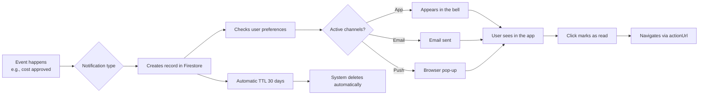

# Notification Center - User Guide

The **Notification Center** is where you see and manage all alerts received in SGI. Unlike the **preferences** in Settings (where you choose HOW you want to receive them), this is the screen where notifications arrive and can be managed.

---

## 1. Accessing the Center

You can reach the Center in 2 ways:

1. **Bell in the header** (upper right corner) - click to open a quick dropdown OR go to the full page
2. **Direct URL** `/notifications`

<!-- TODO: screenshot of the Notification Center with list of notifications and filters. File: images/notifications-center.png. Capture: list of notifications + filters dropdown open + selection checkbox -->
{ .placeholder-image }

---

## 2. What you see

### Header with statistics

| Element | What it shows |
|----------|--------------|
| **Unread badge** | How many new notifications you have |
| **Total** | Total notifications in the current list |
| **"Marcar todas como lidas" (Mark all as read) button** | Appears if there are unread ones |
| **"Limpar filtros" (Clear filters) button** | Appears if any filter is active |

### Each notification card

| Element | Description |
|----------|-----------|
| **Icon** | Notification type (project, budget, schedule, etc.) |
| **Title** | Short summary (e.g., "Project assigned") |
| **Message** | Details (e.g., "You have been assigned to the Residential Painting project") |
| **Timestamp** | How long ago it was generated |
| **Read indicator** | Blue dot if unread |
| **Checkbox** | For batch actions |

---

## 3. The 12 notification types

### Projects

| Type | When it appears |
|------|----------------|
| `project_assigned` | You have been assigned to a project |
| `project_unassigned` | You have been removed from a project |
| `project_status_changed` | Status of your project has changed |

### Budget

| Type | When it appears |
|------|----------------|
| `budget_alert` | Project reached X% of budget (configured limit) |
| `budget_exceeded` | Project exceeded 100% of budget |

### Scheduling

| Type | When it appears |
|------|----------------|
| `schedule_created` | New schedule was created for you |
| `schedule_updated` | Your schedule was changed |
| `schedule_cancelled` | Your schedule was cancelled |
| `schedule_reminder` | Reminder before the schedule time |

### Inventory

| Type | When it appears |
|------|----------------|
| `low_stock_alert` | Inventory item is below minimum quantity |

### Scope / Work Order

| Type | When it appears |
|------|----------------|
| `scope_ready_for_review` | Work Order is ready for admin review |

### System

| Type | When it appears |
|------|----------------|
| `emergency` | **Emergency notification** sent by admin (ignores preferences) |

---

## 4. Filters

Click the filter icon to open the dropdown:

### By status

- **All**
- **Unread** (only the new ones)
- **Read** (only the old ones)

### By type

Multi-select dropdown with the 12 types. Activate multiple simultaneous filters.

---

## 5. Available actions

### Per individual notification

- **Click** the notification -> marks as read + navigates to the related page (`actionUrl`)
- E.g., clicking "Project assigned" takes you directly to the project

### Batch actions

1. Select notifications with the **checkboxes**
2. Buttons appear:
   - **Mark selected as read**
   - **Delete selected**
   - **Unselect all**

### Mark all as read

Button at the top (only appears if there are unread ones). Marks everything at once, regardless of filter.

### Delete

After selecting, click "Delete selected" and confirm in the **AlertDialog**.

!!! warning "Deletion is permanent"
    Deleted notifications **cannot be recovered**. If you just want to "hide", use "Mark as read" instead of deleting.

---

## 6. Notification pipeline

---

## 7. TTL (automatic expiration)

!!! note "Notifications expire in 30 days"
    The system **automatically deletes** notifications older than 30 days (`expiresAt` field). This keeps the database clean and relevant.

    If you want to keep an important notification, **write down the content** before it expires. Or turn it into an action (e.g., create a task in the project).

---

## 8. Deep links (navigation)

Each notification has an `actionUrl` that leads directly to the related resource. When clicking:

| Type | Leads to |
|------|-----------|
| `project_assigned` | `/projects/{id}` |
| `budget_alert` | `/projects/{id}` (Costs tab) |
| `schedule_created` | `/scheduling` (filtered by the schedule) |
| `scope_ready_for_review` | `/projects/{id}` (Work Order tab) |
| `low_stock_alert` | `/inventory` (filtered by the item) |
| `emergency` | Modal with full content |

---

## Important Rules

### Limits and constraints

| Item | Value | Note |
|------|-------|-----------|
| **TTL** | 30 days | Automatic (`expiresAt` field) |
| **Available channels** | In-App, Email, Push (+ WhatsApp future) | WhatsApp exists as a type but is disabled in the UI |
| **Priority** | low / normal / high / emergency | Emergency ignores preferences |

### Permissions

| Operation | All users |
|----------|:---:|
| See own notifications | Yes |
| Mark as read | Yes |
| Delete own notification | Yes |
| See others' notifications | **No** (each user sees only their own) |

### Validations and special behaviors

!!! danger "Emergency always arrives"
    Notifications of type `emergency` **ignore ALL your preferences** and arrive on all available channels. This is by design - emergencies are critical and cannot be silenced.

!!! warning "Push requires browser permission"
    Even if you have "Push" enabled in preferences, the browser must have granted permission. If denied:
    - Chrome/Edge: click the lock next to the URL -> Permissions -> Notifications -> Allow
    - Firefox: similar
    - Safari: System Settings > Safari > Notifications

!!! note "Old notifications disappear"
    After 30 days a notification is **permanently removed**. Plan actions based on notifications in advance.

### System defaults

| Setting | Default value |
|---|---|
| All categories | **All channels enabled** (In-App, Email, Push) |
| Emergency | Always all channels (not configurable) |
| TTL | 30 days |
| Priority | `normal` |

---

## Quick summary

| You want to... | Do this... |
|-------------|-------------|
| See all notifications | Click the bell or access `/notifications` |
| See only unread | Filter by "Unread" |
| Mark several as read | Checkbox + "Mark selected as read" |
| Delete several | Checkbox + "Delete selected" |
| See only one type | Filter by type in the dropdown |
| Configure channels | Settings > Notifications |
| Disable emergency | **Impossible** (by design) |
