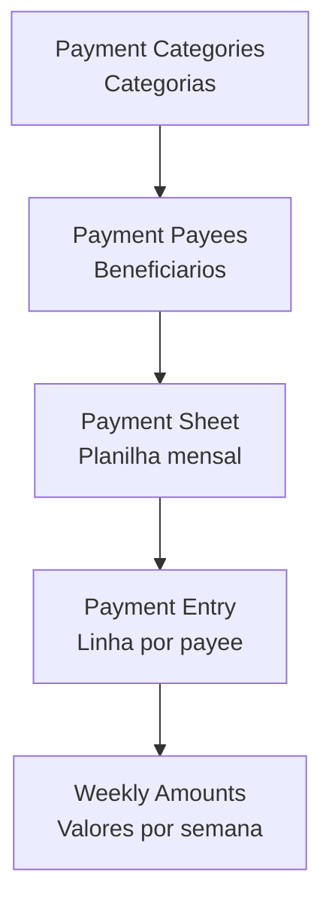
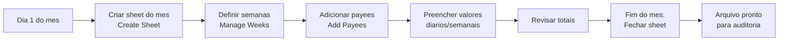

# Pagamentos - Guia do Usuário

O módulo **Pagamentos** do SGI é um controle mensal de desembolsos para funcionários, subcontratados e fornecedores - uma planilha digital estruturada que substitui o Excel do RH/financeiro.

!!! note "Apenas para administradores"
    O módulo Pagamentos só é acessível por **Administradores** e **Super Administradores**. Funcionários não veem este menu.

---

## 1. Como funciona o módulo

O sistema organiza pagamentos em **4 entidades**:

| Entidade | O que é | Exemplo |
|----------|---------|---------|
| **Payment Category** | Grupo de payees | "Subcontratados", "Funcionários", "Fornecedores" |
| **Payment Payee** | Quem recebe | "Nathan", "Carpintaria XYZ Ltda" |
| **Payment Sheet** | Planilha de 1 mês | "2026-01" (janeiro de 2026) |
| **Payment Entry** | Linha na planilha | Nathan recebe X, Y, Z nas semanas 1, 2, 3 |

---

## 2. Acessando

No menu lateral, clique em **"Pagamentos"**.

<!-- TODO: screenshot da pagina principal. Arquivo: images/payments-main.png. Capturar: header + seletor de sheet (dropdown com meses) + botoes Manage Categories/Payees -->
{ .placeholder-image }

No topo você tem:

| Elemento | O que faz |
|----------|-----------|
| **Dropdown de sheet** | Escolhe qual mês visualizar (ex: "Janeiro 2026") |
| **Badge de status** | Mostra se a sheet está **"open"** (aberta) ou **"closed"** (fechada) |
| **Botão "Manage Categories"** | Abre dialog para gerenciar categorias |
| **Botão "Manage Payees"** | Abre dialog para gerenciar beneficiários |

---

## 3. Fluxo mensal típico

### Passo a passo mensal

1. **Criar a sheet do mês** (início do mês)
2. **Definir as semanas** (4 ou 5 datas de fim de semana)
3. **Adicionar payees** que vão receber naquele mês
4. **Preencher valores** semana a semana conforme vai pagando
5. **Revisar totais** antes de fechar
6. **Fechar sheet** (`closed`) - passa a ser read-only para auditoria

---

## 4. Gerenciando Categorias

Antes de adicionar payees, você precisa ter **categorias** para organizar.

Clique em **"Manage Categories"**.

<!-- TODO: screenshot de ManageCategoriesDialog. Arquivo: images/payments-categories-dialog.png. Capturar: lista de categorias com cores e botoes editar/deletar -->
{ .placeholder-image }

### Campos da categoria

| Campo | Descrição |
|-------|-----------|
| **Nome** | Ex: "Subcontratados", "Funcionários" |
| **Cor** | Nome de cor para theming (emerald, amber, blue, purple, pink, cyan, lime, red, orange, indigo) |
| **Ordem** | Em qual posição a categoria aparece |
| **Ativo** | Se a categoria está em uso (soft delete) |

### Exemplo de categorias

| Nome | Cor |
|------|-----|
| Subcontratados | `blue` |
| Funcionários | `emerald` |
| Fornecedores | `amber` |
| Serviços | `purple` |

---

## 5. Gerenciando Payees (Beneficiários)

Cada payee tem uma categoria e um método de pagamento preferencial.

Clique em **"Manage Payees"**.

<!-- TODO: screenshot de ManagePayeesDialog. Arquivo: images/payments-payees-dialog.png. Capturar: lista de payees agrupados por categoria, com nome/empresa/metodo -->
{ .placeholder-image }

### Campos do payee

| Campo | Obrigatório | Descrição |
|-------|:---:|-----------|
| **Nome curto** | Sim | Nome na planilha (ex: "Nathan") |
| **Nome completo** | Sim | Nome oficial (ex: "Nathanael da Silva") |
| **Categoria** | Sim | A qual categoria pertence |
| **Método de pagamento** | Sim | Zelle / Check / Cash / Company Check |
| **Empresa** | Não | Para subcontratados/fornecedores |
| **Ordem** | Não | Posição na planilha |
| **Ativo** | Sim | Soft delete |

### Métodos de pagamento disponíveis

| Método | Código | Uso típico |
|--------|--------|------------|
| **Zelle** | `zelle` | Transferência Zelle (bancos US) |
| **Check** | `check` | Cheque pessoal |
| **Cash** | `cash` | Dinheiro em espécie |
| **Company Check** | `company_check` | Cheque da empresa |

!!! note "Cada payee tem 1 método"
    Um payee só pode ter **1 método de pagamento** cadastrado. Se precisar mudar, edite o payee - o método antigo é sobrescrito.

---

## 6. Criando a Planilha do Mês

Clique em **"+ Nova Sheet"** ou similar.

<!-- TODO: screenshot de CreateSheetDialog. Arquivo: images/payments-create-sheet.png. Capturar: dialog com seletores de ano/mes + preview das semanas -->
{ .placeholder-image }

### Campos

| Campo | Descrição |
|-------|-----------|
| **Ano** | 2026 (padrão: ano atual) |
| **Mês** | 1-12 |
| **Semanas** | Datas de encerramento de cada semana do mês (ex: 05/01, 12/01, 19/01, 26/01) |

### ID da sheet

O sistema cria automaticamente o ID no formato **`YYYY-MM`** (ex: `2026-01` para janeiro de 2026).

!!! warning "ID único por mês"
    Você **não pode criar duas sheets do mesmo mês**. Se tentar criar `2026-01` quando já existe, o sistema retorna erro. Use a sheet existente ou exclua a anterior.

---

## 7. Preenchendo a Planilha

<!-- TODO: screenshot de PaymentSheetView. Arquivo: images/payments-sheet-view.png. Capturar: grid com categorias (colapsaveis) + linhas de payee + colunas de semanas + totais -->
{ .placeholder-image }

A sheet é exibida como uma **grid** com:

- **Linhas:** payees agrupados por categoria (categorias colapsáveis)
- **Colunas:** semanas do mês (datas de fim de semana)
- **Células:** valor pago ao payee naquela semana
- **Totais:** por semana, por categoria, e grand total do mês

### Adicionar payees à sheet

1. Clique em **"Add Payees"** (se a sheet estiver vazia)
2. Selecione os payees que vão receber nesse mês
3. Confirme

Cada payee selecionado gera uma **linha (entry)** na sheet.

### Preencher valores

Clique na célula do cruzamento (payee × semana) e digite o valor. O sistema:

- **Atualiza em tempo real** o total do payee naquele mês
- **Recalcula** o subtotal da categoria
- **Atualiza** o grand total

### Gerenciar semanas

Clique em **"Manage Weeks"** para ajustar as datas de fim de semana (útil em meses com 5 semanas).

<!-- TODO: screenshot de ManageWeeksDialog. Arquivo: images/payments-manage-weeks.png. Capturar: dialog com lista de datas editaveis -->
{ .placeholder-image }

---

## 8. Fechando a Sheet

Ao final do mês, quando todos os pagamentos foram lançados:

1. Clique no **toggle de status** (ícone de cadeado aberto)
2. Confirme a ação
3. Status muda para **`closed`**

### O que acontece ao fechar

- Sheet fica **read-only** (nenhum valor pode ser alterado)
- Payees não podem ser adicionados/removidos
- Semanas não podem ser ajustadas
- Badge mostra **"Fechado"**

### Reabrir sheet fechada

Se precisar alterar algo retroativamente:

1. Clique no toggle novamente (agora é cadeado fechado)
2. Confirme
3. Status volta para **`open`**
4. Edição reativada

!!! warning "Reabrir é visível"
    A alteração de status aparece no `updatedAt` da sheet - auditoria pode rastrear quando foi fechada e reaberta.

---

## Regras Importantes

### Campos obrigatórios e limites

**Categorias:**

| Campo | Obrigatório | Observação |
|-------|:---:|---|
| `name` | Sim | Texto livre |
| `color` | Sim | Nome de cor Material (emerald, amber, etc.) |
| `sortOrder` | Não | Ordem na lista |
| `active` | Sim (default true) | Soft delete |

**Payees:**

| Campo | Obrigatório | Observação |
|-------|:---:|---|
| `name` | Sim | Nome curto na planilha |
| `fullName` | Sim | Nome completo oficial |
| `categoryId` | Sim | FK para categoria existente |
| `paymentMethod` | Sim | zelle / check / cash / company_check |
| `companyName` | Não | Para PJ/subcontratados |

**Sheets:**

| Campo | Obrigatório | Observação |
|-------|:---:|---|
| `year` | Sim | Ano (ex: 2026) |
| `month` | Sim | 1-12 |
| `weekEndings` | Sim | Array de datas ISO (sem limite de quantidade) |
| `status` | Sim | open / closed |

### Permissões necessárias

| Operação | Super Admin | Admin | Funcionário |
|----------|:---:|:---:|:---:|
| Ver menu "Pagamentos" | Sim | Sim | **Não** |
| Criar/editar categorias | Sim | Sim | Não |
| Criar/editar payees | Sim | Sim | Não |
| Criar sheet mensal | Sim | Sim | Não |
| Preencher valores | Sim | Sim | Não |
| Fechar/reabrir sheet | Sim | Sim | Não |
| Deletar sheet | Sim | Sim | Não |

### Validações que bloqueiam

!!! danger "Sheet `closed` é read-only"
    Tentar editar valor em uma sheet fechada retorna erro. Reabra a sheet primeiro se precisar alterar.

!!! warning "ID único por mês"
    Formato `YYYY-MM` - duas sheets do mesmo mês geram erro no create.

!!! warning "Payees de categoria desativada"
    Se você desativar uma categoria (`active: false`), os payees daquela categoria continuam existindo e podem ainda aparecer em sheets antigas. Mas não podem ser adicionados a novas sheets.

### Defaults do sistema

| Configuração | Valor |
|---|---|
| Status inicial da sheet | `open` |
| Payees em sheet nova | Nenhum (adicionar manualmente) |
| Semanas padrão | 4 (pode ajustar para 5) |
| Método de pagamento padrão | Nenhum (obrigatório escolher) |

---

## Resumo rápido

| Você quer... | Faça isso... |
|-------------|-------------|
| Ver planilha do mês | Menu "Pagamentos" > dropdown de sheet |
| Criar nova sheet do mês | "+ Nova Sheet" |
| Adicionar categoria | "Manage Categories" > "+" |
| Adicionar payee (pessoa) | "Manage Payees" > "+" |
| Adicionar payee à sheet | Sheet > "Add Payees" |
| Preencher valor da semana | Clicar na célula > digitar |
| Fechar mês | Toggle de status no header |
| Reabrir mês | Toggle novamente |
