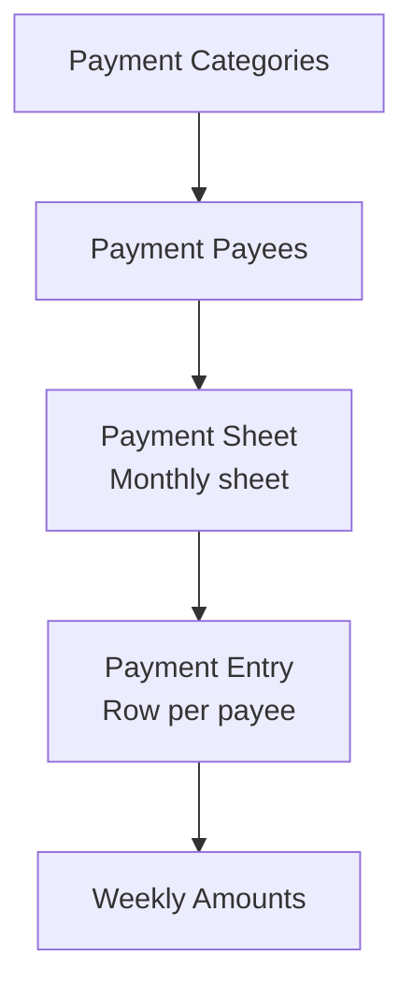
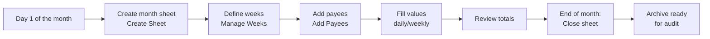

# Payments - User Guide

The SGI **Payments** module is a monthly control of disbursements for employees, subcontractors, and suppliers - a structured digital spreadsheet that replaces HR/financial Excel.

!!! note "Administrators only"
    The Payments module is only accessible by **Administrators** and **Super Administrators**. Employees do not see this menu.

---

## 1. How the module works

The system organizes payments into **4 entities**:

| Entity | What it is | Example |
|----------|---------|---------|
| **Payment Category** | Payee group | "Subcontractors", "Employees", "Suppliers" |
| **Payment Payee** | Who receives | "Nathan", "XYZ Carpentry Ltd" |
| **Payment Sheet** | 1-month spreadsheet | "2026-01" (January 2026) |
| **Payment Entry** | Row in the sheet | Nathan receives X, Y, Z in weeks 1, 2, 3 |

---

## 2. Accessing

In the side menu, click **"Pagamentos"** (Payments).

<!-- TODO: screenshot of main page. File: images/payments-main.png. Capture: header + sheet selector (dropdown with months) + Manage Categories/Payees buttons -->
{ .placeholder-image }

At the top you have:

| Element | What it does |
|----------|-----------|
| **Sheet dropdown** | Choose which month to view (e.g., "January 2026") |
| **Status badge** | Shows if the sheet is **"open"** or **"closed"** |
| **"Manage Categories" button** | Opens dialog to manage categories |
| **"Manage Payees" button** | Opens dialog to manage payees |

---

## 3. Typical monthly flow

### Monthly step-by-step

1. **Create the month sheet** (beginning of the month)
2. **Define the weeks** (4 or 5 week-ending dates)
3. **Add payees** who will receive that month
4. **Fill in values** week by week as you pay
5. **Review totals** before closing
6. **Close sheet** (`closed`) - becomes read-only for audit

---

## 4. Managing Categories

Before adding payees, you need to have **categories** to organize them.

Click **"Manage Categories"**.

<!-- TODO: screenshot of ManageCategoriesDialog. File: images/payments-categories-dialog.png. Capture: category list with colors and edit/delete buttons -->
{ .placeholder-image }

### Category fields

| Field | Description |
|-------|-----------|
| **Name** | E.g., "Subcontractors", "Employees" |
| **Color** | Color name for theming (emerald, amber, blue, purple, pink, cyan, lime, red, orange, indigo) |
| **Order** | In which position the category appears |
| **Active** | Whether the category is in use (soft delete) |

### Example categories

| Name | Color |
|------|-----|
| Subcontractors | `blue` |
| Employees | `emerald` |
| Suppliers | `amber` |
| Services | `purple` |

---

## 5. Managing Payees

Each payee has a category and a preferred payment method.

Click **"Manage Payees"**.

<!-- TODO: screenshot of ManagePayeesDialog. File: images/payments-payees-dialog.png. Capture: list of payees grouped by category, with name/company/method -->
{ .placeholder-image }

### Payee fields

| Field | Required | Description |
|-------|:---:|-----------|
| **Short name** | Yes | Name on the sheet (e.g., "Nathan") |
| **Full name** | Yes | Official name (e.g., "Nathanael da Silva") |
| **Category** | Yes | Which category they belong to |
| **Payment method** | Yes | Zelle / Check / Cash / Company Check |
| **Company** | No | For subcontractors/suppliers |
| **Order** | No | Position on the sheet |
| **Active** | Yes | Soft delete |

### Available payment methods

| Method | Code | Typical use |
|--------|--------|------------|
| **Zelle** | `zelle` | Zelle transfer (US banks) |
| **Check** | `check` | Personal check |
| **Cash** | `cash` | Physical cash |
| **Company Check** | `company_check` | Company check |

!!! note "Each payee has 1 method"
    A payee can only have **1 registered payment method**. If you need to change it, edit the payee - the old method is overwritten.

---

## 6. Creating the Monthly Sheet

Click **"+ Nova Sheet"** (+ New Sheet) or similar.

<!-- TODO: screenshot of CreateSheetDialog. File: images/payments-create-sheet.png. Capture: dialog with year/month selectors + weeks preview -->
{ .placeholder-image }

### Fields

| Field | Description |
|-------|-----------|
| **Year** | 2026 (default: current year) |
| **Month** | 1-12 |
| **Weeks** | Week-ending dates for each week of the month (e.g., 01/05, 01/12, 01/19, 01/26) |

### Sheet ID

The system automatically creates the ID in the format **`YYYY-MM`** (e.g., `2026-01` for January 2026).

!!! warning "Unique ID per month"
    You **cannot create two sheets for the same month**. If you try to create `2026-01` when it already exists, the system returns an error. Use the existing sheet or delete the previous one.

---

## 7. Filling in the Sheet

<!-- TODO: screenshot of PaymentSheetView. File: images/payments-sheet-view.png. Capture: grid with categories (collapsible) + payee rows + week columns + totals -->
{ .placeholder-image }

The sheet is displayed as a **grid** with:

- **Rows:** payees grouped by category (collapsible categories)
- **Columns:** weeks of the month (week-ending dates)
- **Cells:** amount paid to payee that week
- **Totals:** per week, per category, and grand total of the month

### Adding payees to the sheet

1. Click **"Add Payees"** (if the sheet is empty)
2. Select the payees who will receive that month
3. Confirm

Each selected payee generates a **row (entry)** in the sheet.

### Filling in values

Click the intersection cell (payee × week) and type the value. The system:

- **Updates in real time** the payee's total for that month
- **Recalculates** the category subtotal
- **Updates** the grand total

### Managing weeks

Click **"Manage Weeks"** to adjust week-ending dates (useful in months with 5 weeks).

<!-- TODO: screenshot of ManageWeeksDialog. File: images/payments-manage-weeks.png. Capture: dialog with list of editable dates -->
{ .placeholder-image }

---

## 8. Closing the Sheet

At the end of the month, when all payments have been posted:

1. Click the **status toggle** (open padlock icon)
2. Confirm the action
3. Status changes to **`closed`**

### What happens when closing

- Sheet becomes **read-only** (no values can be changed)
- Payees cannot be added/removed
- Weeks cannot be adjusted
- Badge shows **"Fechado"** (Closed)

### Reopening a closed sheet

If you need to change something retroactively:

1. Click the toggle again (now it's a closed padlock)
2. Confirm
3. Status returns to **`open`**
4. Editing reactivated

!!! warning "Reopening is visible"
    The status change appears in the sheet's `updatedAt` - audit can track when it was closed and reopened.

---

## Important Rules

### Required fields and limits

**Categories:**

| Field | Required | Note |
|-------|:---:|---|
| `name` | Yes | Free text |
| `color` | Yes | Material color name (emerald, amber, etc.) |
| `sortOrder` | No | Order in list |
| `active` | Yes (default true) | Soft delete |

**Payees:**

| Field | Required | Note |
|-------|:---:|---|
| `name` | Yes | Short name on the sheet |
| `fullName` | Yes | Full official name |
| `categoryId` | Yes | FK to existing category |
| `paymentMethod` | Yes | zelle / check / cash / company_check |
| `companyName` | No | For company/subcontractors |

**Sheets:**

| Field | Required | Note |
|-------|:---:|---|
| `year` | Yes | Year (e.g., 2026) |
| `month` | Yes | 1-12 |
| `weekEndings` | Yes | Array of ISO dates (no quantity limit) |
| `status` | Yes | open / closed |

### Required permissions

| Operation | Super Admin | Admin | Employee |
|----------|:---:|:---:|:---:|
| View "Pagamentos" menu | Yes | Yes | **No** |
| Create/edit categories | Yes | Yes | No |
| Create/edit payees | Yes | Yes | No |
| Create monthly sheet | Yes | Yes | No |
| Fill in values | Yes | Yes | No |
| Close/reopen sheet | Yes | Yes | No |
| Delete sheet | Yes | Yes | No |

### Validations that block

!!! danger "`closed` sheet is read-only"
    Trying to edit a value in a closed sheet returns an error. Reopen the sheet first if you need to change it.

!!! warning "Unique ID per month"
    Format `YYYY-MM` - two sheets for the same month generate an error on create.

!!! warning "Payees from deactivated category"
    If you deactivate a category (`active: false`), the payees in that category continue to exist and may still appear in old sheets. But they cannot be added to new sheets.

### System defaults

| Setting | Value |
|---|---|
| Initial sheet status | `open` |
| Payees in new sheet | None (add manually) |
| Default weeks | 4 (can adjust to 5) |
| Default payment method | None (mandatory to choose) |

---

## Quick summary

| You want to... | Do this... |
|-------------|-------------|
| View month spreadsheet | "Pagamentos" menu > sheet dropdown |
| Create new month sheet | "+ Nova Sheet" (+ New Sheet) |
| Add category | "Manage Categories" > "+" |
| Add payee (person) | "Manage Payees" > "+" |
| Add payee to sheet | Sheet > "Add Payees" |
| Fill in week value | Click the cell > type |
| Close month | Status toggle in header |
| Reopen month | Toggle again |
