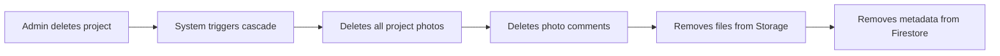

# Project Photos - User Guide

The **Project Photos** module allows you to attach, organize, and comment on images related to the work on each project - progress, inspections, damage, completion, etc.

!!! warning "Tab controlled by permission"
    The **"Fotos"** (Photos) tab in the project detail **only appears** for users with the `canViewProjectPhotos` permission. To upload/edit/delete, you also need `canEditProjectPhotos`.

---

## 1. Where to find it

Photos are in the **"Fotos"** (Photos) tab within each project's detail.

1. Access **"Projetos"** (Projects) in the side menu
2. Click on the desired project card
3. On the detail page, click the **"Fotos"** (Photos) tab

<!-- TODO: screenshot of active PhotosTab. File: images/project-photos-tab.png. Capture: thumbnail grid + upload button + tag filters -->
{ .placeholder-image }

---

## 2. What you see

### Photo Grid

Responsive grid of thumbnails of photos attached to the project.

- **3-4 columns on desktop**
- **2 columns on tablet**
- **1 column on mobile**

Each thumbnail shows:

- Photo thumbnail
- Tags (if any)
- Upload date
- Name of who uploaded

### Empty state

If the project doesn't have photos yet, the card shows:
> "No photos yet. Click 'Upload' to add."

---

## 3. Uploading

Click the **"Upload"** button in the upper right corner of the tab.

<!-- TODO: screenshot of PhotosUploadButton in use. File: images/project-photos-upload.png. Capture: dialog/upload area with drag-and-drop -->
{ .placeholder-image }

### Upload methods

- **Drag-and-drop** - drag photos to the marked area
- **Click to choose** - opens the system file picker
- **Batch upload** - select multiple photos at once

### During upload

- Progress bar per photo
- Background processing (you can navigate to another tab)
- Photos appear in the grid as they complete

---

## 4. Metadata for each photo

When you click on a photo, the **Photo Viewer** opens in fullscreen. In the side panel you can edit:

| Field | Editable? | Description | Limit |
|-------|:---:|-----------|--------|
| **Description** | Yes | Photo description | 2000 characters |
| **Tags** | Yes | Tags for organization (e.g., "progress", "damage") | Max 50 tags, 50 chars each |
| **Taken At** | Yes | When the photo was taken (useful if different from upload) | - |
| **Original Filename** | No | Original file name | - |
| **Uploaded By** | No | Who uploaded (auto-captured) | - |
| **Uploaded At** | No | Upload date (auto-captured) | - |

### Tag suggestions

Organizing photos by tags makes it easier to search later:

- **`progress`** - photos of work being done
- **`before`** - initial state of the location
- **`after`** - final result
- **`damage`** - issues found
- **`material`** - incoming materials
- **`inspection`** - inspection photos

---

## 5. Photo Viewer (Fullscreen View)

When you click on a photo in the grid, a **fullscreen dialog** opens with:

<!-- TODO: screenshot of PhotoViewerDialog. File: images/project-photos-viewer.png. Capture: fullscreen photo + side panel with metadata and comments -->
{ .placeholder-image }

### Elements

- **Image** in high resolution (zoom available)
- **Navigation buttons** (← → for next/previous)
- **Side panel** with editable metadata
- **Comments section**
- **Delete button** (if you have permission)
- **Download button** (download original photo)
- **Close** (ESC or X button)

---

## 6. Collaborative comments

Each photo allows comments. Useful for:

- **Technical discussions**: "Here we need to reinforce the structure before drywall"
- **Instructions**: "Use white joint compound, not gray"
- **History**: "Photo taken before the customer confirmed the change"

### How to comment

1. Open the photo in the Photo Viewer
2. Scroll to the comments section (side panel)
3. Type your comment (free text)
4. Click **"Enviar"** (Send) or press Enter

### Comment fields

| Field | Auto-captured |
|-------|:---:|
| Text | You type |
| Author (`userId`) | Yes |
| Author name (`userName`) | Yes |
| Date (`createdAt`) | Yes |

### Who can delete comments

- **Comment author** - can delete their own
- **Admin** - can delete any comment

---

## 7. Deleting photos

1. Open the photo in the Photo Viewer
2. Click the **trash** icon
3. Confirm in the AlertDialog

!!! warning "Deleting is permanent"
    The photo is removed from Firebase Storage and the metadata from Firestore. **Comments are also deleted along with it.**

### Who can delete

- **Uploader** - owner of the photo can delete their own
- **Admin/Super Admin** - can delete any photo

---

## 8. Cascade Delete (important!)

!!! danger "When deleting a project, all photos go with it"
    If an admin deletes the **entire project**, **all photos** (and comments) of the project are **automatically deleted**. This is an automatic **cascade delete**.

    If you want to preserve important photos before deleting a project:
    1. Download the relevant photos
    2. Only then delete the project

---

## 9. Storage: Firebase vs Google Drive

Each photo has a `storageLocation` field:

| Value | Where the photo is |
|-------|------------------|
| `storage` | Firebase Storage (default) |
| `drive` | Organization's Google Drive (if integration active) |

### When to use Google Drive?

If the organization has the Google Drive integration active (via `Settings > Integrations`, super admin only), photos **can** be stored in Drive in addition to Firebase.

This is useful for:

- **Additional backup** outside Firebase
- **Sharing with external stakeholders** via Drive link
- **Integration with workflows** existing in the company on Workspace

See [Settings](settings.md) for how to activate the Google Drive integration.

---

## Important Rules

### Required fields and limits

| Field | Required | Limit |
|-------|:---:|:---:|
| File (photo) | Yes | **50 MB** per photo |
| MIME type | Yes | `image/*` (jpg, png, heic, webp, gif, etc.) |
| `description` | No | 2000 characters |
| `tags[]` | No | Max 50 tags, 50 chars each |
| `takenAt` | Yes | ISO 8601 (auto or manual) |
| **Comment** (text) | Yes | 1000 characters |

### Required permissions

| Operation | Super Admin | Admin | Employee with `canEditProjectPhotos` | Employee with `canViewProjectPhotos` | Standard employee |
|----------|:---:|:---:|:---:|:---:|:---:|
| View Photos tab | Yes | Yes | Yes | Yes | **No (tab hidden)** |
| View photos and metadata | Yes | Yes | Yes | Yes | No |
| Upload | Yes | Yes | Yes | **No** | No |
| Edit metadata (description, tags) | Yes | Yes | Yes | No | No |
| Delete photo (own) | Yes | Yes | Yes | No | No |
| Delete photo (any) | **Yes** | **Yes** | No | No | No |
| Comment | Yes | Yes | Yes | Yes | No |
| Delete own comment | Yes | Yes | Yes | Yes | No |
| Delete others' comments | **Yes** | **Yes** | No | No | No |

### Validations that block

!!! warning "Maximum size: 50 MB"
    Photos larger than 50 MB are rejected on upload. If the photo is too large:

    - Use compression (apps like Compressor, ImageOptim)
    - Export in "web" quality instead of "original" if it came from a professional camera
    - Reduce resolution (2000x2000 px is already sufficient for documentation)

!!! warning "Images only"
    MIME type must be `image/*`. PDFs, videos, or documents are not accepted in this tab.

!!! danger "Cascade delete when deleting project"
    Deleting project = deleting **all photos and comments**. It is not possible to recover after deleting the project.

### Defaults

| Setting | Value |
|---|---|
| Default storage | Firebase Storage |
| Default `storageLocation` | `storage` |
| Visibility | Restricted to those with `canViewProjectPhotos` |
| Initial tags | None (empty array) |

---

## Quick summary

| You want to... | Do this... |
|-------------|-------------|
| View photos of a project | Project detail > "Fotos" (Photos) tab |
| Upload | Photos tab > "Upload" > drag-and-drop or click |
| Edit description/tags | Click the photo > side panel |
| Comment on a photo | Click the photo > comments section |
| Delete a photo | Click the photo > trash icon |
| Download original photo | Click the photo > download icon |
| Navigate between photos | ← → arrows in the Photo Viewer |
