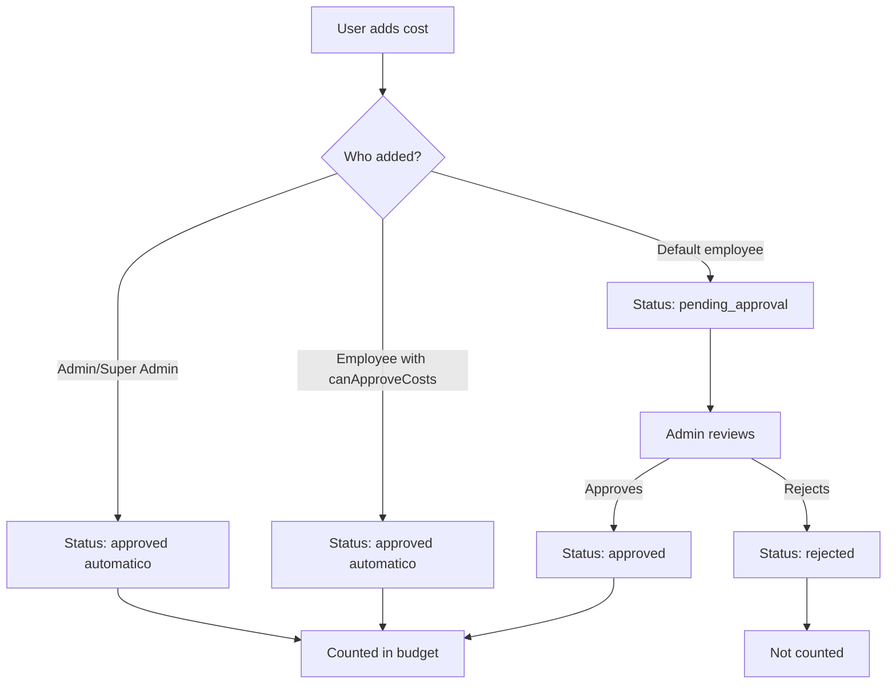
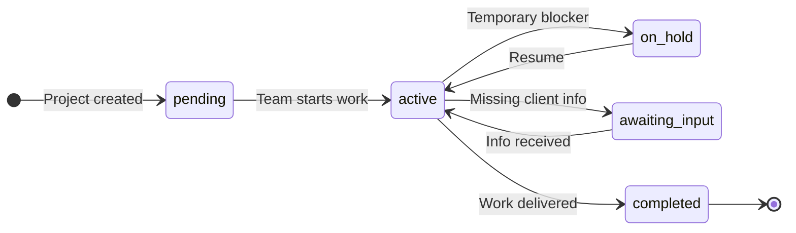

# Projects - User Guide

In this guide, you will learn everything about the **Projects** screen in SGI. This is where you view, create, edit, and track all company projects.

---

## 1. Accessing the Projects screen

On the left sidebar menu, click **"Projetos"** (Projects). You will be taken to the list with all projects in the system.

---

## 2. Understanding the project card

Each project appears as a card with the following information:

- **Project name** - Example: "Instalacao Eletrica - Rua Augusta, 500"
- **Status** - A colored badge indicating the current situation (Pending, In Progress, etc.)
- **Address** - Where the service will be performed
- **Client** - Name of the responsible client
- **Budget** - How much has been spent and the total budget (e.g., R$ 2,500.00 / R$ 5,000.00)
- **Progress bar** - Visually shows how much of the budget has been used
- **Employees** - How many employees are assigned to the project
- **Creation date** - When the project was created

---

## 3. View modes

You can see projects in 3 different ways. The buttons are in the upper right corner of the screen.

### Grid (default)

Shows projects as cards organized in 3 columns. This is the default view and allows you to see multiple projects at once.

### List

Shows projects one below the other in horizontal rows. Useful when you want to see more projects on screen without many visual details.

### Kanban

Organizes projects in columns by status. Each column represents a different status:

- **Pendente (Pending)** - Projects ready to start
- **Em Andamento (In Progress)** - Projects with work in progress
- **Em Espera (On Hold)** - Projects temporarily paused
- **Aguardando Informacao (Awaiting Information)** - Projects waiting for data from a client or someone else
- **Concluido (Completed)** - Finished projects

In Kanban, you can **drag and drop** a project from one column to another to change its status. If you make a mistake, press **Ctrl+Z** to undo.

---

## 4. Searching for projects

At the top of the page, there is a search field with the placeholder text "Buscar por nome, endereco ou cliente..." (Search by name, address or client...).

Just type part of the project name, address, or client name. The list will be filtered automatically as you type.

**Example:** If you type "Pintura", all projects containing "Pintura" in the name will appear.

---

## 5. Filtering projects

Click the **"Filtros"** (Filters) button to open the advanced filters panel.

The available filters are:

### Status
Check the statuses you want to see. You can select more than one at a time:
- Pendente (Pending)
- Em Andamento (In Progress)
- Em Espera (On Hold)
- Aguardando Informacao (Awaiting Information)
- Concluido (Completed)

### Client Group
Filter by client group (if you have groups set up). Select "Todos os Grupos" (All Groups) to see all.

### Budget Status
Filter by the financial state of the project:
- **Todos (All)** - Shows all projects
- **Abaixo (Under)** - Projects with expenses below the alert threshold
- **Proximo (Near)** - Projects with expenses near the alert threshold
- **Ultrapassado (Over)** - Projects that have already spent more than the total budget

---

## 6. Sorting projects

Next to the filters button, there is a sort selector. Click it to choose how projects are ordered:

- **Mais Recentes (Most Recent)** - Most recently created projects first (default)
- **Mais Antigos (Oldest)** - Oldest created projects first
- **Nome (A-Z) (Name A-Z)** - Alphabetical order
- **Nome (Z-A) (Name Z-A)** - Reverse alphabetical order
- **Maior Orcamento (Highest Budget)** - Projects with the highest budget first
- **Menor Orcamento (Lowest Budget)** - Projects with the lowest budget first

---

## 7. Creating a new project

To create a project, click the **"+ Novo Projeto"** (New Project) button in the upper right corner.

A window will open with the following fields:

| Field | Required? | Description |
|-------|:---------:|-------------|
| **Nome do Projeto (Project Name)** | Yes | The name that identifies the project. E.g.: "Residential Painting - Rua das Flores, 100" |
| **Endereco (Address)** | Yes | Full address where the service will be performed |
| **Nome do Cliente (Client Name)** | Yes | Name of the client who hired the service |
| **Grupo do Cliente (Client Group)** | No | Select a group to organize your clients (optional) |
| **Orcamento (Budget)** | Yes | Total budget value. Use 0 if not yet defined |
| **Limite de Alerta (Alert Threshold %)** | No | Budget percentage at which you will be alerted. Default: 80% |
| **Funcionarios Atribuidos (Assigned Employees)** | No | Select which employees will have access to this project |

### Step-by-step example

Let's create a sample project:

1. Click **"+ Novo Projeto"**
2. In **Nome do Projeto**, type: `Pintura Residencial - Rua das Flores, 100`
3. In **Endereco**, type: `Rua das Flores, 100 - Sao Paulo, SP`
4. In **Nome do Cliente**, type: `Ana Silva`
5. In **Orcamento**, type: `15000` (R$ 15,000.00)
6. The **Limite de Alerta** is already filled with 80% - this means when the project spends 80% of the budget (R$ 12,000.00), you will see an alert
7. Click **"Criar Projeto"** (Create Project)

The project will be created with "Pendente" (Pending) status and will appear in the list.

---

## 8. Project details page

To see all details of a project, click its card in the list. You will be taken to the details page.

### Header

At the top of the page, you will find:

- **"Voltar" (Back) button** - Returns to the project list
- **Project name** - The full project name
- **Status** - Colored badge with the current status
- **Address** - Project address
- **Client** - Client name
- **Creation date** - When the project was created
- **"Editar" (Edit) button** - Opens the form to edit the project (administrators only)
- **"Excluir" (Delete) button** - Permanently removes the project (administrators only)

### Budget Panel

Right below the header, there is the budget panel showing 3 important values:

| Information | What it means | Example |
|-------------|---------------|---------|
| **Orcamento Total (Total Budget)** | The total value defined for the project | R$ 20,000.00 |
| **Gasto Atual (Current Spending)** | The sum of all approved costs | R$ 12,000.00 |
| **Disponivel (Available)** | How much remains of the budget (Total - Current Spending) | R$ 8,000.00 |

Below the values, there is a **progress bar** that visually shows the percentage used.

#### How the system calculates

- **Total Budget** = Value defined when you created or edited the project
- **Current Spending** = Sum of all costs that were **approved** (pending or rejected costs do not count)
- **Available** = Total Budget minus Current Spending
- **Percentage** = (Current Spending / Total Budget) x 100

#### Alert Threshold and colors

The **Alert Threshold** is the percentage at which the system warns you that spending is getting high. The default is 80%, but you can change it when creating or editing the project.

The progress bar changes color based on the situation:

| Bar color | Meaning | When it appears |
|:---------:|---------|-----------------|
| Green/Blue | Everything normal | Spending below the alert threshold |
| Orange | Attention! Near the limit | Spending between the alert threshold and 100% |
| Red | Budget exceeded | Spending above 100% of the budget |

**Example:** If the budget is R$ 20,000.00 and the alert threshold is 80%:
- Up to R$ 16,000.00 in spending = green bar (normal)
- From R$ 16,000.00 to R$ 20,000.00 = orange bar (attention)
- Above R$ 20,000.00 = red bar (exceeded)

---

## 9. Project tabs

The details page has 6 tabs. Click each one to see different information.

### Tab: Visao Geral (Overview)

Shows a summary with two sections:

**Project Information:**
- Project Name
- Address
- Client
- Current Status
- Creation date
- Last update date

**Scope Details:**
- Estimated service duration (in hours and minutes)
- Number of assigned employees
- Configured budget alert threshold

---

### Tab: Custos (Costs)

Here you see all costs recorded for this project.

**What appears in each cost:**
- **Value** - How much it cost (e.g., R$ 12,000.00)
- **Status** - Whether it is Approved, Pending, or Rejected
- **Description** - What the expense was for
- **Who added it** - Name of the employee or admin who recorded the cost
- **Date** - When the cost was recorded

**Available actions (administrators only):**
- **"+ Adicionar Custo" (Add Cost)** - Record a new expense for the project
- **"Editar" (Edit)** - Change the data of an existing cost
- **"Ver detalhes" (View details)** - Expand to see more information about the cost

#### How costs work

- When an **administrator** adds a cost, it is **automatically approved** and immediately counts toward the budget
- When an **employee** adds a cost (via Chat), it stays as **"Pending"** until an administrator approves or rejects it
- Only costs with **"Approved"** status are added to the "Current Spending" of the budget
- Pending or rejected costs **do not affect** the budget

#### Inventory Costs

In addition to manual costs, you can also add costs from the system's **Inventory**. When you withdraw items from inventory for a project, the value is automatically recorded as a cost.

> This feature will be explained in detail in the **Inventory Guide**.

---

### Tab: Equipe (Team)

Shows all employees assigned to this project.

**What appears for each employee:**
- **Photo/Initial** - A circle with the name initial
- **Name** - Employee's full name
- **Email** - Employee's email
- **Skills** - Tags showing skills (e.g., carpet_installation, painting, electrical)
- **Role** - Whether they are an Employee or Administrator

Employees are assigned to the project during creation or editing of the project.

---

### Tab: Linha do Tempo (Timeline)

Shows the history of everything that happened in the project, in chronological order.

**Types of events that appear:**
- **Project created** - When the project was created and by whom
- **Status changed** - When the status changed (e.g., "Status changed from Pending to In Progress")
- **Cost approved** - When a cost was approved
- **Employees assigned** - When employees were added or removed
- **Data edited** - When project information was changed

Each event shows the date, time, and who performed the action.

---

### Tab: Work Order (Professional Scope)

The project scope is now called **Work Order** - a complete professional service order with header, customer info, categories and detailed items.

<!-- TODO: screenshot of WorkOrderView complete. File: images/work-order-view.png. Capture: expanded categories with items and values -->
{ .placeholder-image }

The Work Order is generated through the **AI Chat** (from text, photo, audio or video) **or** imported from an **external PDF**. It contains:

- **Header:** WO number, job number, customer, job address
- **16 professional categories** (Framing, Electrical, Drywall, Plumbing, etc.)
- **Detailed items** with task, action, type, quantity, unit, room
- **Prices** (visible only to administrators)
- **Formal status** (Draft → Ready for Review → Approved → In Progress → Completed)
- **PDF export** to send to the client

📖 **See the [Work Order Guide](work-order-en.md)** for complete system documentation.

---

### Tab: Relatorios (Reports)

Shows the history of daily progress reports for the project.

Reports are created by employees through **AI Chat**. There is no "Create Report" button on this tab - all reports come from the Chat.

📖 See the [AI Chat](chat-en.md) and [Daily Reports](daily-reports.md) guides for the full flow.

---

### Tab: Project Photos

<!-- TODO: screenshot of PhotosTab with PhotoGrid. File: images/project-photos-tab.png. Capture: grid of thumbnails + upload button -->
{ .placeholder-image }

The **Photos** tab allows attaching images to the project (work progress, damages, inspections, etc.). Features:

- Upload multiple photos (up to 50MB each)
- Metadata: description, tags, capture date
- Per-photo comments (collaborative)

!!! warning "Permission required"
    The "Photos" tab **only appears** for users with the `canViewProjectPhotos` permission. To upload/edit/delete, you also need `canEditProjectPhotos`.

📖 See the [Project Photos Guide](project-photos.md) for full instructions.

---

## 10. Editing a project

To edit a project:

1. Click the project in the list to open the details page
2. Click the **"Editar"** (Edit) button in the upper right corner
3. A window will open with the current project data already filled in
4. Change whatever is needed (name, address, client, budget, alert threshold, employees)
5. Click **"Salvar"** (Save) to confirm the changes

The changes will be saved and the page will be updated automatically.

---

## 11. Deleting a project

To delete a project:

1. Click the project in the list to open the details page
2. Click the **"Excluir"** (Delete) button in the upper right corner
3. A confirmation window will appear showing the project data (name, address, client, budget, spending, status)
4. Read carefully - **this action is permanent and cannot be undone**
5. If you are sure, click the confirmation button to delete

After deleting, you will be redirected back to the project list.

---

## 12. Kanban - Managing status

The Kanban mode is ideal for visually managing project status.

### How to use

**On desktop:**
- **Drag and drop** a project card to the desired status column
- Example: Drag "Instalacao Carpete" from the "Pendente" column to "Em Andamento"
- The system will update the status automatically

**Undo:**
- If you moved a project by mistake, press **Ctrl+Z** (or **Cmd+Z** on Mac) to undo
- An "Undo" button also appears in the notification that shows up after moving

### What each column means

| Status | Meaning | When to use |
|--------|---------|-------------|
| **Pendente** (`pending`) | The project was created and is ready to start | New or approved projects |
| **Em Andamento** (`active`) | Work is being done | When the team started the service |
| **Em Espera** (`on_hold`) | The project is paused | When there is a temporary blocker |
| **Aguardando Informacao** (`awaiting_input`) | Missing information to continue | When you need data from the client or supplier |
| **Concluido** (`completed`) | The project is finished | When all work has been delivered |

!!! warning "Reason required for `on_hold` and `awaiting_input`"
    When you change a project to **On Hold** or **Awaiting Info**, the system opens a modal asking for the **reason** (`statusReason` field, up to 500 characters). Without a reason, the change is **not saved**.

    This reason appears in the project Timeline and helps the team understand why work stopped.

!!! note "Status change: admin only"
    Only **Super Admin** and **Admin** can change project status. Employees do not have access to Kanban drag-and-drop or status buttons.

---

## Important Rules

### Required fields and limits

| Field | Required | Min | Max | Note |
|-------|:---:|:---:|:---:|---|
| `projectName` | Yes | 3 chars | 100 chars | - |
| `address` | Yes | 5 chars | - | - |
| `clientName` | Yes | 3 chars | - | - |
| `clientGroupId` | No | - | - | Must exist if provided |
| `budget` | Yes | 0 | - | Can be 0 (not defined) |
| `budgetAlertThreshold` | No | 0 | 1 | Default: 0.8 (80%) |
| `assignedUsers` | No | - | - | Empty array if none |
| `statusReason` | Conditional | - | 500 chars | **Required** when changing to `on_hold` or `awaiting_input` |

### Required permissions

| Operation | Super Admin | Admin | Employee with permission | Default employee |
|-----------|:---:|:---:|:---:|:---:|
| View all projects | Yes | Yes | `canViewAllProjects` | Assigned only |
| Create project | Yes | Yes | `canCreateProjects` | No |
| Edit project | Yes | Yes | `canEditProjects` | No |
| Delete project | Yes | Yes | `canDeleteProjects` | No |
| Change status (Kanban) | Yes | Yes | No (admins only) | No |
| Add cost | Yes | Yes | `canAddCosts` | No |
| Approve cost | Yes | Yes | `canApproveCosts` | No |

### Blocking validations

!!! warning "Reason required"
    Changing a project to `on_hold` or `awaiting_input` without filling in `statusReason` blocks the operation.

!!! note "Deleting a project is not blocked"
    The system **allows** deleting a project even with costs, schedules, photos, and daily reports. **All related data is lost** (cascade delete for photos, others become orphaned). Be careful.

### System defaults

| Setting | Default |
|---|---|
| Initial status | `pending` |
| `budgetAlertThreshold` | 0.8 (80%) |
| `assignedUsers` | [] (empty) |
| `clientGroupId` | null (no group) |
| Initial list view | Grid |
| Items per page | 20 (infinite scroll) |
| Sort order | Most recent first |

---

## Quick reference

| You want to... | Do this... |
|----------------|-----------|
| See all projects | Click "Projetos" in the sidebar menu |
| Search for a project | Type in the search field |
| Filter by status | Click "Filtros" and check the statuses |
| Create a project | Click "+ Novo Projeto" |
| View details | Click on the project card |
| Edit a project | Details > "Editar" button |
| Delete a project | Details > "Excluir" button |
| Quickly change status | Use Kanban mode and drag the card |
| Track expenses | Details > "Custos" tab |
| See the team | Details > "Equipe" tab |
| View history | Details > "Linha do Tempo" tab |
