# Projetos - Guia do Usuario

Neste guia, voce vai aprender tudo sobre a tela de **Projetos** do SGI. Aqui e onde voce visualiza, cria, edita e acompanha todos os projetos da empresa.

---

## 1. Acessando a tela de Projetos

No menu lateral esquerdo, clique em **"Projetos"**. Voce sera levado para a lista com todos os projetos do sistema.

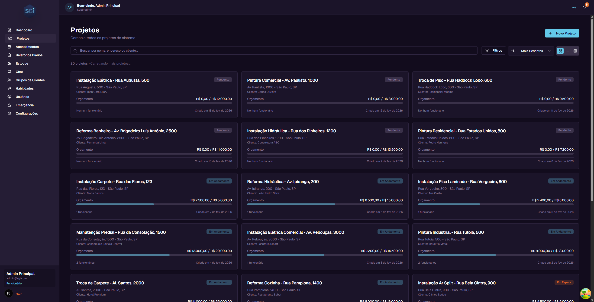

---

## 2. Entendendo o card do projeto

Cada projeto aparece como um card com as seguintes informacoes:

- **Nome do projeto** - Exemplo: "Instalacao Eletrica - Rua Augusta, 500"
- **Status** - Uma etiqueta colorida indicando a situacao atual (Pendente, Em Andamento, etc.)
- **Endereco** - Onde o servico sera realizado
- **Cliente** - Nome do cliente responsavel
- **Orcamento** - Quanto ja foi gasto e o orcamento total (ex: R$ 2.500,00 / R$ 5.000,00)
- **Barra de progresso** - Mostra visualmente quanto do orcamento ja foi utilizado
- **Funcionarios** - Quantos funcionarios estao atribuidos ao projeto
- **Data de criacao** - Quando o projeto foi criado

---

## 3. Modos de visualizacao

Voce pode ver os projetos de 3 formas diferentes. Os botoes ficam no canto superior direito da tela.

### Grade (padrao)

Mostra os projetos em cards organizados em 3 colunas. E a visualizacao padrao e permite ver varios projetos de uma vez.

### Lista

Mostra os projetos um abaixo do outro, em linhas horizontais. Util para quando voce quer ver mais projetos na tela sem muitos detalhes visuais.

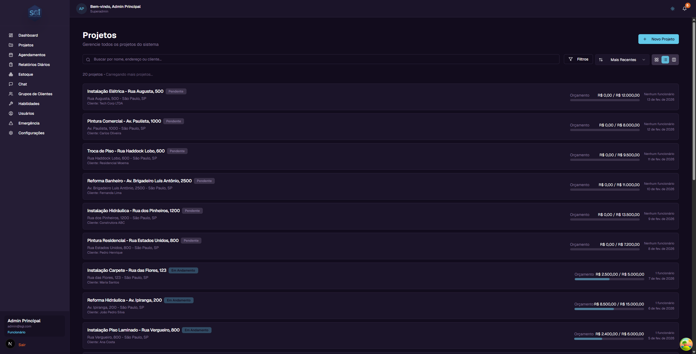

### Kanban

Organiza os projetos em colunas por status. Cada coluna representa um status diferente:

- **Pendente** - Projetos prontos para comecar
- **Em Andamento** - Projetos com trabalho em progresso
- **Em Espera** - Projetos pausados temporariamente
- **Aguardando Informacao** - Projetos esperando dados do cliente ou de outra pessoa
- **Concluido** - Projetos finalizados

No Kanban, voce pode **arrastar e soltar** um projeto de uma coluna para outra para mudar o status dele. Se voce errar, use **Ctrl+Z** para desfazer.

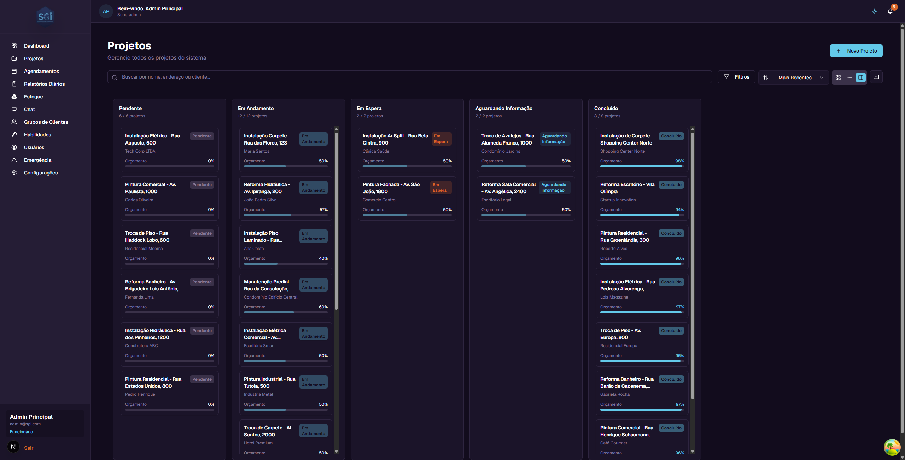

---

## 4. Buscando projetos

No topo da pagina, existe um campo de busca com o texto "Buscar por nome, endereco ou cliente...".

Basta digitar parte do nome do projeto, do endereco ou do nome do cliente. A lista sera filtrada automaticamente conforme voce digita.

**Exemplo:** Se voce digitar "Pintura", todos os projetos que contenham "Pintura" no nome vao aparecer.

---

## 5. Filtrando projetos

Clique no botao **"Filtros"** para abrir o painel de filtros avancados.

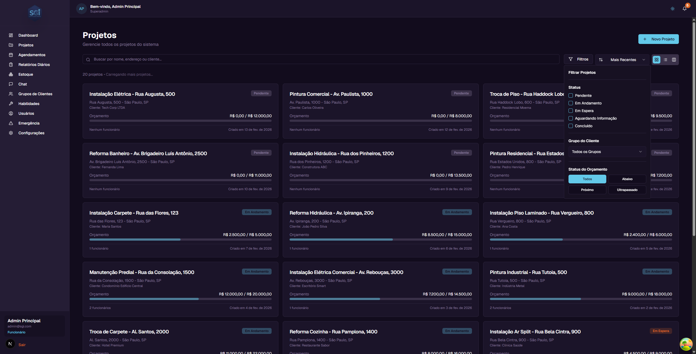

Os filtros disponiveis sao:

### Status
Marque os status que voce quer ver. Voce pode selecionar mais de um ao mesmo tempo:
- Pendente
- Em Andamento
- Em Espera
- Aguardando Informacao
- Concluido

### Grupo do Cliente
Filtre por grupo de clientes (se voce tiver grupos cadastrados). Selecione "Todos os Grupos" para ver todos.

### Status do Orcamento
Filtre pelo estado financeiro do projeto:
- **Todos** - Mostra todos os projetos
- **Abaixo** - Projetos com gastos abaixo do limite de alerta
- **Proximo** - Projetos com gastos perto do limite de alerta
- **Ultrapassado** - Projetos que ja gastaram mais do que o orcamento total

---

## 6. Ordenando projetos

Ao lado do botao de filtros, existe um seletor de ordenacao. Clique nele para escolher como os projetos sao ordenados:

- **Mais Recentes** - Projetos criados mais recentemente primeiro (padrao)
- **Mais Antigos** - Projetos criados ha mais tempo primeiro
- **Nome (A-Z)** - Ordem alfabetica
- **Nome (Z-A)** - Ordem alfabetica inversa
- **Maior Orcamento** - Projetos com maior orcamento primeiro
- **Menor Orcamento** - Projetos com menor orcamento primeiro

---

## 7. Criando um novo projeto

Para criar um projeto, clique no botao **"+ Novo Projeto"** no canto superior direito.

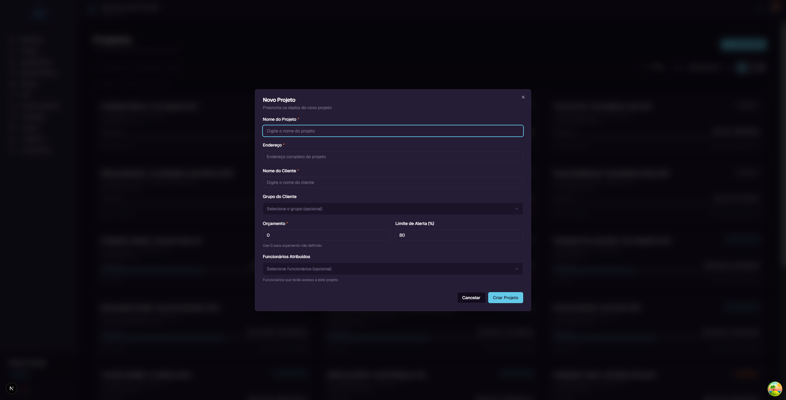

Uma janela vai abrir com os seguintes campos:

| Campo | Obrigatorio? | Descricao |
|-------|:---:|-----------|
| **Nome do Projeto** | Sim | O nome que identifica o projeto. Ex: "Pintura Residencial - Rua das Flores, 100" |
| **Endereco** | Sim | Endereco completo onde o servico sera realizado |
| **Nome do Cliente** | Sim | Nome do cliente que contratou o servico |
| **Grupo do Cliente** | Nao | Selecione um grupo para organizar seus clientes (opcional) |
| **Orcamento** | Sim | Valor total do orcamento. Use 0 se ainda nao foi definido |
| **Limite de Alerta (%)** | Nao | Porcentagem do orcamento a partir da qual voce sera alertado. Padrao: 80% |
| **Funcionarios Atribuidos** | Nao | Selecione quais funcionarios terao acesso a este projeto |

### Exemplo passo a passo

Vamos criar um projeto de exemplo:

1. Clique em **"+ Novo Projeto"**
2. Em **Nome do Projeto**, digite: `Pintura Residencial - Rua das Flores, 100`
3. Em **Endereco**, digite: `Rua das Flores, 100 - Sao Paulo, SP`
4. Em **Nome do Cliente**, digite: `Ana Silva`
5. Em **Orcamento**, digite: `15000` (R$ 15.000,00)
6. O **Limite de Alerta** ja vem preenchido com 80% - isso significa que quando o projeto gastar 80% do orcamento (R$ 12.000,00), voce vera um alerta
7. Clique em **"Criar Projeto"**

O projeto sera criado com o status "Pendente" e aparecera na lista.

---

## 8. Pagina de detalhes do projeto

Para ver todos os detalhes de um projeto, clique no card dele na lista. Voce sera levado para a pagina de detalhes.

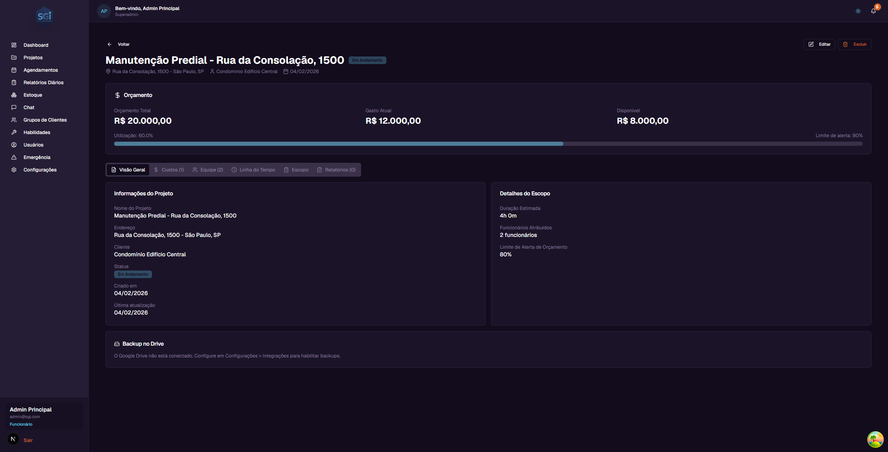

### Cabecalho

No topo da pagina, voce encontra:

- **Botao "Voltar"** - Retorna para a lista de projetos
- **Nome do projeto** - O nome completo do projeto
- **Status** - Etiqueta colorida com o status atual
- **Endereco** - Endereco do projeto
- **Cliente** - Nome do cliente
- **Data de criacao** - Quando o projeto foi criado
- **Botao "Editar"** - Abre o formulario para editar o projeto (apenas administradores)
- **Botao "Excluir"** - Remove o projeto permanentemente (apenas administradores)

### Painel de Orcamento

Logo abaixo do cabecalho, existe o painel de orcamento que mostra 3 valores importantes:

| Informacao | O que significa | Exemplo |
|------------|----------------|---------|
| **Orcamento Total** | O valor total definido para o projeto | R$ 20.000,00 |
| **Gasto Atual** | A soma de todos os custos aprovados | R$ 12.000,00 |
| **Disponivel** | Quanto ainda resta do orcamento (Total - Gasto Atual) | R$ 8.000,00 |

Abaixo dos valores, existe uma **barra de progresso** que mostra visualmente a porcentagem utilizada.

#### Como o sistema calcula

- **Orcamento Total** = Valor definido quando voce criou ou editou o projeto
- **Gasto Atual** = Soma de todos os custos que foram **aprovados** (custos pendentes ou rejeitados nao contam)
- **Disponivel** = Orcamento Total menos o Gasto Atual
- **Porcentagem** = (Gasto Atual / Orcamento Total) x 100

#### Limite de Alerta e cores

O **Limite de Alerta** e a porcentagem a partir da qual o sistema avisa que voce esta gastando muito. O padrao e 80%, mas voce pode mudar ao criar ou editar o projeto.

A barra de progresso muda de cor conforme a situacao:

| Cor da barra | Significado | Quando aparece |
|:---:|-------------|----------------|
| Verde/Azul | Tudo normal | Gastos abaixo do limite de alerta |
| Laranja | Atencao! Proximo do limite | Gastos entre o limite de alerta e 100% |
| Vermelho | Orcamento ultrapassado | Gastos acima de 100% do orcamento |

**Exemplo:** Se o orcamento e R$ 20.000,00 e o limite de alerta e 80%:
- Ate R$ 16.000,00 de gastos = barra verde (normal)
- De R$ 16.000,00 a R$ 20.000,00 = barra laranja (atencao)
- Acima de R$ 20.000,00 = barra vermelha (ultrapassou)

---

## 9. Abas do projeto

A pagina de detalhes tem 6 abas. Clique em cada uma para ver informacoes diferentes.

### Aba: Visao Geral

Mostra um resumo com duas secoes:

**Informacoes do Projeto:**
- Nome do Projeto
- Endereco
- Cliente
- Status atual
- Data de criacao
- Data da ultima atualizacao

**Detalhes do Escopo:**
- Duracao estimada do servico (em horas e minutos)
- Quantidade de funcionarios atribuidos
- Limite de alerta de orcamento configurado

---

### Aba: Custos

Aqui voce ve todos os custos registrados neste projeto.

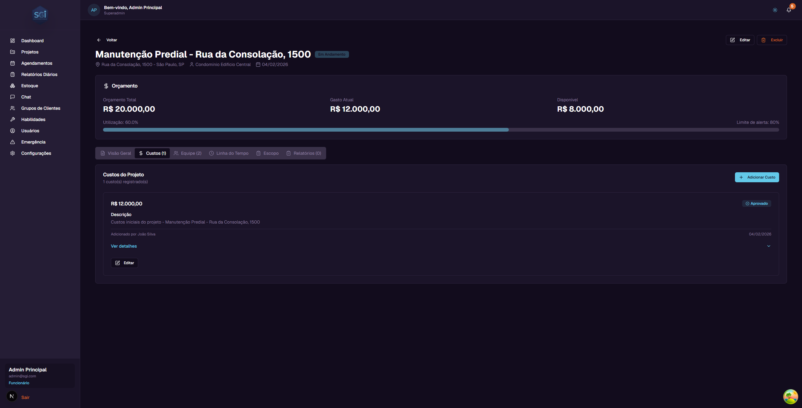

**O que aparece em cada custo:**
- **Valor** - Quanto custou (ex: R$ 12.000,00)
- **Status** - Se esta Aprovado, Pendente ou Rejeitado
- **Descricao** - O que foi o gasto
- **Quem adicionou** - Nome do funcionario ou admin que registrou o custo
- **Data** - Quando o custo foi registrado

**Acoes disponiveis (apenas administradores):**
- **"+ Adicionar Custo"** - Registrar um novo gasto no projeto
- **"Editar"** - Alterar os dados de um custo existente
- **"Ver detalhes"** - Expandir para ver mais informacoes do custo

#### Como os custos funcionam

- Quando um **administrador** adiciona um custo, ele e **aprovado automaticamente** e ja conta no orcamento
- Quando um **funcionario** adiciona um custo (via Chat), ele fica como **"Pendente"** ate um administrador aprovar ou rejeitar
- Somente custos com status **"Aprovado"** sao somados no "Gasto Atual" do orcamento
- Custos pendentes ou rejeitados **nao afetam** o orcamento

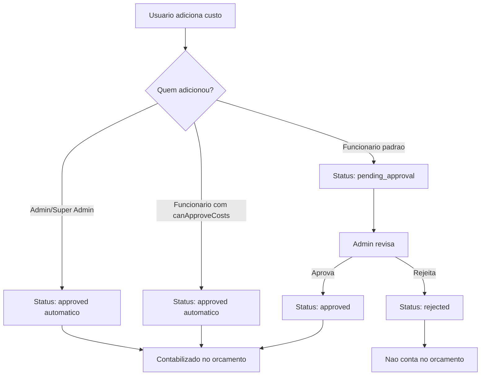

#### Custos de Estoque

Alem de custos manuais, voce tambem pode adicionar custos a partir do **Estoque** do sistema. Ao retirar itens do estoque para um projeto, o valor e registrado automaticamente como custo.

> Este recurso sera explicado em detalhes no **Guia de Estoque**.

---

### Aba: Equipe

Mostra todos os funcionarios que estao atribuidos a este projeto.

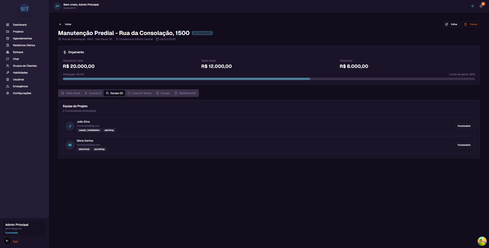

**O que aparece para cada funcionario:**
- **Foto/Inicial** - Uma bolinha com a inicial do nome
- **Nome** - Nome completo do funcionario
- **Email** - Email do funcionario
- **Habilidades** - Tags mostrando as habilidades (ex: carpet_installation, painting, electrical)
- **Cargo** - Se e Funcionario ou Administrador

Os funcionarios sao atribuidos ao projeto durante a criacao ou edicao do projeto.

---

### Aba: Linha do Tempo

Mostra o historico de tudo que aconteceu no projeto, em ordem cronologica.

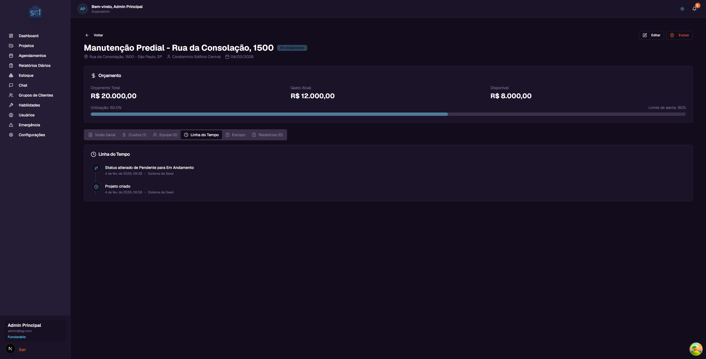

**Tipos de eventos que aparecem:**
- **Projeto criado** - Quando o projeto foi criado e por quem
- **Status alterado** - Quando o status mudou (ex: "Status alterado de Pendente para Em Andamento")
- **Custo aprovado** - Quando um custo foi aprovado
- **Funcionarios atribuidos** - Quando funcionarios foram adicionados ou removidos
- **Dados editados** - Quando informacoes do projeto foram alteradas

Cada evento mostra a data, hora e quem realizou a acao.

---

### Aba: Work Order (Escopo Profissional)

O escopo do projeto agora e chamado **Work Order** - uma ordem de servico profissional completa com header, cliente, categorias e items detalhados.

<!-- TODO: screenshot de WorkOrderView completo. Arquivo: images/work-order-view.png. Capturar: categorias expandidas com items e valores -->
{ .placeholder-image }

A Work Order e gerada atraves do **Chat com IA** (a partir de texto, foto, audio ou video) **ou** importada de um **PDF externo**. Ela contem:

- **Header:** numero da WO, numero do job, cliente, endereco do trabalho
- **16 categorias profissionais** (Framing, Electrical, Drywall, Plumbing, etc.)
- **Items detalhados** com task, acao, tipo, quantidade, unidade, comodo
- **Precos** (visiveis apenas para administradores)
- **Status formal** (Draft → Ready for Review → Approved → In Progress → Completed)
- **Export em PDF** para envio ao cliente

📖 **Consulte o [Guia de Work Order](work-order.md)** para documentacao completa do sistema.

---

### Aba: Relatorios

Mostra o historico de relatorios diarios de progresso do projeto.

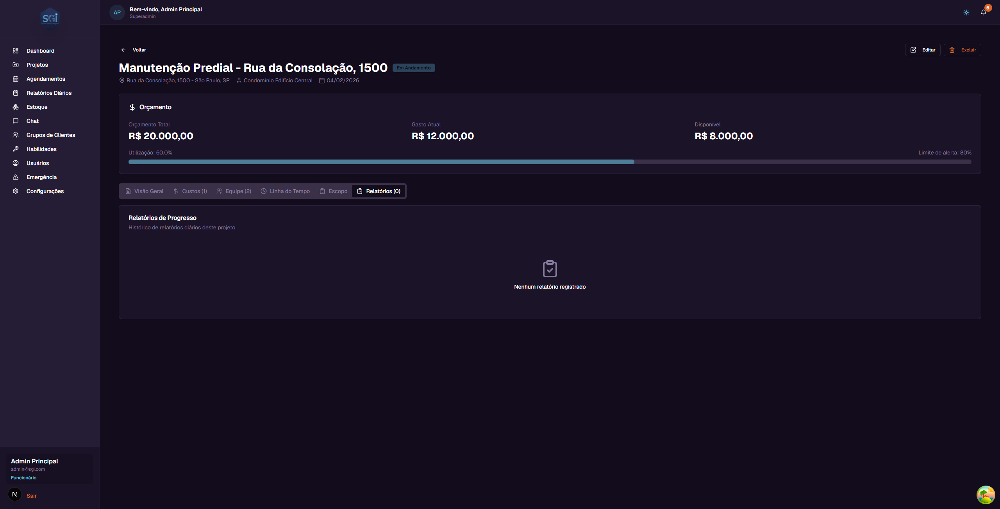

Os relatorios sao criados pelos funcionarios atraves do **Chat com IA**. Nao ha botao "Criar Relatorio" nesta aba - todos os relatorios vem do Chat.

📖 Veja os guias [Chat com IA](chat.md) e [Relatorios Diarios](relatorios-diarios.md) para o fluxo completo.

---

### Aba: Fotos do Projeto

<!-- TODO: screenshot de PhotosTab com PhotoGrid. Arquivo: images/project-photos-tab.png. Capturar: grid de miniaturas + botao de upload -->
{ .placeholder-image }

A aba **Fotos** permite anexar imagens ao projeto (progresso do trabalho, danos, vistorias, etc.). Inclui:

- Upload de multiplas fotos (ate 50MB cada)
- Metadados: descricao, tags, data da captura
- Comentarios por foto (colaborativo)

!!! warning "Permissao necessaria"
    A aba "Fotos" **so aparece** para usuarios com a permissao `canViewProjectPhotos`. Para fazer upload/editar/deletar, precisa tambem de `canEditProjectPhotos`.

📖 Veja o [Guia de Fotos do Projeto](fotos-de-projeto.md) para instrucoes completas.

---

## 10. Editando um projeto

Para editar um projeto:

1. Clique no projeto na lista para abrir a pagina de detalhes
2. Clique no botao **"Editar"** no canto superior direito
3. Uma janela vai abrir com os dados atuais do projeto ja preenchidos
4. Altere o que for necessario (nome, endereco, cliente, orcamento, limite de alerta, funcionarios)
5. Clique em **"Salvar"** para confirmar as alteracoes

As alteracoes serao salvas e a pagina sera atualizada automaticamente.

---

## 11. Excluindo um projeto

Para excluir um projeto:

1. Clique no projeto na lista para abrir a pagina de detalhes
2. Clique no botao **"Excluir"** no canto superior direito
3. Uma janela de confirmacao vai aparecer mostrando os dados do projeto (nome, endereco, cliente, orcamento, gastos, status)
4. Leia com atencao - **esta acao e permanente e nao pode ser desfeita**
5. Se tiver certeza, clique no botao de confirmacao para excluir

Apos excluir, voce sera redirecionado de volta para a lista de projetos.

---

## 12. Kanban - Gerenciando status

O modo Kanban e ideal para gerenciar o status dos projetos de forma visual.

### Como usar

**No computador (desktop):**
- **Arraste e solte** o card de um projeto para a coluna do status desejado
- Exemplo: Arraste "Instalacao Carpete" da coluna "Pendente" para "Em Andamento"
- O sistema vai atualizar o status automaticamente

**Desfazer:**
- Se voce moveu um projeto por engano, pressione **Ctrl+Z** (ou **Cmd+Z** no Mac) para desfazer
- Tambem aparece um botao de "Desfazer" na notificacao que surge apos mover

### O que cada coluna significa

| Status | Significado | Quando usar |
|--------|-------------|-------------|
| **Pendente** (`pending`) | O projeto foi criado e esta pronto para comecar | Projetos novos ou aprovados |
| **Em Andamento** (`active`) | O trabalho esta sendo executado | Quando a equipe comecou o servico |
| **Em Espera** (`on_hold`) | O projeto esta pausado | Quando ha um impedimento temporario |
| **Aguardando Informacao** (`awaiting_input`) | Falta uma informacao para continuar | Quando precisa de dados do cliente ou fornecedor |
| **Concluido** (`completed`) | O projeto foi finalizado | Quando todo o servico foi entregue |

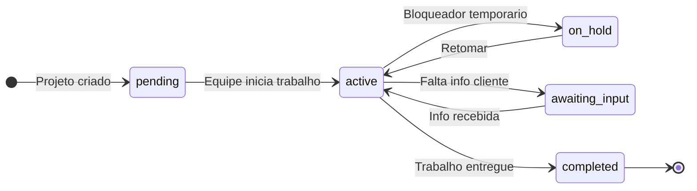

!!! warning "Motivo obrigatorio em `on_hold` e `awaiting_input`"
    Quando voce muda um projeto para **Em Espera** ou **Aguardando Informacao**, o sistema abre um modal pedindo o **motivo** (campo `statusReason`, ate 500 caracteres). Sem motivo, a mudanca **nao e salva**.

    Esse motivo aparece na Timeline do projeto e ajuda a equipe a entender por que o trabalho parou.

!!! note "Mudanca de status: apenas admins"
    Apenas **Super Admin** e **Admin** podem mudar o status de um projeto. Funcionarios nao tem acesso ao Kanban drag-and-drop nem aos botoes de status.

---

## Regras Importantes

### Campos obrigatórios e limites

| Campo | Obrigatório | Min | Max | Observação |
|-------|:---:|:---:|:---:|---|
| `projectName` | Sim | 3 chars | 100 chars | - |
| `address` | Sim | 5 chars | - | - |
| `clientName` | Sim | 3 chars | - | - |
| `clientGroupId` | Não | - | - | Deve existir se informado |
| `budget` | Sim | 0 | - | Pode ser 0 (não definido) |
| `budgetAlertThreshold` | Não | 0 | 1 | Padrão: 0.8 (80%) |
| `assignedUsers` | Não | - | - | Array vazio se nenhum |
| `statusReason` | Condicional | - | 500 chars | **Obrigatório** ao mudar para `on_hold` ou `awaiting_input` |

### Permissões necessárias

| Operação | Super Admin | Admin | Funcionário com permissão | Funcionário padrão |
|----------|:---:|:---:|:---:|:---:|
| Ver todos os projetos | Sim | Sim | `canViewAllProjects` | Só atribuídos |
| Criar projeto | Sim | Sim | `canCreateProjects` | Não |
| Editar projeto | Sim | Sim | `canEditProjects` | Não |
| Deletar projeto | Sim | Sim | `canDeleteProjects` | Não |
| Mudar status (Kanban) | Sim | Sim | Não (reservado admins) | Não |
| Adicionar custo | Sim | Sim | `canAddCosts` | Não |
| Aprovar custo | Sim | Sim | `canApproveCosts` | Não |

### Validações que bloqueiam

!!! warning "Motivo obrigatório"
    Mudar projeto para `on_hold` ou `awaiting_input` sem preencher `statusReason` bloqueia a operação.

!!! note "Deletar projeto não bloqueia"
    O sistema **permite** deletar projeto mesmo com custos, agendamentos, fotos, daily reports. **Todos os dados relacionados são perdidos** (cascade delete das fotos, outros ficam órfãos). Seja cuidadoso.

### Defaults do sistema

| Configuração | Padrão |
|---|---|
| Status inicial | `pending` |
| `budgetAlertThreshold` | 0.8 (80%) |
| `assignedUsers` | [] (vazio) |
| `clientGroupId` | null (sem grupo) |
| Vista inicial da lista | Grid |
| Itens por página | 20 (infinite scroll) |
| Ordenação | Mais recentes primeiro |

---

## Resumo rapido

| Voce quer... | Faca isso... |
|-------------|-------------|
| Ver todos os projetos | Clique em "Projetos" no menu lateral |
| Buscar um projeto | Digite no campo de busca |
| Filtrar por status | Clique em "Filtros" e marque os status |
| Criar um projeto | Clique em "+ Novo Projeto" |
| Ver detalhes | Clique no card do projeto |
| Editar um projeto | Detalhes > botao "Editar" |
| Excluir um projeto | Detalhes > botao "Excluir" |
| Mudar status rapidamente | Use o modo Kanban e arraste o card |
| Acompanhar gastos | Detalhes > aba "Custos" |
| Ver a equipe | Detalhes > aba "Equipe" |
| Ver historico | Detalhes > aba "Linha do Tempo" |
