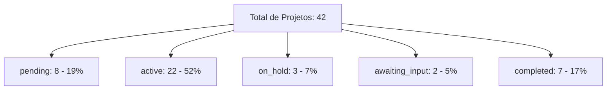

# Relatórios e Analytics - Guia do Usuário

O módulo **Relatórios e Analytics** (menu "Reports") mostra indicadores agregados do portfólio de projetos - uma visão executiva para tomada de decisão.

!!! note "Não confundir com Relatórios Diários"
    Existem **dois módulos** com nomes parecidos:

    - **Relatórios Diários** (`Daily Reports`, menu `/daily-reports`): relatórios de progresso enviados por funcionários via Chat durante as visitas. [Ver guia](relatorios-diarios.md).
    - **Relatórios e Analytics** (`Reports`, menu `/reports`) - **este guia**: indicadores agregados de todo o portfólio (budget, status, completion).

---

## 1. Acessando

No menu lateral, clique em **"Relatórios"** (Reports). Disponível apenas para **administradores**.

<!-- TODO: screenshot da pagina Analytics. Arquivo: images/reports-analytics-main.png. Capturar: 4 stats cards + budget analysis + projects by status + botoes de export -->
{ .placeholder-image }

---

## 2. Stats Cards (4 indicadores principais)

No topo, 4 cards com indicadores-chave:

### Total de Projetos

- **Número** - quantos projetos no total
- **Sub-métrica** - quantos estão ativos

### Budget Utilization (%)

- **Percentagem** - quanto do orçamento total consolidado já foi gasto
- Cálculo: `totalSpent / totalBudget × 100`
- Cor muda conforme o valor: verde (baixo), laranja (perto do limite), vermelho (ultrapassou)

### Completion Rate (%)

- **Percentagem** - quantos projetos estão concluídos vs total
- Cálculo: `completedProjects / totalProjects × 100`
- Útil para medir throughput da operação

### Over Budget Count

- **Número** - quantos projetos ultrapassaram o orçamento
- Vermelho se > 0 (atenção necessária)

---

## 3. Budget Analysis (Análise de Orçamento)

Card detalhado com 3 valores-chave:

| Valor | Fórmula | Exemplo |
|-------|---------|---------|
| **Total Budget** | Soma de `budget` de todos os projetos | R$ 150.000,00 |
| **Total Spent** | Soma de `currentCost` de todos | R$ 112.500,00 |
| **Balance** | Total Budget - Total Spent | R$ 37.500,00 |

Abaixo, uma **progress bar** mostra visualmente o % utilizado, com cores:

| Cor | Quando |
|-----|--------|
| 🟢 Verde | < 80% do orçamento consolidado |
| 🟠 Laranja | 80-100% (perto do limite) |
| 🔴 Vermelho | > 100% (ultrapassou) |

---

## 4. Projects by Status

Breakdown de projetos por status, com **contagem, percentagem e barra de progresso** para cada.

### Como ler

| Status | Percentagem saudável? |
|--------|----------------------|
| **Pending** | Depende - se muitos, talvez aprovação esteja gargalo |
| **Active** | Idealmente a maioria |
| **On Hold** | Poucos - muitos indicam problemas operacionais |
| **Awaiting Input** | Poucos - muitos indicam problemas de comunicação |
| **Completed** | Crescente ao longo do mês |

---

## 5. Export Options

No topo da página, botões para exportar dados:

| Formato | Quando usar |
|---------|-------------|
| **PDF** | Para apresentar em reunião, imprimir, arquivar |
| **Excel** | Para análise detalhada com planilhas |
| **CSV** | Para importar em outras ferramentas de BI |

!!! warning "Funcionalidade em evolução"
    Os botões de export estão presentes na UI. A qualidade do export (especialmente Excel/CSV) pode variar - teste com um mês específico e ajuste filtros se necessário.

---

## 6. Como usar Analytics para decisão

### Monitoramento semanal

Olhe os **4 stats cards** e pergunte:

1. **Total de Projetos** está crescendo? Bom sinal de novos negócios.
2. **Budget Utilization** está < 80%? Dentro do planejado.
3. **Completion Rate** está crescente? Operação entregando.
4. **Over Budget Count** > 0? Revisar quais e entender causas.

### Identificar gargalos

No **Projects by Status**:

- Muitos em `pending` = gargalo na aprovação inicial
- Muitos em `on_hold` = problemas operacionais (falta material, cliente indeciso)
- Muitos em `awaiting_input` = comunicação travada com cliente

### Budget Health

No **Budget Analysis**:

- Progress bar verde = operação saudável
- Progress bar laranja = alerta, reveja custos
- Progress bar vermelha = crise, ação imediata necessária

---

## Regras Importantes

### Permissões

| Operação | Super Admin | Admin | Funcionário |
|----------|:---:|:---:|:---:|
| Ver menu "Reports" | Sim | Sim | **Não** |
| Acessar Analytics | Sim | Sim | Não |
| Export PDF/Excel/CSV | Sim | Sim | Não |

### Cálculos

| Indicador | Fórmula | Notas |
|-----------|---------|-------|
| Budget Utilization | `totalSpent / totalBudget × 100` | Só considera custos `approved` |
| Completion Rate | `completedProjects / totalProjects × 100` | Inclui todos os projetos (ativos, pausados, etc.) |
| Over Budget Count | `count(projects where currentCost > budget)` | Independente do status |

### Limites e notas

!!! note "Só custos aprovados contam"
    Custos com status `pending_approval` **não** são somados em `totalSpent`. Isso evita inflação artificial dos indicadores.

!!! warning "Analytics não filtra por período"
    Atualmente o Analytics mostra **todos os projetos ativos e históricos**. Para análise de um mês específico, exporte e filtre manualmente no Excel.

!!! tip "Atualização em tempo real"
    Como tudo usa Firestore Client SDK com TanStack Query, os indicadores **atualizam automaticamente** conforme novos custos são aprovados ou projetos mudam de status.

### Defaults

| Configuração | Valor |
|---|---|
| Período | Todos os projetos (sem filtro de data) |
| Custos considerados | Apenas `approved` |
| Moeda | USD (pode mudar conforme config da organização) |

---

## Resumo rápido

| Você quer... | Faça isso... |
|-------------|-------------|
| Ver saúde geral do portfólio | Menu "Reports" > 4 stats cards |
| Analisar orçamento consolidado | Card "Budget Analysis" |
| Ver quantos projetos em cada status | Card "Projects by Status" |
| Exportar para apresentação | Botão "Export PDF" |
| Exportar para análise | Botão "Export Excel/CSV" |
| Monitorar custos por projeto individual | Use a aba **Custos** de cada projeto ([Projetos](projetos.md)) |
| Ver relatórios diários de campo | Menu **Relatórios Diários** ([Relatórios Diários](relatorios-diarios.md)) - é outro módulo |
