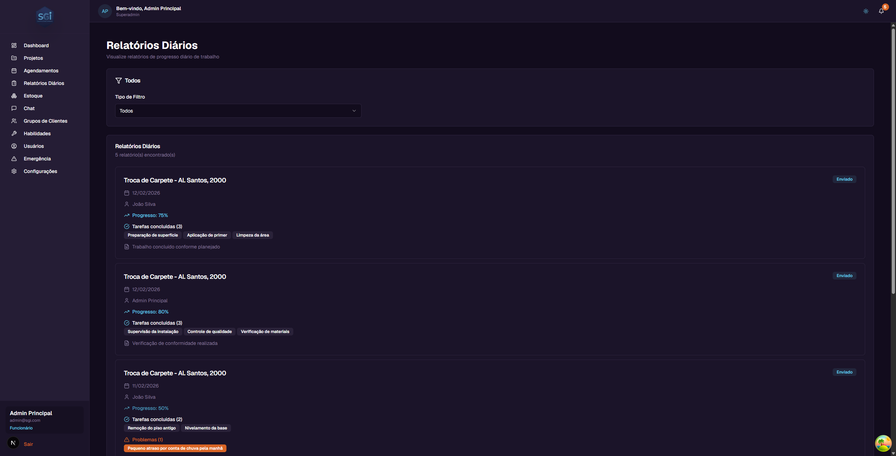
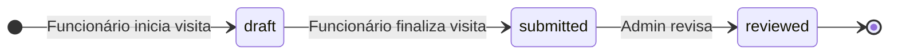

# Relatórios Diários - Guia do Usuário

Este guia explica como funciona o módulo de **Relatórios Diários** do SGI. Os relatórios são usados para acompanhar o progresso diário do trabalho em campo.

---

## 1. Acessando os Relatórios Diários

No menu lateral, clique em **"Relatórios Diários"**.

!!! warning "Relatórios são criados SOMENTE pelo Chat"
    **Não existe botão "Criar Relatório"** nesta página. Todos os relatórios são gerados pelos funcionários através do **[Chat com IA](chat.md)** durante ou após uma visita.

    Esta página é apenas para **visualização, filtro e auditoria** dos relatórios já enviados.

---

## 2. Entendendo um relatório

Cada card contém:

| Campo | Descrição | Exemplo |
|-------|-----------|---------|
| **Projeto** | Nome do projeto (título do card) | Instalação Carpete - Rua das Flores 123 |
| **Status** | Badge do status atual | Enviado |
| **Data** | Data do relatório | 15/02/2026 |
| **Funcionário** | Quem enviou | João Silva |
| **Progresso** | Porcentagem de conclusão | 75% |
| **Tarefas concluídas** | Lista das atividades realizadas | Preparação de superfície, Primer |
| **Problemas** | Dificuldades encontradas | Contrapiso irregular no quarto 2 |
| **Notas** | Observações adicionais | Faltam os quartos menores |
| **Fotos anexadas** | Imagens do progresso | 2 fotos |

---

## 3. Como um relatório é criado (via Chat)

O funcionário, durante a visita, usa o Chat com IA para reportar progresso naturalmente:

> **Funcionário:** "Cheguei no projeto da Rua das Flores"
> **IA:** "Visita iniciada! Bom trabalho."
>
> **Funcionário:** "Fiz 40% do carpete, terminei a sala e estou começando os quartos"
> **IA:** "Progresso atualizado: 40%. Tarefas registradas: sala concluída, quartos iniciados."
>
> **Funcionário:** [Envia 2 fotos do carpete instalado]
> **IA:** "Fotos recebidas e anexadas ao relatório."
>
> **Funcionário:** "Encontrei contrapiso irregular no quarto 2, vai precisar nivelar"
> **IA:** "Problema registrado."
>
> **Funcionário:** "Terminei por hoje, 75%"
> **IA:** "Relatório finalizado e enviado!"

📖 Veja o [Guia do Chat](chat.md) para detalhes completos do fluxo.

---

## 4. Status de um relatório

| Status | Significado | Quem muda |
|--------|-------------|-----------|
| **Rascunho** (`draft`) | Em construção durante a visita | Sistema (via Chat) |
| **Enviado** (`submitted`) | Funcionário finalizou e enviou | Funcionário (via Chat "Terminei") |
| **Revisado** (`reviewed`) | Admin já analisou | **Admin** (ação manual) |

!!! warning "Após enviado, não dá para editar"
    Depois que o funcionário marca como **enviado**, ele **não pode mais editar** o relatório. Se precisar corrigir algo, terá que pedir ao admin para ajustar ou criar um novo relatório.

---

## 5. Filtros disponíveis

| Filtro | Opções | O que faz |
|--------|--------|-----------|
| **Tipo de Filtro** | Todos / Por Projeto / Por Usuário | Muda o critério principal |
| **Por Projeto** | Dropdown de projetos | Lista só relatórios do projeto selecionado |
| **Por Usuário** (admin) | Dropdown de usuários | Lista só relatórios do funcionário |

!!! note "Visibilidade por cargo"
    - **Administradores/Super Admins:** Veem **todos** os relatórios + filtro por usuário
    - **Funcionários:** Veem **apenas os próprios** relatórios

---

## 6. Relatórios aparecem no detalhe do projeto

Cada relatório também aparece na **aba "Relatórios"** do projeto correspondente, permitindo visualizar todo o histórico de progresso do projeto em um só lugar.

---

## Regras Importantes

### Campos obrigatórios

| Campo | Obrigatório | Limites | Observação |
|-------|:---:|:---:|---|
| `projectId` | Sim | - | Projeto deve existir |
| `userId` | Sim | - | Usuário autenticado |
| `reportDate` | Sim | - | ISO 8601 (YYYY-MM-DD) |
| `progressPercentage` | Sim | 0-100 | Porcentagem |
| `tasksCompleted` | Não | Array de strings | Lista de tarefas |
| `issues` | Não | Array de strings | Lista de problemas |
| `notes` | Não | Texto livre | Observações |
| `attachments` | Não | Array | URLs das fotos anexadas |
| `status` | Sim | draft / submitted / reviewed | Status atual |

### Permissões necessárias

| Operação | Super Admin | Admin | Funcionário |
|----------|:---:|:---:|:---:|
| Criar via Chat | Sim | Sim | Sim |
| Ver próprios relatórios | Sim | Sim | Sim |
| Ver relatórios de todos | Sim | Sim | **Não** |
| Filtrar por usuário | Sim | Sim | Não |
| Marcar como revisado | Sim | Sim | **Não** |
| Editar relatório `submitted` | Não (ninguém) | Não (ninguém) | Não |

### Validações que bloqueiam

!!! warning "Relatório submitted é imutável"
    Uma vez enviado (`submitted`), **nem o funcionário nem o admin podem editar** o conteúdo do relatório. Isso garante a integridade da auditoria.

    Para corrigir algo: criar um novo relatório ou adicionar comentário externo (fora do sistema).

!!! danger "Relatório não pode ser deletado pelo funcionário"
    Funcionários **não têm permissão** para deletar seus próprios relatórios. Apenas admins conseguem deletar (via Firestore direto).

### Defaults do sistema

| Configuração | Valor | Observação |
|---|---|---|
| Status inicial | `draft` | Automático ao "Cheguei no local" |
| Transição automática | `draft → submitted` | Ao dizer "Terminei" no Chat |
| Revisão | Manual | Admin precisa marcar como `reviewed` |

---

## Resumo rápido

| Você quer... | Faça isso... |
|-------------|-------------|
| Ver todos os relatórios | Menu "Relatórios Diários" |
| Ver relatórios de um projeto | Filtrar "Por Projeto" OU ir na aba "Relatórios" do projeto |
| Ver relatórios de um funcionário | Filtrar "Por Usuário" (admin) |
| Criar um relatório | **Pelo [Chat com IA](chat.md)** - não há outro caminho |
| Marcar como revisado | Admin, direto no card do relatório |
