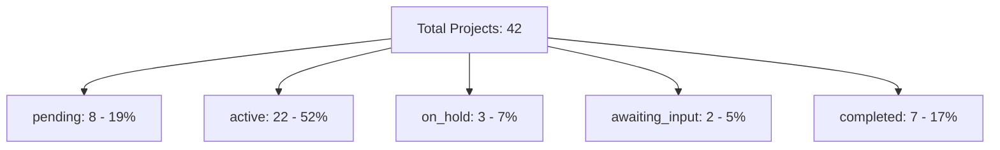

# Reports and Analytics - User Guide

The **Reports and Analytics** module ("Reports" menu) shows aggregated indicators of the project portfolio - an executive view for decision-making.

!!! note "Don't confuse with Daily Reports"
    There are **two modules** with similar names:

    - **Daily Reports** (`Daily Reports`, menu `/daily-reports`): progress reports sent by employees via Chat during visits. [See guide](daily-reports.md).
    - **Reports and Analytics** (`Reports`, menu `/reports`) - **this guide**: aggregated indicators of the entire portfolio (budget, status, completion).

---

## 1. Accessing

In the side menu, click **"Relatórios"** (Reports). Available only to **administrators**.

<!-- TODO: screenshot of Analytics page. File: images/reports-analytics-main.png. Capture: 4 stats cards + budget analysis + projects by status + export buttons -->
{ .placeholder-image }

---

## 2. Stats Cards (4 main indicators)

At the top, 4 cards with key indicators:

### Total Projects

- **Number** - how many projects in total
- **Sub-metric** - how many are active

### Budget Utilization (%)

- **Percentage** - how much of the total consolidated budget has already been spent
- Calculation: `totalSpent / totalBudget × 100`
- Color changes according to the value: green (low), orange (near limit), red (exceeded)

### Completion Rate (%)

- **Percentage** - how many projects are completed vs total
- Calculation: `completedProjects / totalProjects × 100`
- Useful for measuring operation throughput

### Over Budget Count

- **Number** - how many projects have exceeded the budget
- Red if > 0 (attention needed)

---

## 3. Budget Analysis

Detailed card with 3 key values:

| Value | Formula | Example |
|-------|---------|---------|
| **Total Budget** | Sum of `budget` across all projects | $150,000.00 |
| **Total Spent** | Sum of `currentCost` across all | $112,500.00 |
| **Balance** | Total Budget - Total Spent | $37,500.00 |

Below, a **progress bar** visually shows the % used, with colors:

| Color | When |
|-----|--------|
| Green | < 80% of consolidated budget |
| Orange | 80-100% (near the limit) |
| Red | > 100% (exceeded) |

---

## 4. Projects by Status

Breakdown of projects by status, with **count, percentage, and progress bar** for each.

### How to read

| Status | Healthy percentage? |
|--------|----------------------|
| **Pending** | Depends - if many, approval may be a bottleneck |
| **Active** | Ideally the majority |
| **On Hold** | Few - many indicate operational issues |
| **Awaiting Input** | Few - many indicate communication issues |
| **Completed** | Growing throughout the month |

---

## 5. Export Options

At the top of the page, buttons to export data:

| Format | When to use |
|---------|-------------|
| **PDF** | For presenting in a meeting, printing, archiving |
| **Excel** | For detailed analysis with spreadsheets |
| **CSV** | For importing into other BI tools |

!!! warning "Evolving functionality"
    Export buttons are present in the UI. Export quality (especially Excel/CSV) may vary - test with a specific month and adjust filters if necessary.

---

## 6. How to use Analytics for decision-making

### Weekly monitoring

Look at the **4 stats cards** and ask:

1. Is **Total Projects** growing? Good sign of new business.
2. Is **Budget Utilization** < 80%? Within plan.
3. Is **Completion Rate** growing? Operation is delivering.
4. **Over Budget Count** > 0? Review which ones and understand causes.

### Identify bottlenecks

In **Projects by Status**:

- Many in `pending` = bottleneck in initial approval
- Many in `on_hold` = operational issues (lack of material, indecisive customer)
- Many in `awaiting_input` = communication stalled with customer

### Budget Health

In **Budget Analysis**:

- Green progress bar = healthy operation
- Orange progress bar = alert, review costs
- Red progress bar = crisis, immediate action needed

---

## Important Rules

### Permissions

| Operation | Super Admin | Admin | Employee |
|----------|:---:|:---:|:---:|
| View "Reports" menu | Yes | Yes | **No** |
| Access Analytics | Yes | Yes | No |
| Export PDF/Excel/CSV | Yes | Yes | No |

### Calculations

| Indicator | Formula | Notes |
|-----------|---------|-------|
| Budget Utilization | `totalSpent / totalBudget × 100` | Only considers `approved` costs |
| Completion Rate | `completedProjects / totalProjects × 100` | Includes all projects (active, paused, etc.) |
| Over Budget Count | `count(projects where currentCost > budget)` | Independent of status |

### Limits and notes

!!! note "Only approved costs count"
    Costs with status `pending_approval` are **not** summed in `totalSpent`. This avoids artificial inflation of indicators.

!!! warning "Analytics does not filter by period"
    Currently, Analytics shows **all active and historical projects**. For analysis of a specific month, export and filter manually in Excel.

!!! tip "Real-time updates"
    Since everything uses Firestore Client SDK with TanStack Query, the indicators **update automatically** as new costs are approved or projects change status.

### Defaults

| Setting | Value |
|---|---|
| Period | All projects (no date filter) |
| Costs considered | Only `approved` |
| Currency | USD (can change according to organization config) |

---

## Quick summary

| You want to... | Do this... |
|-------------|-------------|
| View portfolio overall health | "Reports" menu > 4 stats cards |
| Analyze consolidated budget | "Budget Analysis" card |
| View how many projects in each status | "Projects by Status" card |
| Export for presentation | "Export PDF" button |
| Export for analysis | "Export Excel/CSV" button |
| Monitor costs per individual project | Use the **Custos** (Costs) tab of each project ([Projects](projects.md)) |
| View field daily reports | **Daily Reports** menu ([Daily Reports](daily-reports.md)) - it's another module |
