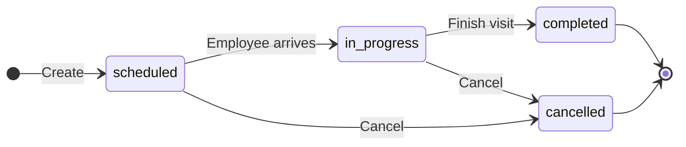
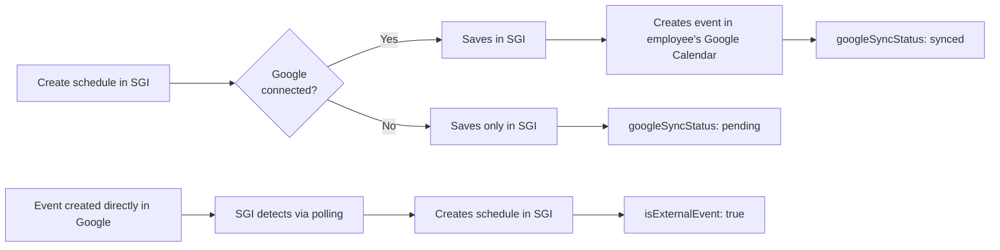

# Scheduling - User Guide

This guide explains everything about the **Scheduling** module in SGI, used to schedule visits and employee appointments on projects.

---

## 1. Accessing the Scheduling screen

On the left sidebar menu, click **"Agendamentos"** (Scheduling). You will see the main management page.

---

## 2. View modes

There are 2 modes, with a toggle in the upper right corner. The preference is **saved per user** (persisted between sessions).

### List (default)

Schedules grouped by date, from most recent to oldest. Each card shows:

- **Time** - Start and end time (e.g., 14:00 -> 17:00)
- **Status** - Colored badge (Scheduled, In progress, Completed, Cancelled)
- **Project** - Name of the linked project
- **Employee** - Who is assigned
- **Notes** - Additional notes about the visit
- **Buttons** - Edit and Cancel

### Calendar

Weekly grid (Monday to Sunday), slots from 08:00 to 18:00. Color-coded blocks by status.

Use **"Anterior"** (Previous), **"Hoje"** (Today), and **"Proximo"** (Next) to navigate between weeks.

---

## 3. Creating a schedule

Click **"Novo Agendamento"** (New Schedule) in the upper right corner (desktop) or the **floating "+" button** (mobile).

| Field | Required? | Description |
|-------|:---:|-----------|
| **Project** | Yes | Project linked to the visit |
| **Employee** | Yes | Who will perform the visit |
| **Date** | Yes | Date of the visit |
| **Start time** | Yes | Time it begins |
| **Duration** | Yes | 1h, 2h, 3h, 4h, or custom (minimum 1 minute) |
| **Notes** | No | Additional notes |

### Step-by-step example

1. Click **"Novo Agendamento"**
2. In **Project**, select: `Plumbing Installation - 700 Dr. Melo Alves Street`
3. In **Employee**, select: `Joao Silva`
4. In **Date**, select the desired date
5. In **Start time**, type: `09:00`
6. In **Duration**, select: `2 hours`
7. In **Notes**, type: `Bring tools for inspection`
8. Click **"Criar Agendamento"** (Create Schedule)

---

## 4. Editing and cancelling

### Edit

In the list, click **"Editar"** (Edit) on the card. You can change:

- **Date** - Change the day
- **Start time** - Change the time
- **Duration** - Change the duration
- **Notes** - Edit the notes

### Cancel

Click **"Cancelar"** (Cancel) on the card. The status changes to **Cancelled** (the schedule is not deleted, it remains on record).

---

## 5. Filters

At the top of the page:

| Filter | What it does |
|--------|-----------|
| **Users** | Filter by employee (admin); employees see only their own |
| **Status** | scheduled / in progress / completed / cancelled |
| **Date** | Range (start and end date) |

---

## 6. Schedule statuses

| Status | Meaning | Color |
|--------|-------------|-----|
| **Scheduled** (`scheduled`) | Visit scheduled for the future | Blue |
| **In progress** (`in_progress`) | Visit happening now | Green |
| **Completed** (`completed`) | Visit performed | Gray |
| **Cancelled** (`cancelled`) | Visit cancelled | Red |

---

## 7. Google Calendar integration

When the organization's Google account is connected (via **Settings > Integrations**, only super admin can connect), schedules sync automatically.

### How it works

- The system creates **individual calendars per employee** (e.g., `SGI - Joao Silva`)
- Create/edit/cancel in SGI appears automatically in Google Calendar
- **Two-way sync:** events created directly in Google Calendar **also appear in SGI** (with `isExternalEvent` flag)

### Sync status

Each schedule has a `googleSyncStatus` field visible in the detail view:

| Status | Meaning |
|--------|-------------|
| `pending` | Waiting for next sync |
| `syncing` | Synchronization in progress |
| `synced` | Successfully synchronized |
| `failed` | Sync error (message in `googleSyncError`) |

### Without Google connected

!!! note "Google Calendar is optional"
    The integration is **not mandatory**. If the Google account is not connected, the schedule is created **normally in SGI** - it just does not sync with Google. Everything works, there is just no external calendar.

---

## 8. Smart employee suggestion

When creating a schedule via the **[AI Chat](chat-en.md)**, the AI **automatically suggests** the best employee based on:

1. **Skills** - Employees with the right competency for the job
2. **Availability** - Avoids schedule conflicts
3. **Workload** - Prefers those with fewer schedules in the period

!!! tip "The suggestion is a recommendation"
    The AI suggests, but **you decide**. You can accept, choose another employee, or ask the AI to show other options.

---

## Important Rules

### Required fields and limits

| Field | Required | Minimum | Maximum | Note |
|-------|:---:|:---:|:---:|---|
| `projectId` | Yes | - | - | Must exist in the system |
| `employeeId` | Yes | - | - | User must be active |
| `startTime` | Yes | - | - | ISO 8601 (past date is allowed) |
| `durationMinutes` | Yes | 1 min | - | No explicit maximum limit |
| `notes` | No | - | - | Free text |

### Required permissions

| Operation | Super Admin | Admin | Employee with `canCreateSchedules` | Standard Employee |
|----------|:---:|:---:|:---:|:---:|
| See own schedules | Yes | Yes | Yes | Yes |
| See everyone's schedules | Yes | Yes | No | No |
| Create schedule | Yes | Yes | Yes | No |
| Edit schedule | Yes | Yes | Yes (own only) | No |
| Cancel schedule | Yes | Yes | Yes (own only) | No |

### Validations that block

!!! warning "Time conflict"
    The system **automatically validates** whether the employee already has a schedule in the same slot and returns an error:
    `Employee not available at this time`

    To resolve: choose another time or another employee.

!!! note "Past dates are allowed"
    The system **allows** creating schedules on past dates (useful for recording visits that have already happened). Pay attention when confirming the date.

### System defaults

| Setting | Default value | Where to change |
|---|---|---|
| Default duration | 2 hours | At creation |
| Calendar slot | 08:00-18:00 | System (not configurable) |
| Initial status | `scheduled` | Automatic |
| Google Calendar sync | Optional | Super admin in Integrations |

---

## Quick summary

| You want to... | Do this... |
|-------------|-------------|
| See all schedules | Click "Agendamentos" in the menu |
| View as calendar | Click the "Calendario" (Calendar) button |
| Create schedule | Click "Novo Agendamento" |
| Create via Chat | "Schedule visit for project X tomorrow 9am" |
| Edit schedule | "Editar" button on the card |
| Cancel schedule | "Cancelar" button on the card |
| Filter by employee | "Todos os usuarios" (All users) dropdown |
| See Google integration | Settings > Integrations (super admin) |
