# Users and Skills - User Guide

In this guide, you will learn everything about the **Users** screen and the **Skills** screen in SGI. This is where you manage the team, invite new users, set permissions, and organize employee competencies.

---

## 1. Accessing the Users screen

On the left sidebar menu, click **"Usuarios"** (Users). You will be taken to the page with all registered users in the system.

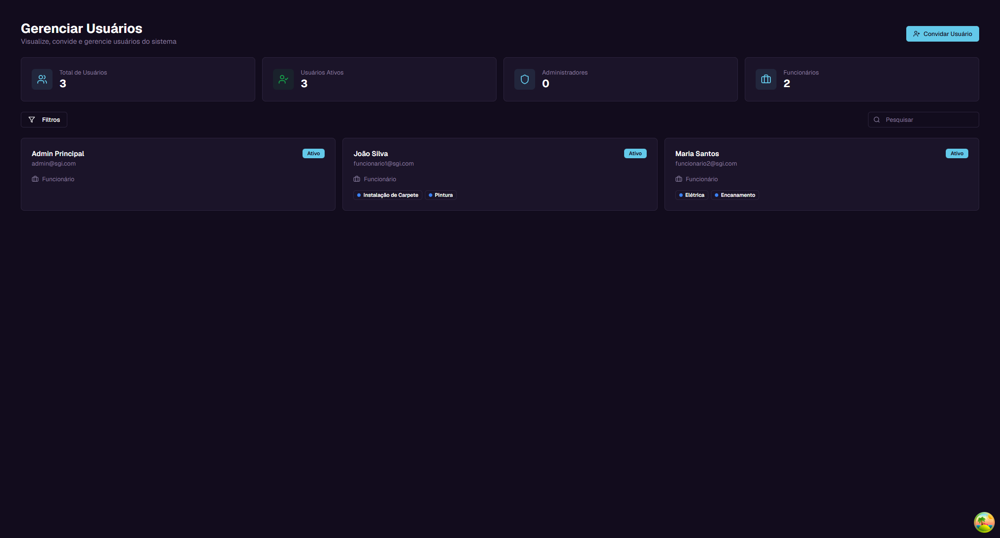

---

## 2. Understanding the main screen

### Summary cards

At the top of the page, there are 4 cards with general information:

| Card | What it shows | Example |
|------|--------------|---------|
| **Total de Usuarios (Total Users)** | How many users are registered | 3 |
| **Usuarios Ativos (Active Users)** | How many users have active accounts | 3 |
| **Administradores (Administrators)** | How many users have Admin role | 0 |
| **Funcionarios (Employees)** | How many users have Employee role | 2 |

### Search field

Below the cards, there is a search field with the text "Pesquisar" (Search). Type a user's name or email to filter the list.

### Each user card

Each user appears as a card with the following information:

- **Name** - User's full name (e.g., "Joao Silva")
- **Email** - User's email (e.g., funcionario1@sgi.com)
- **Status** - Green "Ativo" (Active) or red "Inativo" (Inactive) tag
- **Role** - Icon + text indicating the role (e.g., Funcionario/Employee)
- **Skills** - Colored badges showing the user's skills (e.g., Instalacao de Carpete, Pintura)

---

## 3. Role hierarchy

SGI has 3 access levels. Each role has different permissions in the system.

### Super Administrator

The highest role. Has full control over the system:
- Can invite users of any role (superadmin, admin, employee)
- Can manage all users
- All permissions are enabled

### Administrator

Manages employees and projects:
- Can only invite Employees
- Can only manage Employees
- Has all permissions except managing other admins

### Employee

Basic system access:
- Cannot invite anyone
- Cannot manage other users
- Granular permissions (individually configured by the administrator)

### Comparison table

| Permission | Super Admin | Admin | Employee |
|-----------|:-----------:|:-----:|:--------:|
| Create projects | Yes | Yes | No |
| Edit projects | Yes | Yes | No |
| Delete projects | Yes | Yes | No |
| View all projects | Yes | Yes | No |
| Add costs | Yes | Yes | Yes |
| Approve costs | Yes | Yes | No |

> **Note:** An employee's permissions can be individually adjusted by the administrator. For example, you can give a specific employee permission to create projects.

### Who can invite whom

| Your role | Can invite |
|-----------|-----------|
| **Super Administrator** | Super Admin, Admin, and Employee |
| **Administrator** | Only Employee |
| **Employee** | No one |

---

## 4. Inviting a new user

To add a new team member, click the **"Convidar Usuario"** (Invite User) button in the upper right corner.

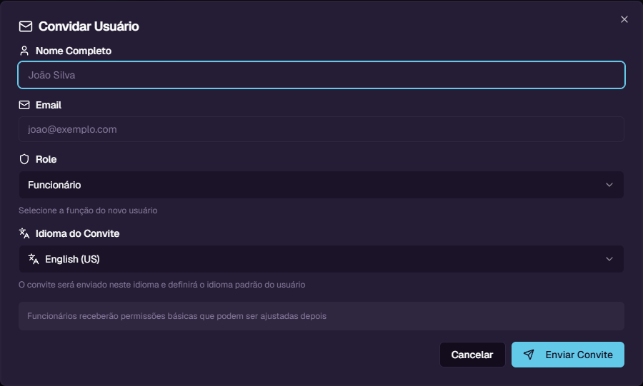

A window will open with the following fields:

| Field | Required? | Description |
|-------|:---------:|-------------|
| **Nome Completo (Full Name)** | Yes | The new user's full name |
| **Email** | Yes | Email to send the invitation |
| **Role** | Yes | User's role: Funcionario (Employee), Administrador (Administrator), or Super Administrador (Super Administrator) |
| **Idioma do Convite (Invitation Language)** | No | Language of the invitation email (English US or Portugues BR). Sets the system language on first access, but the employee can change it later in settings |

### Step-by-step example

Let's invite a new employee:

1. Click **"Convidar Usuario"**
2. In **Nome Completo**, type: `Carlos Oliveira`
3. In **Email**, type: `carlos@exemplo.com`
4. In **Role**, select: `Funcionario`
5. In **Idioma do Convite**, select: `Portugues (BR)`
6. Click **"Enviar Convite"** (Send Invitation)

The system will send an email with the invitation link to the provided address.

> **Note:** The invitation is valid for **7 days**. After this period, the link expires and you will need to send a new invitation.

---

## 5. How the user accepts the invitation

After you send the invitation, the new user receives an email with a special link. The process is as follows:

1. The user receives the email and clicks the link
2. They are taken to a page showing the invitation details (name, email, role, who invited them)
3. The user creates a password (minimum 6 characters)
4. Clicks **"Completar Cadastro"** (Complete Registration)

Done! The account is automatically created with:
- Default permissions for the selected role
- Zeroed statistics (projects and costs)
- "Active" status

---

## 6. User details

To view a user's details, click their card in the list. A side panel will open with complete information.

### Header

At the top of the panel, you see:
- **Avatar** - Circle with the name initial
- **Name** - Full name
- **Email** - User's email
- **Role** - Badge indicating the role (e.g., Funcionario)
- **Status** - Badge indicating Active or Inactive
- **"Editar" (Edit) button** - Opens the edit form

### Tab: Basico (Basic)

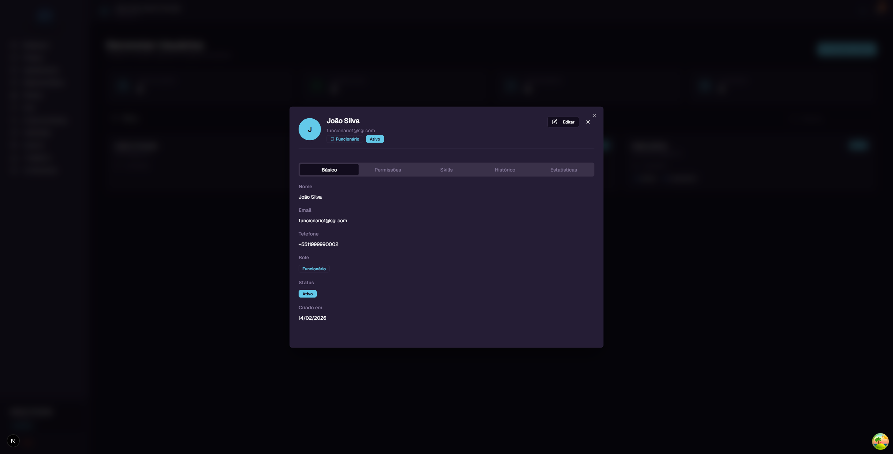

Shows the user's personal information:
- Name
- Email
- Phone
- Role (colored badge)
- Status (colored badge)
- Account creation date

### Tab: Permissoes (Permissions)

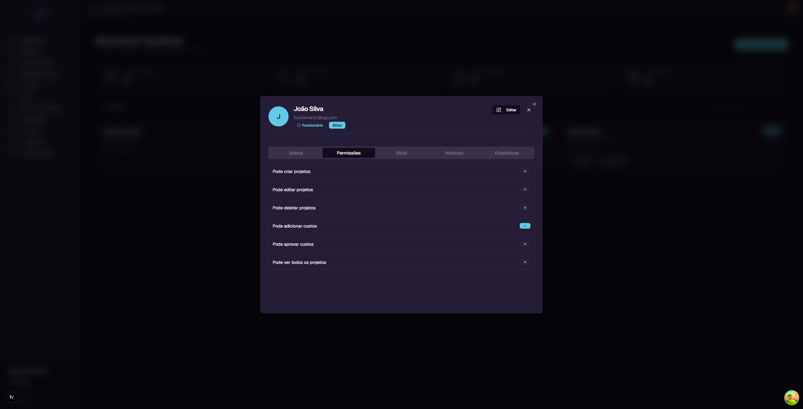

Shows the 6 user permissions with toggles (on/off):

| Permission | What it controls |
|-----------|-----------------|
| **Pode criar projetos (Can create projects)** | Allows creating new projects in the system |
| **Pode editar projetos (Can edit projects)** | Allows changing data of existing projects |
| **Pode deletar projetos (Can delete projects)** | Allows deleting projects |
| **Pode adicionar custos (Can add costs)** | Allows recording costs in projects |
| **Pode aprovar custos (Can approve costs)** | Allows managing the status of recorded costs |
| **Pode ver todos os projetos (Can view all projects)** | Allows viewing all projects, not just assigned ones |

### Tab: Skills

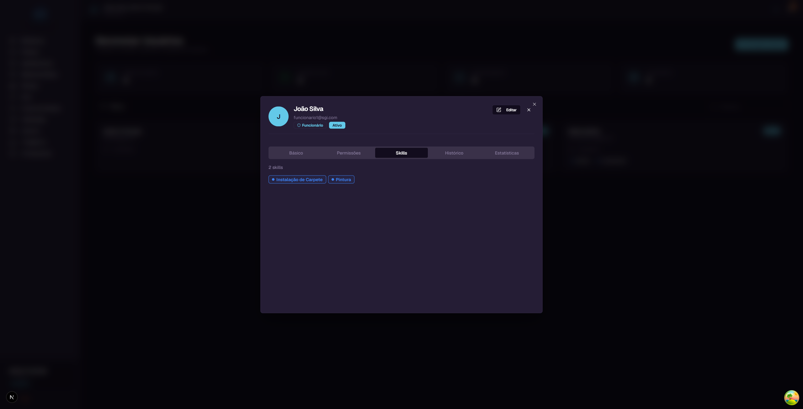

Shows the count and colored badges of skills assigned to the user.

**Example:** Joao Silva has 2 skills: "Instalacao de Carpete" (Carpet Installation) and "Pintura" (Painting).

### Tab: Historico (History)

Shows a timeline with all user activities in the system (audit log). Each event shows the date, time, and what happened.

### Tab: Estatisticas (Statistics)

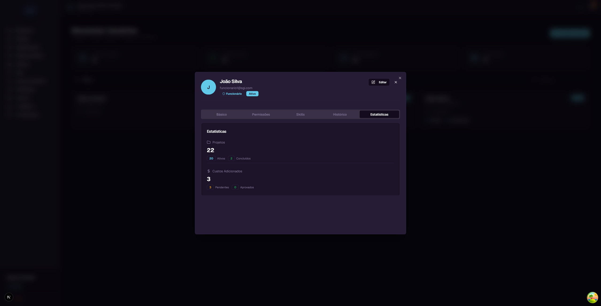

Shows numbers about the user's participation:

**Projects:**
- **Total** - How many projects the user participates in (e.g., 22)
- **Ativos (Active)** - How many are in progress (e.g., 20)
- **Concluidos (Completed)** - How many have been finished (e.g., 2)

**Costs Added:**
- **Total** - How many costs the user has recorded (e.g., 3)
- **Pendentes (Pending)** - How many still await approval (e.g., 3)
- **Aprovados (Approved)** - How many have been approved (e.g., 0)

---

## 7. Editing a user

To edit a user, click their card in the list and then click the **"Editar"** (Edit) button in the upper right corner of the panel.

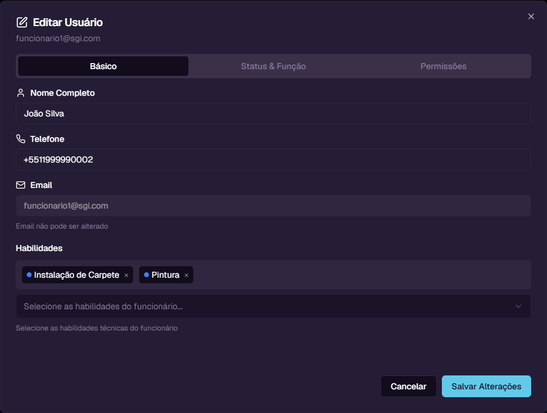

The edit dialog has 3 tabs:

### Tab: Basico (Basic)

- **Nome Completo (Full Name)** - Change the user's name
- **Telefone (Phone)** - Change the phone number
- **Email** - Disabled field (email cannot be changed)
- **Habilidades (Skills)** - Select or remove user skills (multi-select with tags)

### Tab: Status & Funcao (Status & Role)

- **Status** - Switch between Active and Inactive
- **Funcao (Role)** - Change the user's role

> **Deactivating a user:** When you change the status to "Inactive", the user loses access to the system but their data is kept. You can reactivate at any time.

### Tab: Permissoes (Permissions)

- Checkboxes for each of the 6 permissions
- Allows adjusting permissions individually, regardless of the default role

After making changes, click **"Salvar Alteracoes"** (Save Changes).

---

## 8. Filtering users

Click the **"Filtros"** (Filters) button to open the filters panel.

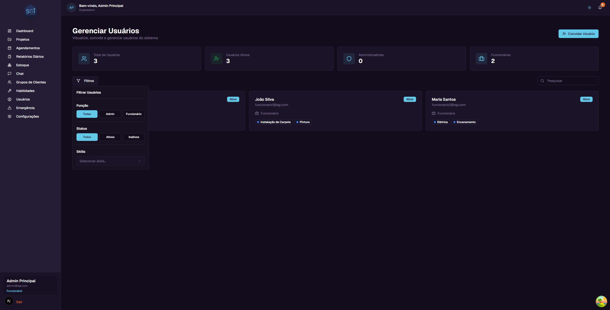

The available filters are:

### Funcao (Role)
Filter by user role:
- **Todas (All)** - Shows everyone (default)
- **Admin** - Only administrators
- **Funcionario (Employee)** - Only employees

### Status
Filter by account state:
- **Todos (All)** - Shows everyone (default)
- **Ativos (Active)** - Only active accounts
- **Inativos (Inactive)** - Only deactivated accounts

### Skills
Filter by specific skill. Select one or more skills from the dropdown to see only users who have that competency.

---

## 9. Permissions in detail

### What each permission controls

| Permission | What the user CAN do with it | What they CANNOT do without it |
|-----------|------------------------------|-------------------------------|
| **Create projects** | Click "+ Novo Projeto" and create projects | Does not see the create project button |
| **Edit projects** | Change name, address, budget, team | Does not see the "Edit" button on projects |
| **Delete projects** | Permanently delete projects | Does not see the "Delete" button on projects |
| **Add costs** | Record expenses in projects | Cannot add costs (via app or chat) |
| **Approve costs** | Manage the status of costs recorded in projects | Cannot change the status of costs |
| **View all projects** | View all projects in the system | Only sees projects they are assigned to |

### Default permissions by role

When a user is created, they receive the default permissions for their role:

- **Super Admin and Admin:** All 6 permissions enabled
- **Employee:** Granular permissions configured by the administrator

### How to adjust an employee's permissions

You can give extra permissions to a specific employee:

1. Click on the employee's card in the list
2. Click **"Editar"** (Edit)
3. Go to the **"Permissoes"** (Permissions) tab
4. Check the desired permissions
5. Click **"Salvar Alteracoes"** (Save Changes)

**Example:** To allow employee Joao Silva to create projects:
1. Open Joao Silva's panel
2. Click "Editar" > "Permissoes" tab
3. Check "Pode criar projetos" (Can create projects)
4. Save

---

## 10. Skills

Skills are competency tags that you assign to employees. They serve two main purposes:

1. **Organization:** Quickly identify what each employee can do
2. **Artificial Intelligence:** The Chat AI uses skills to suggest the right employee for each type of service. For example, when assembling a team for an electrical project, the AI suggests employees with the "Eletrica" (Electrical) skill

### Accessing the Skills screen

On the left sidebar menu, click **"Habilidades"** (Skills). You will see the list of all registered skills.

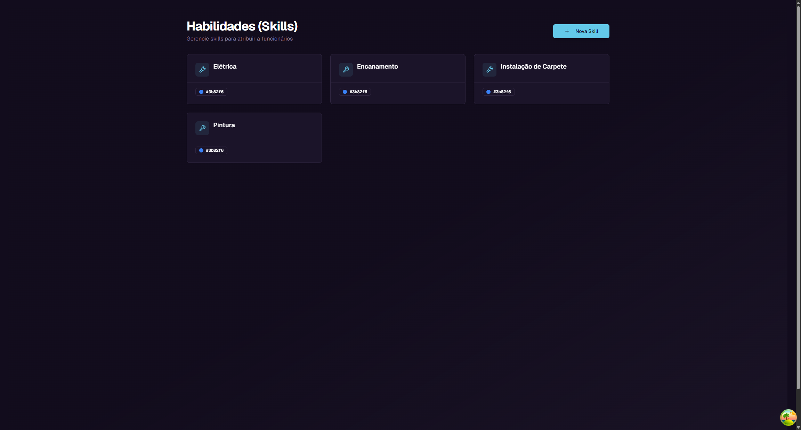

Each skill appears as a card with:
- **Icon** - Tool icon
- **Name** - Skill name (e.g., Eletrica, Pintura, Encanamento)
- **Color** - Visual indicator of the assigned color
- **Buttons** - Edit (pencil) and Delete (trash)

### Creating a new skill

Click the **"Nova Skill"** (New Skill) button in the upper right corner.

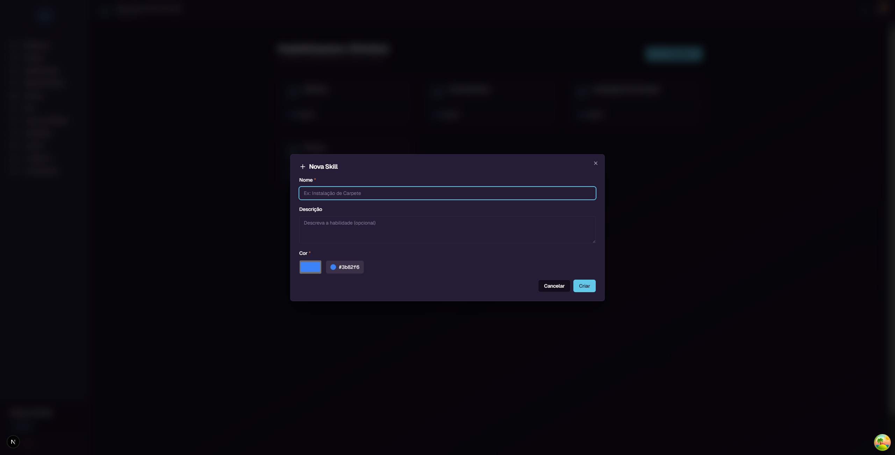

| Field | Required? | Description |
|-------|:---------:|-------------|
| **Nome (Name)** | Yes | Skill name. E.g.: "Instalacao de Carpete" (Carpet Installation) |
| **Descricao (Description)** | No | Skill description (optional) |
| **Cor (Color)** | Yes | Skill badge color (color picker, default: blue #3b82f6) |

Fill in the fields and click **"Criar"** (Create).

### Editing a skill

Click the edit button (pencil icon) on the skill card. The dialog will open with pre-filled fields. Change what is needed and click **"Salvar"** (Save).

### Deleting a skill

Click the delete button (trash icon) on the skill card.

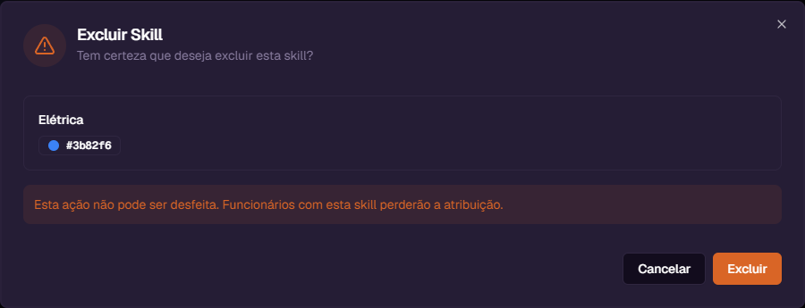

A confirmation window will appear showing:
- Skill name and color
- Warning: **"Esta acao nao pode ser desfeita. Funcionarios com esta skill perderao a atribuicao."** (This action cannot be undone. Employees with this skill will lose the assignment.)

If you are sure, click **"Excluir"** (Delete). Otherwise, click **"Cancelar"** (Cancel).

> **Important:** When you delete a skill, all employees who had that skill lose the assignment automatically.

### How to assign skills to an employee

Skills are assigned when editing a user:

1. Go to the **Users** screen
2. Click on the employee's card
3. Click **"Editar"** (Edit)
4. In the **"Basico"** (Basic) tab, use the **"Habilidades"** (Skills) field to select skills
5. You can add multiple skills and remove them by clicking the "x" on each badge
6. Click **"Salvar Alteracoes"** (Save Changes)

---

## 11. User statistics

The **"Estatisticas"** (Statistics) tab in the user panel shows numbers about their participation in the system.

### Projects

| Indicator | What it means |
|-----------|--------------|
| **Total** | Total number of projects the user participates in |
| **Ativos (Active)** | Projects that are in progress |
| **Concluidos (Completed)** | Projects that have been finished |

### Costs Added

| Indicator | What it means |
|-----------|--------------|
| **Total** | Total number of costs the user has recorded |
| **Pendentes (Pending)** | Costs that still await approval from an administrator |
| **Aprovados (Approved)** | Costs that have been approved |

These numbers help track the productivity and participation of each team member.

---

## Quick reference

| You want to... | Do this... |
|----------------|-----------|
| See all users | Click "Usuarios" in the sidebar menu |
| Search for a user | Type in the "Pesquisar" field |
| Invite new user | Click "Convidar Usuario" |
| View user details | Click on the user card |
| Edit user data | Details > "Editar" button |
| Change permissions | Edit > "Permissoes" tab |
| Deactivate a user | Edit > "Status & Funcao" tab > Status: Inativo |
| Assign skills | Edit > "Basico" tab > "Habilidades" field |
| Filter by role | Click "Filtros" > select the role |
| View statistics | Details > "Estatisticas" tab |
| Manage skills | Click "Habilidades" in the sidebar menu |
| Create new skill | Skills screen > "Nova Skill" |
| Delete a skill | Skills screen > trash icon on the card |
