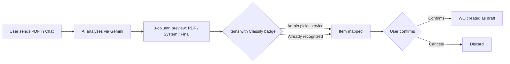
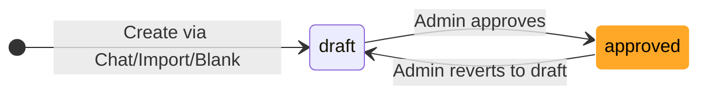

# Work Order - User Guide

The **Work Order** (WO) is SGI's professional system for detailing the work on a project. It replaced the old "Simple Scope" (v3.0+), bringing formal structure from the American construction industry.

---

## 1. What is a Work Order

A Work Order is a **formal document** detailing everything that will be done on a project, with:

- Complete **Header**: WO number, job number, customer, address, date
- **Dynamic work categories** managed by the admin (via Service Catalog)
- Detailed **items** with service, action, type, quantity, unit, room, price
- **Price with breakdown** from 4 possible sources
- Simplified **status**: draft or approved (reversible)
- **Export/Import in PDF**

---

## 2. Where to find it

The Work Order is in the **"Work Order" tab** in the project detail (formerly called "Escopo" / Scope).

See the [Projects Guide](projects.md) for how to navigate to the project.

---

## 3. How to create a Work Order

There are **3 ways**:

### 3.1 Create a blank WO

The most direct way when you already know what you're doing:

1. Open the project
2. Go to the **"Work Order"** tab
3. Click **"Criar WO em branco"** (Create blank WO)
4. The WO is created in `draft` mode with the header already filled with project data
5. Add items manually (see section 9)

### 3.2 Through AI Chat (recommended for inspections)

The fastest way when you're describing the work on site:

- **Describe by text**: "I need a WO for the Rua das Flores project"
- **Send photos** of the location — the AI identifies rooms, materials, dimensions
- **Record audio** while walking through the location describing the work
- **Send a walkthrough video**

The AI organizes everything into the categories automatically and you review it.

See the [Chat Guide](chat-en.md) for the complete flow.

### 3.3 Importing an external PDF

If you received a ready Work Order from another system (customer, partner, estimating software):

1. In the Chat, send the **PDF file** (up to 10 MB)
2. The AI analyzes and extracts the header, customer, and items
3. You **review the preview** with 3 columns: what came in the PDF, the matching service in the system, and the final value
4. Unrecognized items show a **"Classify"** badge — you choose the service manually
5. Confirm and the WO is created in the project

---

## 4. Complete Work Order structure

### Header

The header has all identifying information:

| Field | Example | Required |
|-------|---------|:---:|
| **Work Order Number** | `WO0001-14547` | Yes (auto-generated in SGI) |
| **Job Number** | `25-1959-RPR` | Yes |
| **Job Name** | `590 Indigo Drive - Rabiee, Sarah` | Yes |
| **Project Manager** | Name of the responsible employee | Yes |
| **Work Order Date** | WO date (ISO) | Yes |

!!! tip "Editing the header"
    Admins can edit the header by clicking **"Editar WO"** (Edit WO) while the WO is in `draft`. You can change jobName, projectManager, workOrderDate, customer, and jobAddress.

### Customer

| Field | Example |
|-------|---------|
| **Name** | Sarah Rabiee |
| **Address** | 590 Indigo Drive |
| **Phone** | +1 (321) 555-0100 |
| **Email** | sarah.rabiee@email.com |

### Job Address

| Field | Example |
|-------|---------|
| **Street** | 590 Indigo Drive |
| **City** | Orlando |
| **State** | FL |
| **Zip** | 32828 |

### Categories and Items

WO categories come from the **Service Catalog** — the admin manages which categories and services exist. Each category groups **work items** (specific tasks). A WO has multiple categories, each with multiple items.

📖 See the [Service Catalog Guide](services.md) to understand how the admin configures categories.

---

## 5. Structure of a work item

Each item within a category has:

| Field | Description | Example |
|-------|-----------|---------|
| **Service** | Which catalog service | `Paint trim/casing` (category PNT) |
| **Action** | Action type | `Install` / `Remove` / `Detach & Reset` |
| **Type** | Classification | `Labor` / `Material` / `Equipment` |
| **Quantity** | How much | `100` |
| **Unit** | Unit of measurement | `SF` / `LF` / `EA` / `SY` / `HR` |
| **Room** | Room/location | `Bathroom` |
| **Notes** | Optional note | `* To frame shower curb` |
| **Unit Price** | Unit price (**admin only**) | $4.50 |
| **Total Price** | Quantity × Unit Price (**admin only**) | $450.00 |

### Units of measurement

| Abbreviation | Name | Typical use |
|-------|------|------------|
| **EA** | Each (Unit) | Countable items (sink, toilet, door) |
| **SF** | Square Feet | Areas (walls, floors) |
| **LF** | Linear Feet | Lengths (baseboards, piping) |
| **SY** | Square Yards | Large areas (carpet) |
| **HR** | Hours | Labor time |

### Actions

| Action | Meaning |
|--------|-------------|
| **Install** | Install (add new) |
| **Remove** | Remove (demolish, take out) |
| **Detach & Reset** | Disassemble, store, reassemble later |

---

## 6. Price with breakdown (4 sources)

Each item can have its price defined by **4 different sources**. The admin chooses which to use:

| Source | Description | When to use |
|--------|------------|------------|
| **default** | Default price from service catalog | Always available as a starting point |
| **group_override** | Special price from Client Group (VIP) | Project linked to a group with custom prices |
| **pdf** | Price extracted from imported PDF | When WO came from a PDF file |
| **manual** | Price typed manually by admin | When no automatic source fits |

!!! tip "Automatic priority"
    When multiple sources are available, the system suggests this priority:
    `manual > pdf > group_override > default`

    The admin can pick any source via radio button in the item edit dialog.

---

## 7. Work Order Status

The Work Order has **2 statuses** — and the transition is reversible:

| Status | Meaning | Who changes it |
|--------|-------------|-----------|
| **Draft** (`draft`) | Under construction, editable | Employee or admin |
| **Approved** (`approved`) | Ready for execution | **Admin** (mandatory action) |

!!! note "Reversible"
    Admin can click **"Voltar para rascunho"** (Revert to draft) when the WO is approved — this allows editing again. The audit log preserves the full history of all transitions.

!!! warning "Removed statuses"
    The statuses `ready_for_review`, `in_progress`, and `completed` have been removed. The flow is now simple: `draft` ↔ `approved`.

---

## 8. Who sees what (need to know first)

### Administrator / Super Admin

Sees **everything**:
- All header fields
- All categories and items
- **Unit and total prices** and price source breakdown
- Edit, approve, revert, delete, export PDF buttons

### Employee

Sees **everything EXCEPT prices**:
- Complete header
- Categories and items
- Task, action, type, quantity, unit, room, notes
- **Does not see**: `unitPrice`, `totalPrice`, WO `totalCost`

!!! note "Why don't employees see prices?"
    SGI serves companies that don't want to expose margin/costs to the operational team. Employees need to know **what to do** and **how much** (quantity), but not **how much it costs**. If you need a specific employee to see prices, promote them to admin.

---

## 9. Adding items (via Service Catalog)

!!! warning "Editing only in `draft`"
    Items can only be added/edited while the WO is in **`draft`**. Once `approved`, everything is **read-only** until the admin reverts.

### How to add an item

1. Expand (or create) the desired category
2. Click **"+ Adicionar item"** (+ Add item)
3. In the dialog, select:
   - **Category** — dropdown with catalog categories
   - **Service** — dropdown with services in the chosen category
4. The action, type, unit, and price fields are auto-filled with the service's defaults
5. Adjust quantity, room, notes, and price source as needed
6. Save

### How to edit an existing item

1. Click the edit icon next to the item
2. Change fields: quantity, room, notes, price source, manual price
3. Click **"Salvar"** (Save)

### How to delete an item

1. Click the trash icon next to the item
2. Confirm in the dialog
3. Item is removed (snapshot preserved — old WOs are not affected)

---

## 10. Editing the WO header

Admin can edit the header while the WO is in `draft`:

1. Click **"Editar WO"** (Edit WO) at the top of the Work Order
2. Change: jobName, projectManager, workOrderDate, customer, jobAddress
3. Save

---

## 11. PDF Export

Admin can generate a professional PDF of the complete Work Order to send to the customer or archive.

### How to generate

1. On the WO, click **"Download PDF"** in the header
2. Wait for generation (a few seconds)
3. The PDF is downloaded automatically

The PDF contains:

- Complete header with logo, numbers, dates, customer
- All organized categories and items
- **Prices** (only if the one generating is an admin)
- Signatures (fields for customer and responsible party)

---

## Important Rules

### Required permissions

| Operation | Super Admin | Admin | Employee |
|----------|:---:|:---:|:---:|
| View Work Order (without prices) | Yes | Yes | Yes (if project assigned) |
| View prices | **Yes** | **Yes** | **No** |
| Create blank WO | Yes | Yes | Yes |
| Create WO via Chat | Yes | Yes | Yes (if project assigned) |
| Import WO from PDF | Yes | Yes | Yes |
| Edit items (in draft) | Yes | Yes | Yes |
| Edit header (in draft) | Yes | Yes | No |
| **Approve WO** | **Yes** | **Yes** | **No** |
| **Revert to draft** | **Yes** | **Yes** | **No** |
| Delete WO | Yes | Yes | No |
| Generate PDF | Yes | Yes | Yes (without prices) |

### Validations that block

!!! warning "Items only editable in `draft`"
    Trying to edit an item when the WO is `approved` returns an error. The admin must first revert to `draft`.

!!! warning "PDF Import has a 10 MB limit"
    PDFs larger than 10 MB are rejected on upload. If your external WO is large, try compressing the PDF or splitting it into parts.

!!! note "Service soft delete"
    If a catalog service is deactivated after the WO was created, items that use it are preserved (snapshot freezes name, category, action, type, unit). The WO is not affected.

### System defaults

| Setting | Value |
|---|---|
| Initial status | `draft` |
| Number format | `WO{YY}{MM}-{5-digit SEQUENCE}` (e.g., `WO2601-00001`) |
| Visible prices | Admin/superadmin only |
| Default price source | `default` (catalog) |
| Import: minimum confidence | No block (always accepts, but warns) |

---

## Quick summary

| You want to... | Do this... |
|-------------|-------------|
| Create blank WO | Work Order tab > "Criar WO em branco" |
| Create WO via AI | [Chat](chat-en.md) - "I need a WO for..." |
| Import WO from PDF | [Chat](chat-en.md) - send the PDF file |
| Add item | WO in `draft` > "+ Adicionar item" > Category > Service |
| Edit header | WO in `draft` > "Editar WO" |
| Approve WO (admin) | WO in `draft` > "Aprovar" |
| Revert to draft (admin) | Approved WO > "Voltar para rascunho" |
| Generate PDF | WO > "Download PDF" |
| Delete WO | WO > "Excluir" (admin only) |
