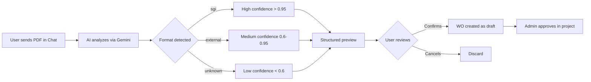
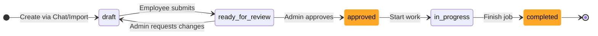

# Work Order - User Guide

The **Work Order** (WO) is SGI's professional system for detailing the work on a project. It replaced the old "Simple Scope" (v3.0+), bringing formal structure from the American construction industry.

---

## 1. What is a Work Order

A Work Order is a **formal document** detailing everything that will be done on a project, with:

- Complete **Header**: WO number, job number, customer, address, date
- **16 work categories** organized in the actual execution order of the job
- Detailed **items** with task, action, type, quantity, unit, room, price
- Formal **status** with mandatory approval
- **Export/Import in PDF**

<!-- TODO: screenshot of full WorkOrderView. File: images/work-order-view.png. Capture: header + 2-3 expanded categories with items + action buttons -->
{ .placeholder-image }

---

## 2. Where to find it

The Work Order is in the **"Work Order" tab** in the project detail (formerly called "Escopo" / Scope).

See the [Projects Guide](projects.md) for how to navigate to the project.

---

## 3. How to create a Work Order

There are **2 ways**:

### 3.1 Through Chat with AI (recommended)

The fastest and most flexible way:

- **Describe by text**: "I need a WO for the Rua das Flores project"
- **Send photos** of the location - the AI identifies rooms, materials, dimensions
- **Record audio** while walking through the location describing the work
- **Send a walkthrough video**

The AI organizes everything into the 16 categories automatically and you review it.

See the [Chat Guide](chat-en.md) for the complete flow.

### 3.2 Importing an external PDF

If you received a ready Work Order from another system (customer, partner, estimating software):

1. In the Chat, send the **PDF file** (up to 10 MB)
2. The AI analyzes and extracts:
   - Header (WO number, job number, project manager, dates)
   - Customer (name, address, phone)
   - Items organized into the 16 categories
   - Prices (if present in the PDF)
3. You **review the structured preview** with a confidence score
4. Confirm and the WO is created in the project

<!-- TODO: screenshot of WorkOrderImportDialog. File: images/work-order-import-dialog.png. Capture: dialog with PDF upload and drag-and-drop area -->
{ .placeholder-image }

<!-- TODO: screenshot of WorkOrderImportPreview. File: images/work-order-import-preview.png. Capture: structured preview of extracted data before confirming -->
{ .placeholder-image }

---

## 4. Complete Work Order structure

### Header

The header has all identifying information:

| Field | Example | Required |
|-------|---------|:---:|
| **Work Order Number** | `WO0001-14547` | Yes (auto-generated in SGI) |
| **Job Number** | `25-1959-RPR` | Yes |
| **Job Name** | `590 Indigo Drive - Rabiee, Sarah` | Yes |
| **Project Manager** | Name of the responsible employee | Yes |
| **Work Order Date** | WO date (ISO) | Yes |

<!-- TODO: screenshot of WorkOrderHeader. File: images/work-order-header.png. Capture: all header fields filled in -->
{ .placeholder-image }

### Customer

| Field | Example |
|-------|---------|
| **Name** | Sarah Rabiee |
| **Address** | 590 Indigo Drive |
| **Phone** | +1 (321) 555-0100 |
| **Email** | sarah.rabiee@email.com |

### Job Address

| Field | Example |
|-------|---------|
| **Street** | 590 Indigo Drive |
| **City** | Orlando |
| **State** | FL |
| **Zip** | 32828 |

### Categories and Items

Each category groups **work items** (specific tasks). A WO has multiple categories, and each category has multiple items.

<!-- TODO: screenshot of expanded WorkOrderCategory. File: images/work-order-category.png. Capture: category with listed items, including price -->
{ .placeholder-image }

---

## 5. The 16 categories (in execution order)

They follow the **actual sequence of the job** - the system executes categories in the order defined below.

| # | Code | Name | Description |
|---|--------|------|-----------|
| 1 | **FRM** | Framing | Initial structure, wood |
| 2 | **ELE** | Electrical | Electrical (wiring, outlets, panels) |
| 3 | **INS** | Insulation | Thermal and acoustic insulation |
| 4 | **DRY** | Drywall | Gypsum boards, partitions |
| 5 | **MUD** | Mud/Taping | Drywall finish (tape, mud) |
| 6 | **FNC** | Finish Carpentry | Baseboards, moldings, doors, windows |
| 7 | **PNT** | Painting | Painting (prime, coats) |
| 8 | **FCW** | Floor Covering | Carpet, laminate, vinyl, wood |
| 9 | **TIL** | Tile | Ceramic, tile, porcelain |
| 10 | **PLM** | Plumbing | Plumbing (rough + finish) |
| 11 | **DTL** | Details | Handles, locks, accessories |
| 12 | **GLS** | Glass | Glass, mirrors, glass shower enclosures |
| 13 | **CLN** | Cleaning | Final cleaning |
| 14 | **TCH** | Touch Ups | Final touch-ups |
| 15 | **CON** | Contents | Move furniture, decoration |
| 16 | **DMO** | Demolition | Demolition, dumpster |

!!! tip "Why this order?"
    It's the **actual** job execution order. Framing before electrical, electrical before drywall, drywall before painting, etc. Respecting this order in the scope helps plan the work.

---

## 6. Structure of a work item

Each item within a category has:

| Field | Description | Example |
|-------|-----------|---------|
| **Task** | What to do | `1/2" drywall - hung, taped, floated` |
| **Action** | Action type | `Install` / `Remove` / `Detach & Reset` |
| **Type** | Classification | `Labor` / `Material` / `Equipment` |
| **Quantity** | How much | `100` |
| **Unit** | Unit of measurement | `SF` / `LF` / `EA` / `SY` / `HR` |
| **Room** | Room/location | `Bathroom` |
| **Notes** | Optional note | `* To frame shower curb` |
| **Unit Price** | Unit price (**admin only**) | $4.50 |
| **Total Price** | Quantity × Unit Price (**admin only**) | $450.00 |

### Units of measurement

| Abbreviation | Name | Typical use |
|-------|------|------------|
| **EA** | Each (Unit) | Countable items (sink, toilet, door) |
| **SF** | Square Feet | Areas (walls, floors) |
| **LF** | Linear Feet | Lengths (baseboards, piping) |
| **SY** | Square Yards | Large areas (carpet) |
| **HR** | Hours | Labor time |

### Actions

| Action | Meaning |
|--------|-------------|
| **Install** | Install (add new) |
| **Remove** | Remove (demolish, take out) |
| **Detach & Reset** | Disassemble, store, reassemble later |

---

## 7. Work Order Status

The Work Order follows a formal flow with approval:

| Status | Meaning | Who changes it |
|--------|-------------|-----------|
| **Draft** (`draft`) | Under construction, editable | Employee or admin |
| **Ready for Review** (`ready_for_review`) | Awaiting approval | Employee |
| **Approved** (`approved`) | Ready for execution | **Admin** (mandatory action) |
| **In Progress** (`in_progress`) | Work in execution | Admin or employee |
| **Completed** (`completed`) | Work finished | Admin or employee |

---

## 8. Who sees what (need to know first)

### Administrator / Super Admin

Sees **everything**:
- All header fields
- All categories and items
- **Unit and total prices**
- Edit, approve, delete, export PDF buttons

### Employee

Sees **everything EXCEPT prices**:
- Complete header
- Categories and items
- Task, action, type, quantity, unit, room, notes
- **Does not see**: `unitPrice`, `totalPrice`, WO `totalCost`

!!! note "Why don't employees see prices?"
    SGI serves companies that don't want to expose margin/costs to the operational team. Employees need to know **what to do** and **how much** (quantity), but not **how much it costs**. If you need a specific employee to see prices, promote them to admin.

---

## 9. Editing items

!!! warning "Editing only in `draft`"
    Items can only be edited while the WO is in **`draft`**. After `ready_for_review`, everything becomes **read-only**.

    If you need to change something in an approved WO: the admin needs to return it to `draft` (if execution hasn't started yet) or create a new additional WO.

<!-- TODO: screenshot of WorkOrderEditItemDialog. File: images/work-order-edit-item.png. Capture: item edit dialog with all fields -->
{ .placeholder-image }

### How to edit

1. Click the edit icon next to the item
2. Change fields: task, action, quantity, unit, room, notes, price
3. Click **"Salvar"** (Save)

### How to add a new item

1. Expand the desired category
2. Click **"+ Adicionar item"** (+ Add item) at the bottom of the category
3. Fill in the fields
4. Save

### How to delete an item

1. Click the trash icon next to the item
2. Confirm in the dialog
3. Item is removed from the category

---

## 10. PDF Export

Admin can generate a professional PDF of the complete Work Order to send to the customer or archive.

### How to generate

1. On the WO, click **"Download PDF"** in the header
2. Wait for generation (a few seconds)
3. The PDF is downloaded automatically

The PDF contains:

- Complete header with logo, numbers, dates, customer
- All organized categories and items
- **Prices** (only if the one generating is an admin)
- Signatures (fields for customer and responsible party)

---

## Important Rules

### Required fields and limits

| Field | Required | Limit | Note |
|-------|:---:|:---:|---|
| `workOrderNumber` | Yes | - | Auto-generated (`WO{YEAR}{MONTH}-{SEQ}`) |
| `jobNumber` | Yes | - | Can be entered manually |
| `jobName` | Yes | - | Descriptive job name |
| `projectManager` | Yes | - | Must be a registered employee |
| `workOrderDate` | Yes | - | ISO 8601 |
| `customer.name` | Yes | - | - |
| `customer.address` | Yes | - | - |
| `customer.phone` | Yes | - | - |
| `customer.email` | No | - | Optional |
| `jobAddress.*` | Yes | - | street, city, state, zip all required |
| **PDF Import** | - | 10 MB | For upload in Chat |

### Required permissions

| Operation | Super Admin | Admin | Employee |
|----------|:---:|:---:|:---:|
| View Work Order (without prices) | Yes | Yes | Yes (if project assigned) |
| View prices | **Yes** | **Yes** | **No** |
| Create WO (via Chat) | Yes | Yes | Yes (if project assigned) |
| Import WO from PDF | Yes | Yes | Yes |
| Edit items (in draft) | Yes | Yes | Yes |
| **Approve WO** | **Yes** | **Yes** | **No** |
| Delete WO | Yes | Yes | No |
| Generate PDF | Yes | Yes | Yes (without prices) |

### Validations that block

!!! warning "Items only editable in `draft`"
    Trying to edit an item when the WO is in `ready_for_review` (or later) returns an error. Return to `draft` first (if the admin allows it).

!!! warning "PDF Import has a 10 MB limit"
    PDFs larger than 10 MB are rejected on upload. If your external WO is large, try compressing the PDF or splitting it into parts.

!!! note "Import confidence score"
    PDFs with confidence `< 0.6` (unknown format) **are still accepted**, but the system warns that data may have been extracted incorrectly. Always review the preview before confirming.

### System defaults

| Setting | Value |
|---|---|
| Initial status | `draft` |
| Number format | `WO{YY}{MM}-{5-digit SEQUENCE}` (e.g., `WO2601-00001`) |
| Category sort order | Fixed (see section 5 table) |
| Visible prices | Admin/superadmin only |
| Import: minimum confidence | No block (always accepts, but warns) |

---

## Quick summary

| You want to... | Do this... |
|-------------|-------------|
| Create WO from scratch | [Chat](chat-en.md) - "I need a WO for..." |
| Import WO from PDF | [Chat](chat-en.md) - send the PDF file |
| Edit items | WO in `draft` > click edit on the item |
| Send for approval | WO > "Enviar para revisão" (Send for review) button |
| Approve WO (admin) | WO in `ready_for_review` > "Aprovar" (Approve) |
| Generate PDF | WO > "Download PDF" |
| Delete WO | WO > "Excluir" (Delete, admin only) |
