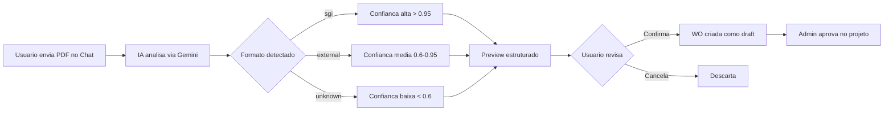
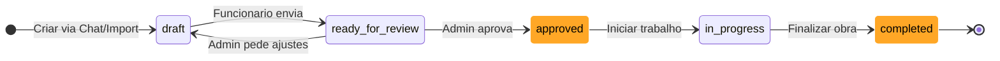

# Work Order (Ordem de Serviço) - Guia do Usuário

O **Work Order** (WO) é o sistema profissional do SGI para detalhar o trabalho de um projeto. Substituiu o antigo "Escopo simples" (v3.0+), trazendo estrutura formal da indústria americana de construção civil.

---

## 1. O que é uma Work Order

Uma Work Order é um **documento formal** que detalha tudo que será feito em um projeto, com:

- **Header** completo: número da WO, número do job, cliente, endereço, data
- **16 categorias** de trabalho organizadas na ordem de execução real da obra
- **Items** detalhados com task, ação, tipo, quantidade, unidade, cômodo, preço
- **Status** formal com aprovação obrigatória
- **Export/Import em PDF**

<!-- TODO: screenshot de WorkOrderView completo. Arquivo: images/work-order-view.png. Capturar: header + 2-3 categorias expandidas com items + botoes de action -->
{ .placeholder-image }

---

## 2. Onde encontrar

A Work Order fica na **aba "Work Order"** no detalhe de um projeto (antigamente chamada "Escopo").

📖 Veja o [Guia de Projetos](projetos.md) para como navegar até o projeto.

---

## 3. Como criar uma Work Order

Existem **2 formas**:

### 3.1 Pelo Chat com IA (recomendado)

O jeito mais rápido e flexível:

- **Descreva por texto**: "Preciso de uma WO para o projeto Rua das Flores"
- **Envie fotos** do local - a IA identifica cômodos, materiais, dimensões
- **Grave áudio** caminhando pelo local descrevendo o trabalho
- **Envie vídeo** de walkthrough

A IA organiza tudo nas 16 categorias automaticamente e você revisa.

📖 Veja o [Guia do Chat](chat.md) para o fluxo completo.

### 3.2 Importando PDF externo

Se você recebeu uma Work Order pronta de outro sistema (cliente, parceiro, estimating software):

1. No Chat, envie o **arquivo PDF** (até 10 MB)
2. A IA analisa e extrai:
   - Header (WO number, job number, project manager, datas)
   - Customer (nome, endereço, telefone)
   - Items organizados nas 16 categorias
   - Preços (se presentes no PDF)
3. Você **revisa o preview estruturado** com score de confiança
4. Confirma e a WO é criada no projeto

<!-- TODO: screenshot de WorkOrderImportDialog. Arquivo: images/work-order-import-dialog.png. Capturar: dialog com upload de PDF e area drag-and-drop -->
{ .placeholder-image }

<!-- TODO: screenshot de WorkOrderImportPreview. Arquivo: images/work-order-import-preview.png. Capturar: preview estruturado dos dados extraidos antes de confirmar -->
{ .placeholder-image }

---

## 4. Estrutura completa da Work Order

### Header

O cabeçalho tem todas as informações identificadoras:

| Campo | Exemplo | Obrigatório |
|-------|---------|:---:|
| **Work Order Number** | `WO0001-14547` | Sim (auto-gerado no SGI) |
| **Job Number** | `25-1959-RPR` | Sim |
| **Job Name** | `590 Indigo Drive - Rabiee, Sarah` | Sim |
| **Project Manager** | Nome do funcionário responsável | Sim |
| **Work Order Date** | Data da WO (ISO) | Sim |

<!-- TODO: screenshot de WorkOrderHeader. Arquivo: images/work-order-header.png. Capturar: todos os campos do header preenchidos -->
{ .placeholder-image }

### Customer (Cliente)

| Campo | Exemplo |
|-------|---------|
| **Name** | Sarah Rabiee |
| **Address** | 590 Indigo Drive |
| **Phone** | +1 (321) 555-0100 |
| **Email** | sarah.rabiee@email.com |

### Job Address (Endereço do trabalho)

| Campo | Exemplo |
|-------|---------|
| **Street** | 590 Indigo Drive |
| **City** | Orlando |
| **State** | FL |
| **Zip** | 32828 |

### Categorias e Items

Cada categoria agrupa **items de trabalho** (tasks específicas). Uma WO tem múltiplas categorias, e cada categoria tem múltiplos items.

<!-- TODO: screenshot de WorkOrderCategory expandida. Arquivo: images/work-order-category.png. Capturar: categoria com items listados, incluindo preco -->
{ .placeholder-image }

---

## 5. As 16 categorias (em ordem de execução)

Seguem a **sequência real da obra** - o sistema executa categorias na ordem definida abaixo.

| # | Código | Nome | Descrição |
|---|--------|------|-----------|
| 1 | **FRM** | Framing | Estrutura inicial, madeira |
| 2 | **ELE** | Electrical | Elétrica (fiação, tomadas, painéis) |
| 3 | **INS** | Insulation | Isolamento térmico e acústico |
| 4 | **DRY** | Drywall | Placas de gesso, divisórias |
| 5 | **MUD** | Mud/Taping | Acabamento drywall (fita, massa) |
| 6 | **FNC** | Finish Carpentry | Rodapés, molduras, portas, janelas |
| 7 | **PNT** | Painting | Pintura (prime, coats) |
| 8 | **FCW** | Floor Covering | Carpete, laminado, vinílico, madeira |
| 9 | **TIL** | Tile | Cerâmica, azulejo, porcelanato |
| 10 | **PLM** | Plumbing | Encanamento (rough + finish) |
| 11 | **DTL** | Details | Maçanetas, fechaduras, acessórios |
| 12 | **GLS** | Glass | Vidros, espelhos, box de vidro |
| 13 | **CLN** | Cleaning | Limpeza final |
| 14 | **TCH** | Touch Ups | Retoques finais |
| 15 | **CON** | Contents | Mover móveis, decoração |
| 16 | **DMO** | Demolition | Demolição, dumpster |

!!! tip "Por que essa ordem?"
    É a ordem **real** de execução da obra. Framing antes de elétrica, elétrica antes de drywall, drywall antes de pintura, etc. Respeitar essa ordem no escopo ajuda a planejar o trabalho.

---

## 6. Estrutura de um item de trabalho

Cada item dentro de uma categoria tem:

| Campo | Descrição | Exemplo |
|-------|-----------|---------|
| **Task** | O que fazer | `1/2" drywall - hung, taped, floated` |
| **Action** | Tipo de ação | `Install` / `Remove` / `Detach & Reset` |
| **Type** | Classificação | `Labor` / `Material` / `Equipment` |
| **Quantity** | Quanto | `100` |
| **Unit** | Unidade de medida | `SF` / `LF` / `EA` / `SY` / `HR` |
| **Room** | Cômodo/local | `Bathroom` |
| **Notes** | Observação opcional | `* To frame shower curb` |
| **Unit Price** | Preço unitário (**só admin**) | $4.50 |
| **Total Price** | Quantity × Unit Price (**só admin**) | $450.00 |

### Unidades de medida

| Sigla | Nome | Uso típico |
|-------|------|------------|
| **EA** | Each (Unidade) | Itens contáveis (pia, vaso, porta) |
| **SF** | Square Feet | Áreas (paredes, pisos) |
| **LF** | Linear Feet | Comprimentos (rodapés, tubulações) |
| **SY** | Square Yards | Áreas grandes (carpete) |
| **HR** | Hours | Tempo de mão de obra |

### Actions (Ações)

| Action | Significado |
|--------|-------------|
| **Install** | Instalar (adicionar novo) |
| **Remove** | Remover (demolir, retirar) |
| **Detach & Reset** | Desmontar, guardar, remontar depois |

---

## 7. Status da Work Order

A Work Order segue um fluxo formal com aprovação:

| Status | Significado | Quem muda |
|--------|-------------|-----------|
| **Rascunho** (`draft`) | Em construção, editável | Funcionário ou admin |
| **Pronto para Revisão** (`ready_for_review`) | Aguardando aprovação | Funcionário |
| **Aprovado** (`approved`) | Pronto para execução | **Admin** (ação obrigatória) |
| **Em Andamento** (`in_progress`) | Trabalho em execução | Admin ou funcionário |
| **Concluído** (`completed`) | Trabalho finalizado | Admin ou funcionário |

---

## 8. Quem vê o quê (precisa saber antes)

### Administrador / Super Admin

Vê **tudo**:
- Todos os campos do header
- Todas as categorias e items
- **Preços** unitários e totais
- Botões de editar, aprovar, excluir, exportar PDF

### Funcionário

Vê **tudo EXCETO preços**:
- Header completo
- Categorias e items
- Task, action, type, quantity, unit, room, notes
- **Não vê**: `unitPrice`, `totalPrice`, `totalCost` da WO

!!! note "Por quê funcionários não veem preços?"
    O SGI serve empresas que não querem expor margem/custos ao time operacional. Funcionários precisam saber **o que fazer** e **quanto** (quantidade), mas não **quanto custa**. Se precisar que um funcionário específico veja preços, promova ele a admin.

---

## 9. Editando items

!!! warning "Edição só em `draft`"
    Items só podem ser editados enquanto a WO está em **`draft`**. Depois de `ready_for_review`, tudo fica **read-only**.

    Se precisar mudar algo em uma WO aprovada: admin precisa voltá-la para `draft` (se ainda não iniciou execução) ou criar uma WO nova adicional.

<!-- TODO: screenshot de WorkOrderEditItemDialog. Arquivo: images/work-order-edit-item.png. Capturar: dialog de edicao de item com todos os campos -->
{ .placeholder-image }

### Como editar

1. Clique no ícone de editar ao lado do item
2. Altere campos: task, action, quantity, unit, room, notes, preço
3. Clique em **"Salvar"**

### Como adicionar novo item

1. Expanda a categoria desejada
2. Clique em **"+ Adicionar item"** no rodapé da categoria
3. Preencha os campos
4. Salve

### Como deletar item

1. Clique no ícone de lixeira ao lado do item
2. Confirme no dialog
3. Item é removido da categoria

---

## 10. Export em PDF

Admin pode gerar um PDF profissional da Work Order completa para enviar ao cliente ou arquivar.

### Como gerar

1. Na WO, clique em **"Download PDF"** no header
2. Aguarde a geração (alguns segundos)
3. O PDF é baixado automaticamente

O PDF contém:

- Header completo com logo, números, datas, cliente
- Todas as categorias e items organizados
- **Preços** (apenas se quem gerar for admin)
- Assinaturas (campos para cliente e responsável)

---

## Regras Importantes

### Campos obrigatórios e limites

| Campo | Obrigatório | Limite | Observação |
|-------|:---:|:---:|---|
| `workOrderNumber` | Sim | - | Auto-gerado (`WO{ANO}{MES}-{SEQ}`) |
| `jobNumber` | Sim | - | Pode ser informado manualmente |
| `jobName` | Sim | - | Nome descritivo do job |
| `projectManager` | Sim | - | Deve ser um funcionário cadastrado |
| `workOrderDate` | Sim | - | ISO 8601 |
| `customer.name` | Sim | - | - |
| `customer.address` | Sim | - | - |
| `customer.phone` | Sim | - | - |
| `customer.email` | Não | - | Opcional |
| `jobAddress.*` | Sim | - | street, city, state, zip todos obrigatórios |
| **Import PDF** | - | 10 MB | Para upload no Chat |

### Permissões necessárias

| Operação | Super Admin | Admin | Funcionário |
|----------|:---:|:---:|:---:|
| Ver Work Order (sem preços) | Sim | Sim | Sim (se projeto atribuído) |
| Ver preços | **Sim** | **Sim** | **Não** |
| Criar WO (via Chat) | Sim | Sim | Sim (se projeto atribuído) |
| Importar WO de PDF | Sim | Sim | Sim |
| Editar items (em draft) | Sim | Sim | Sim |
| **Aprovar WO** | **Sim** | **Sim** | **Não** |
| Deletar WO | Sim | Sim | Não |
| Gerar PDF | Sim | Sim | Sim (sem preços) |

### Validações que bloqueiam

!!! warning "Items só editáveis em `draft`"
    Tentar editar um item quando a WO está em `ready_for_review` (ou posterior) retorna erro. Volte ao `draft` primeiro (se o admin permitir).

!!! warning "Import PDF tem limite de 10 MB"
    PDFs maiores que 10 MB são rejeitados no upload. Se sua WO externa está grande, tente comprimir o PDF ou dividir em partes.

!!! note "Score de confiança no import"
    PDFs com confiança `< 0.6` (formato desconhecido) **ainda são aceitos**, mas o sistema alerta que pode ter extraído dados errados. Sempre revise o preview antes de confirmar.

### Defaults do sistema

| Configuração | Valor |
|---|---|
| Status inicial | `draft` |
| Formato do número | `WO{AA}{MM}-{SEQUENCIAL 5 dígitos}` (ex: `WO2601-00001`) |
| Sort order das categorias | Fixo (ver tabela da seção 5) |
| Preços visíveis | Apenas admin/superadmin |
| Import: confiança mínima | Sem bloqueio (sempre aceita, mas avisa) |

---

## Resumo rápido

| Você quer... | Faça isso... |
|-------------|-------------|
| Criar WO do zero | [Chat](chat.md) - "Preciso de uma WO para..." |
| Importar WO de PDF | [Chat](chat.md) - envie o arquivo PDF |
| Editar items | WO em `draft` > clicar editar no item |
| Enviar para aprovação | WO > botão "Enviar para revisão" |
| Aprovar WO (admin) | WO em `ready_for_review` > "Aprovar" |
| Gerar PDF | WO > "Download PDF" |
| Deletar WO | WO > "Excluir" (admin only) |
