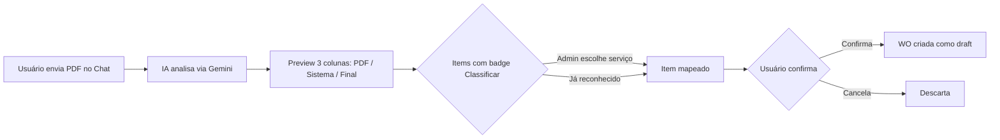
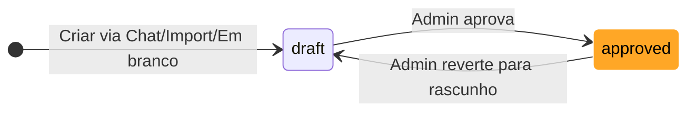

# Work Order (Ordem de Serviço) - Guia do Usuário

O **Work Order** (WO) é o sistema profissional do SGI para detalhar o trabalho de um projeto. Substituiu o antigo "Escopo simples" (v3.0+), trazendo estrutura formal da indústria americana de construção civil.

---

## 1. O que é uma Work Order

Uma Work Order é um **documento formal** que detalha tudo que será feito em um projeto, com:

- **Header** completo: número da WO, número do job, cliente, endereço, data
- **Categorias de trabalho** dinâmicas gerenciadas pelo admin (via Catálogo de Serviços)
- **Items** detalhados com serviço, ação, tipo, quantidade, unidade, cômodo, preço
- **Preço com breakdown** de 4 fontes possíveis
- **Status** simplificado: rascunho ou aprovado (reversível)
- **Export/Import em PDF**

---

## 2. Onde encontrar

A Work Order fica na **aba "Work Order"** no detalhe de um projeto (antigamente chamada "Escopo").

📖 Veja o [Guia de Projetos](projetos.md) para como navegar até o projeto.

---

## 3. Como criar uma Work Order

Existem **3 formas**:

### 3.1 Criar WO em branco

A forma mais direta quando você já sabe o que vai fazer:

1. Abra o projeto
2. Vá na aba **"Work Order"**
3. Clique em **"Criar WO em branco"**
4. A WO é criada em modo `draft` com o header já preenchido com os dados do projeto
5. Adicione items manualmente (veja seção 9)

### 3.2 Pelo Chat com IA (recomendado para vistoria)

O jeito mais rápido quando você está descrevendo o trabalho:

- **Descreva por texto**: "Preciso de uma WO para o projeto Rua das Flores"
- **Envie fotos** do local — a IA identifica cômodos, materiais, dimensões
- **Grave áudio** caminhando pelo local descrevendo o trabalho
- **Envie vídeo** de walkthrough

A IA organiza tudo nas categorias automaticamente e você revisa.

📖 Veja o [Guia do Chat](chat.md) para o fluxo completo.

### 3.3 Importando PDF externo

Se você recebeu uma Work Order pronta de outro sistema (cliente, parceiro, estimating software):

1. No Chat, envie o **arquivo PDF** (até 10 MB)
2. A IA analisa e extrai o header, cliente e items
3. Você **revisa o preview** com 3 colunas: o que veio no PDF, o serviço correspondente no sistema, e o valor final
4. Items não reconhecidos ficam com badge **"Classificar"** — você escolhe o serviço manualmente
5. Confirma e a WO é criada no projeto

---

## 4. Estrutura completa da Work Order

### Header

O cabeçalho tem todas as informações identificadoras:

| Campo | Exemplo | Obrigatório |
|-------|---------|:---:|
| **Work Order Number** | `WO0001-14547` | Sim (auto-gerado no SGI) |
| **Job Number** | `25-1959-RPR` | Sim |
| **Job Name** | `590 Indigo Drive - Rabiee, Sarah` | Sim |
| **Project Manager** | Nome do funcionário responsável | Sim |
| **Work Order Date** | Data da WO (ISO) | Sim |

!!! tip "Editando o header"
    Admin pode editar o header clicando em **"Editar WO"** enquanto a WO está em `draft`. Você pode mudar jobName, projectManager, workOrderDate, customer e jobAddress.

### Customer (Cliente)

| Campo | Exemplo |
|-------|---------|
| **Name** | Sarah Rabiee |
| **Address** | 590 Indigo Drive |
| **Phone** | +1 (321) 555-0100 |
| **Email** | sarah.rabiee@email.com |

### Job Address (Endereço do trabalho)

| Campo | Exemplo |
|-------|---------|
| **Street** | 590 Indigo Drive |
| **City** | Orlando |
| **State** | FL |
| **Zip** | 32828 |

### Categorias e Items

As categorias da WO vêm do **Catálogo de Serviços** — o admin gerencia quais categorias e serviços existem. Cada categoria agrupa **items de trabalho** (tasks específicas). Uma WO tem múltiplas categorias, e cada categoria tem múltiplos items.

📖 Veja o [Guia do Catálogo de Serviços](servicos.md) para entender como o admin configura as categorias.

---

## 5. Estrutura de um item de trabalho

Cada item dentro de uma categoria tem:

| Campo | Descrição | Exemplo |
|-------|-----------|---------|
| **Serviço** | Qual serviço do catálogo | `Paint trim/casing` (categoria PNT) |
| **Action** | Tipo de ação | `Install` / `Remove` / `Detach & Reset` |
| **Type** | Classificação | `Labor` / `Material` / `Equipment` |
| **Quantity** | Quanto | `100` |
| **Unit** | Unidade de medida | `SF` / `LF` / `EA` / `SY` / `HR` |
| **Room** | Cômodo/local | `Bathroom` |
| **Notes** | Observação opcional | `* To frame shower curb` |
| **Unit Price** | Preço unitário (**só admin**) | $4.50 |
| **Total Price** | Quantity × Unit Price (**só admin**) | $450.00 |

### Unidades de medida

| Sigla | Nome | Uso típico |
|-------|------|------------|
| **EA** | Each (Unidade) | Itens contáveis (pia, vaso, porta) |
| **SF** | Square Feet | Áreas (paredes, pisos) |
| **LF** | Linear Feet | Comprimentos (rodapés, tubulações) |
| **SY** | Square Yards | Áreas grandes (carpete) |
| **HR** | Hours | Tempo de mão de obra |

### Actions (Ações)

| Action | Significado |
|--------|-------------|
| **Install** | Instalar (adicionar novo) |
| **Remove** | Remover (demolir, retirar) |
| **Detach & Reset** | Desmontar, guardar, remontar depois |

---

## 6. Preço com breakdown (4 fontes)

Cada item pode ter o preço definido por **4 fontes diferentes**. O admin escolhe qual usar:

| Fonte | Descrição | Quando usa |
|-------|-----------|-----------|
| **default** | Preço padrão do catálogo de serviços | Ponto de partida sempre disponível |
| **group_override** | Preço especial do Grupo de Cliente (VIP) | Projeto vinculado a um grupo com preços customizados |
| **pdf** | Preço extraído do PDF importado | Quando a WO veio de um arquivo PDF |
| **manual** | Preço digitado manualmente pelo admin | Quando nenhuma das fontes automáticas serve |

!!! tip "Prioridade automática"
    Quando há múltiplas fontes disponíveis, o sistema sugere a seguinte prioridade:
    `manual > pdf > group_override > default`

    O admin pode escolher qualquer fonte via radio button no dialog de edição do item.

---

## 7. Status da Work Order

A Work Order tem **2 status** — e a transição é reversível:

| Status | Significado | Quem muda |
|--------|-------------|-----------|
| **Rascunho** (`draft`) | Em construção, editável | Funcionário ou admin |
| **Aprovado** (`approved`) | Pronto para execução | **Admin** (ação obrigatória) |

!!! note "Reversível"
    Admin pode clicar em **"Voltar para rascunho"** quando a WO está aprovada — isso permite editar novamente. O audit log preserva o histórico de todas as transições.

!!! warning "Status removidos"
    Os status `ready_for_review`, `in_progress` e `completed` foram removidos. O fluxo agora é simples: `draft` ↔ `approved`.

---

## 8. Quem vê o quê (precisa saber antes)

### Administrador / Super Admin

Vê **tudo**:
- Todos os campos do header
- Todas as categorias e items
- **Preços** unitários, totais e breakdown de fonte
- Botões de editar, aprovar, reverter, excluir, exportar PDF

### Funcionário

Vê **tudo EXCETO preços**:
- Header completo
- Categorias e items
- Task, action, type, quantity, unit, room, notes
- **Não vê**: `unitPrice`, `totalPrice`, `totalCost` da WO

!!! note "Por quê funcionários não veem preços?"
    O SGI serve empresas que não querem expor margem/custos ao time operacional. Funcionários precisam saber **o que fazer** e **quanto** (quantidade), mas não **quanto custa**. Se precisar que um funcionário específico veja preços, promova ele a admin.

---

## 9. Adicionando items (via Catálogo de Serviços)

!!! warning "Edição só em `draft`"
    Items só podem ser adicionados/editados enquanto a WO está em **`draft`**. Depois de `approved`, tudo fica **read-only** até o admin reverter.

### Como adicionar item

1. Expanda (ou crie) a categoria desejada
2. Clique em **"+ Adicionar item"**
3. No dialog, selecione:
   - **Categoria** — dropdown com as categorias do catálogo
   - **Serviço** — dropdown com os serviços da categoria escolhida
4. Os campos action, type, unit e preço são preenchidos automaticamente com os defaults do serviço
5. Ajuste quantity, room, notes e a fonte do preço se necessário
6. Salve

### Como editar item existente

1. Clique no ícone de editar ao lado do item
2. Altere campos: quantity, room, notes, fonte do preço, preço manual
3. Clique em **"Salvar"**

### Como deletar item

1. Clique no ícone de lixeira ao lado do item
2. Confirme no dialog
3. Item é removido (snapshot preservado — WOs antigas não são afetadas)

---

## 10. Editando o header da WO

Admin pode editar o header enquanto a WO está em `draft`:

1. Clique em **"Editar WO"** no topo da Work Order
2. Altere: jobName, projectManager, workOrderDate, customer, jobAddress
3. Salve

---

## 11. Export em PDF

Admin pode gerar um PDF profissional da Work Order completa para enviar ao cliente ou arquivar.

### Como gerar

1. Na WO, clique em **"Download PDF"** no header
2. Aguarde a geração (alguns segundos)
3. O PDF é baixado automaticamente

O PDF contém:

- Header completo com logo, números, datas, cliente
- Todas as categorias e items organizados
- **Preços** (apenas se quem gerar for admin)
- Assinaturas (campos para cliente e responsável)

---

## Regras Importantes

### Permissões necessárias

| Operação | Super Admin | Admin | Funcionário |
|----------|:---:|:---:|:---:|
| Ver Work Order (sem preços) | Sim | Sim | Sim (se projeto atribuído) |
| Ver preços | **Sim** | **Sim** | **Não** |
| Criar WO em branco | Sim | Sim | Sim |
| Criar WO via Chat | Sim | Sim | Sim (se projeto atribuído) |
| Importar WO de PDF | Sim | Sim | Sim |
| Editar items (em draft) | Sim | Sim | Sim |
| Editar header (em draft) | Sim | Sim | Não |
| **Aprovar WO** | **Sim** | **Sim** | **Não** |
| **Reverter para draft** | **Sim** | **Sim** | **Não** |
| Deletar WO | Sim | Sim | Não |
| Gerar PDF | Sim | Sim | Sim (sem preços) |

### Validações que bloqueiam

!!! warning "Items só editáveis em `draft`"
    Tentar editar um item quando a WO está `approved` retorna erro. Admin precisa primeiro reverter para `draft`.

!!! warning "Import PDF tem limite de 10 MB"
    PDFs maiores que 10 MB são rejeitados no upload. Se sua WO externa está grande, tente comprimir o PDF ou dividir em partes.

!!! note "Soft delete de serviços"
    Se um serviço do catálogo for desativado após a criação da WO, os items que o usam são preservados (snapshot congela nome, categoria, action, type, unit). A WO não é afetada.

### Defaults do sistema

| Configuração | Valor |
|---|---|
| Status inicial | `draft` |
| Formato do número | `WO{AA}{MM}-{SEQUENCIAL 5 dígitos}` (ex: `WO2601-00001`) |
| Preços visíveis | Apenas admin/superadmin |
| Fonte de preço padrão | `default` (catálogo) |
| Import: confiança mínima | Sem bloqueio (sempre aceita, mas avisa) |

---

## Resumo rápido

| Você quer... | Faça isso... |
|-------------|-------------|
| Criar WO do zero | Aba Work Order > "Criar WO em branco" |
| Criar WO via IA | [Chat](chat.md) - "Preciso de uma WO para..." |
| Importar WO de PDF | [Chat](chat.md) - envie o arquivo PDF |
| Adicionar item | WO em `draft` > "+ Adicionar item" > Categoria > Serviço |
| Editar header | WO em `draft` > "Editar WO" |
| Aprovar WO (admin) | WO em `draft` > "Aprovar" |
| Reverter para rascunho (admin) | WO `approved` > "Voltar para rascunho" |
| Gerar PDF | WO > "Download PDF" |
| Deletar WO | WO > "Excluir" (admin only) |
